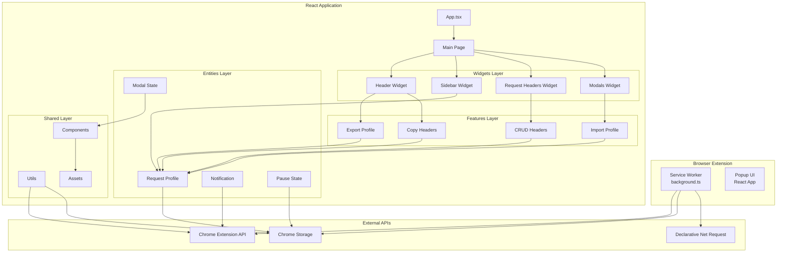
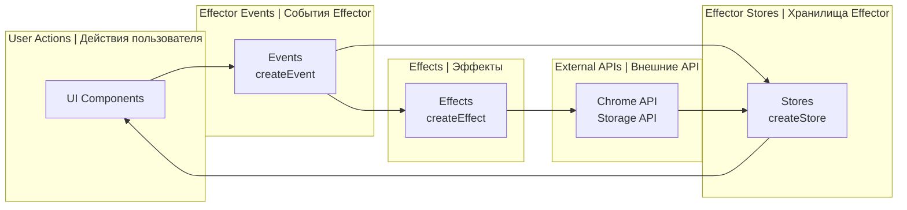
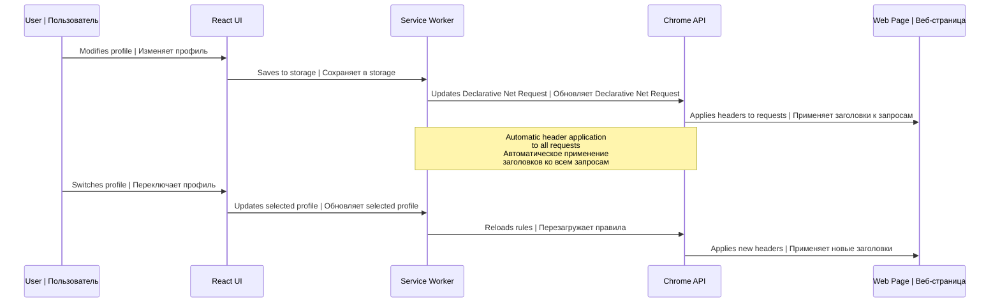
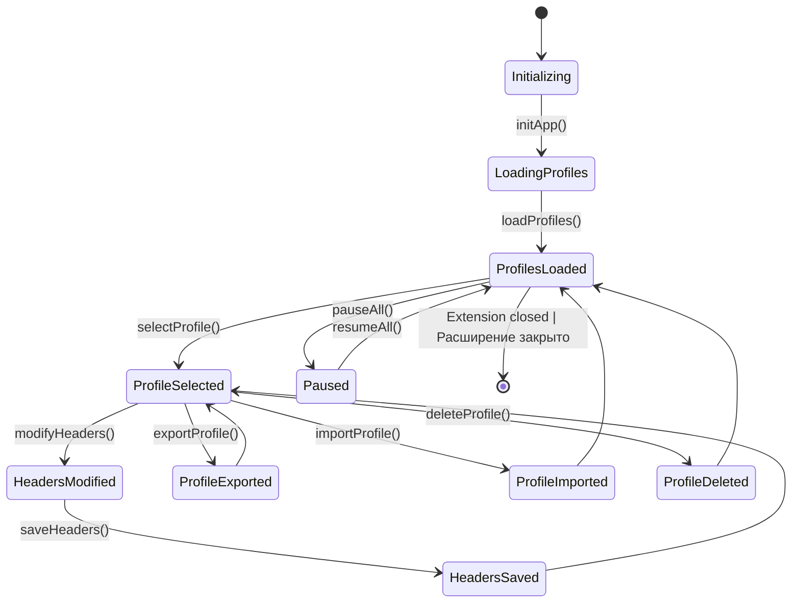
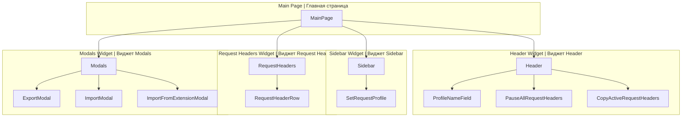
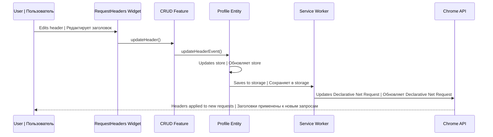

# 🏗️ Cloudhood Architecture Diagrams | Диаграммы архитектуры Cloudhood

## General Project Architecture | Общая архитектура проекта



## Effector Data Flow | Поток данных Effector



## Feature-Sliced Design Structure | Структура Feature-Sliced Design

```mermaid
graph TD
    subgraph "App Layer | Слой App"
        A[App.tsx<br/>Initialization | Инициализация]
    end

    subgraph "Pages Layer | Слой Pages"
        P[Main Page<br/>Widget composition | Композиция виджетов]
    end

    subgraph "Widgets Layer | Слой Widgets"
        W1[Header<br/>Profile management | Управление профилями]
        W2[Sidebar<br/>Profile list | Список профилей]
        W3[Request Headers<br/>Editing | Редактирование]
        W4[Modals<br/>Dialogs | Диалоги]
    end

    subgraph "Features Layer | Слой Features"
        F1[Export Profile<br/>Data export | Экспорт данных]
        F2[Import Profile<br/>Data import | Импорт данных]
        F3[Copy Headers<br/>Copying | Копирование]
        F4[CRUD Headers<br/>Header management | Управление заголовками]
    end

    subgraph "Entities Layer | Слой Entities"
        E1[Request Profile<br/>Main entity | Основная сущность]
        E2[Notification<br/>Notifications | Уведомления]
        E3[Modal<br/>Modal state | Состояние модалок]
        E4[Pause<br/>Pause state | Состояние паузы]
    end

    subgraph "Shared Layer | Слой Shared"
        S1[Utils<br/>Utilities | Утилиты]
        S2[Components<br/>Components | Компоненты]
        S3[Assets<br/>Resources | Ресурсы]
        S4[Constants<br/>Constants | Константы]
    end

    %% Dependencies (only lower layers can import from higher layers)
    %% Зависимости (только нижележащие слои могут импортировать из вышележащих)
    A --> P
    P --> W1
    P --> W2
    P --> W3
    P --> W4

    W1 --> F1
    W1 --> F3
    W2 --> E1
    W3 --> F4
    W4 --> F2

    F1 --> E1
    F2 --> E1
    F3 --> E1
    F4 --> E1

    F1 --> S1
    F2 --> S1
    F3 --> S1
    F4 --> S1

    E1 --> S1
    E2 --> S1
    E3 --> S1
    E4 --> S1

    W1 --> S2
    W2 --> S2
    W3 --> S2
    W4 --> S2
```

## Chrome Extension API Integration | Интеграция с Chrome Extension API



## Effector State Management | Управление состоянием Effector



## UI Component Architecture | Компонентная архитектура UI



## Header Change Data Flow | Поток данных при изменении заголовков



---

## 📊 Project Statistics | Статистика проекта

- **Total files | Общее количество файлов**: ~150
- **Lines of code | Строки кода**: ~15,000
- **TypeScript files | TypeScript файлы**: ~120
- **React components | React компоненты**: ~25
- **Effector stores**: ~15
- **Effector events**: ~30
- **Utilities | Утилиты**: ~20

## 🎯 Key Metrics | Ключевые метрики

- **Test coverage | Покрытие тестами**: Unit tests for utilities, E2E for main scenarios | Unit tests для утилит, E2E для основных сценариев
- **Performance | Производительность**: Lazy loading for modals | Ленивая загрузка модальных окон
- **Bundle size | Размер бандла**: Optimized for browser extensions | Оптимизирован для расширений браузера
- **Compatibility | Совместимость**: Chrome + Firefox via polyfill | Chrome + Firefox через polyfill
