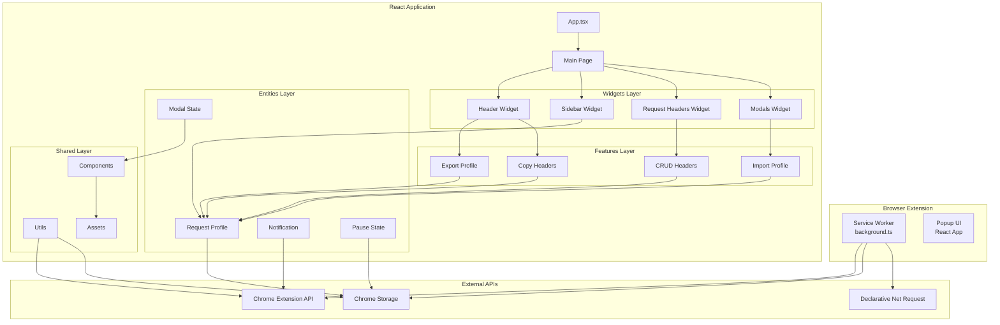
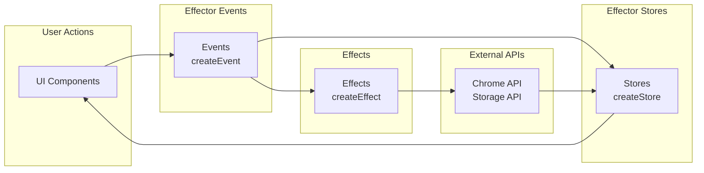
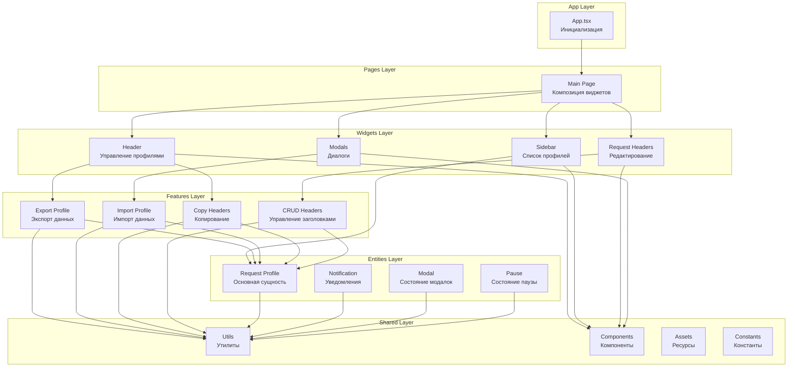
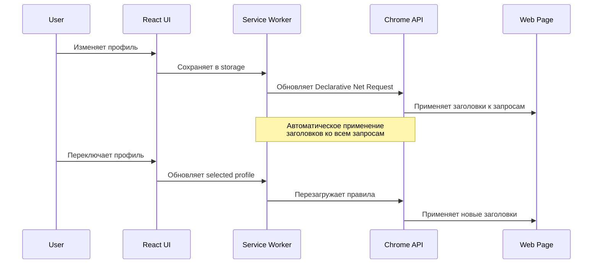
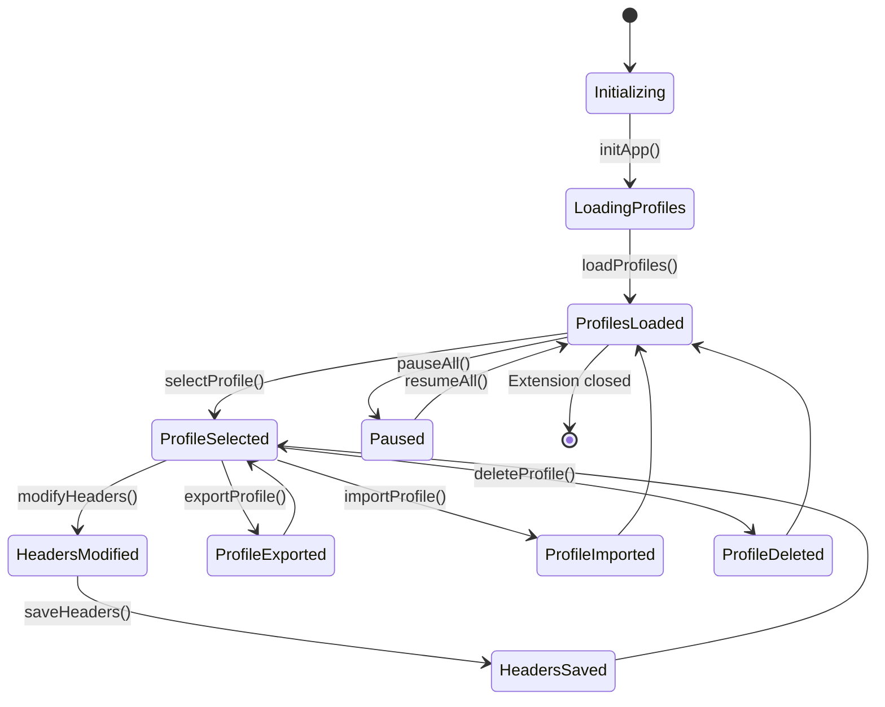
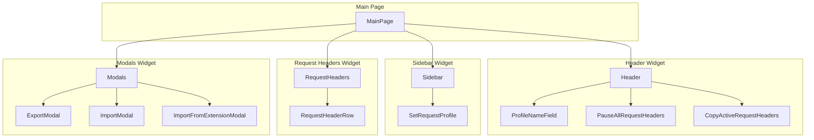
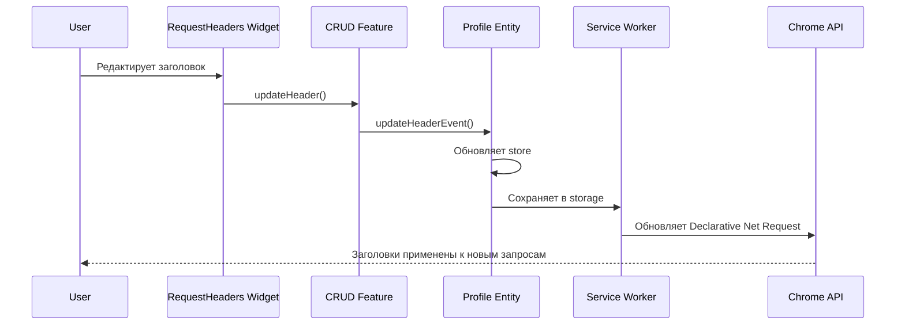

# 🏗️ Диаграмма архитектуры Cloudhood

## Общая архитектура проекта

```mermaid
graph TB
    subgraph "Browser Extension"
        SW[Service Worker<br/>background.ts]
        POPUP[Popup UI<br/>React App]
    end

    subgraph "React Application"
        APP[App.tsx]
        MAIN[Main Page]

        subgraph "Widgets Layer"
            HEADER[Header Widget]
            SIDEBAR[Sidebar Widget]
            HEADERS[Request Headers Widget]
            MODALS[Modals Widget]
        end

        subgraph "Features Layer"
            EXPORT[Export Profile]
            IMPORT[Import Profile]
            COPY[Copy Headers]
            CRUD[CRUD Headers]
        end

        subgraph "Entities Layer"
            PROFILE[Request Profile]
            NOTIFICATION[Notification]
            MODAL[Modal State]
            PAUSE[Pause State]
        end

        subgraph "Shared Layer"
            UTILS[Utils]
            COMPONENTS[Components]
            ASSETS[Assets]
        end
    end

    subgraph "External APIs"
        CHROME[Chrome Extension API]
        STORAGE[Chrome Storage]
        NET[Declarative Net Request]
    end

    %% Connections
    SW --> CHROME
    SW --> STORAGE
    SW --> NET

    APP --> MAIN
    MAIN --> HEADER
    MAIN --> SIDEBAR
    MAIN --> HEADERS
    MAIN --> MODALS

    HEADER --> EXPORT
    HEADER --> COPY
    SIDEBAR --> PROFILE
    HEADERS --> CRUD
    MODALS --> IMPORT

    EXPORT --> PROFILE
    IMPORT --> PROFILE
    COPY --> PROFILE
    CRUD --> PROFILE

    PROFILE --> STORAGE
    NOTIFICATION --> CHROME
    MODAL --> COMPONENTS
    PAUSE --> STORAGE

    UTILS --> CHROME
    UTILS --> STORAGE
    COMPONENTS --> ASSETS
```

## Поток данных Effector

```mermaid
graph LR
    subgraph "User Actions"
        UI[UI Components]
    end

    subgraph "Effector Events"
        EVENTS[Events<br/>createEvent]
    end

    subgraph "Effector Stores"
        STORES[Stores<br/>createStore]
    end

    subgraph "Effects"
        EFFECTS[Effects<br/>createEffect]
    end

    subgraph "External APIs"
        API[Chrome API<br/>Storage API]
    end

    UI --> EVENTS
    EVENTS --> STORES
    EVENTS --> EFFECTS
    STORES --> UI
    EFFECTS --> API
    API --> STORES
```

## Структура Feature-Sliced Design

```mermaid
graph TD
    subgraph "App Layer"
        A[App.tsx<br/>Инициализация]
    end

    subgraph "Pages Layer"
        P[Main Page<br/>Композиция виджетов]
    end

    subgraph "Widgets Layer"
        W1[Header<br/>Управление профилями]
        W2[Sidebar<br/>Список профилей]
        W3[Request Headers<br/>Редактирование]
        W4[Modals<br/>Диалоги]
    end

    subgraph "Features Layer"
        F1[Export Profile<br/>Экспорт данных]
        F2[Import Profile<br/>Импорт данных]
        F3[Copy Headers<br/>Копирование]
        F4[CRUD Headers<br/>Управление заголовками]
    end

    subgraph "Entities Layer"
        E1[Request Profile<br/>Основная сущность]
        E2[Notification<br/>Уведомления]
        E3[Modal<br/>Состояние модалок]
        E4[Pause<br/>Состояние паузы]
    end

    subgraph "Shared Layer"
        S1[Utils<br/>Утилиты]
        S2[Components<br/>Компоненты]
        S3[Assets<br/>Ресурсы]
        S4[Constants<br/>Константы]
    end

    %% Dependencies (only lower layers can import from higher layers)
    A --> P
    P --> W1
    P --> W2
    P --> W3
    P --> W4

    W1 --> F1
    W1 --> F3
    W2 --> E1
    W3 --> F4
    W4 --> F2

    F1 --> E1
    F2 --> E1
    F3 --> E1
    F4 --> E1

    F1 --> S1
    F2 --> S1
    F3 --> S1
    F4 --> S1

    E1 --> S1
    E2 --> S1
    E3 --> S1
    E4 --> S1

    W1 --> S2
    W2 --> S2
    W3 --> S2
    W4 --> S2
```

## Интеграция с Chrome Extension API

```mermaid
sequenceDiagram
    participant U as User
    participant UI as React UI
    participant SW as Service Worker
    participant API as Chrome API
    participant WEB as Web Page

    U->>UI: Изменяет профиль
    UI->>SW: Сохраняет в storage
    SW->>API: Обновляет Declarative Net Request
    API->>WEB: Применяет заголовки к запросам

    Note over SW,API: Автоматическое применение<br/>заголовков ко всем запросам

    U->>UI: Переключает профиль
    UI->>SW: Обновляет selected profile
    SW->>API: Перезагружает правила
    API->>WEB: Применяет новые заголовки
```

## Управление состоянием Effector

```mermaid
stateDiagram-v2
    [*] --> Initializing

    Initializing --> LoadingProfiles: initApp()
    LoadingProfiles --> ProfilesLoaded: loadProfiles()

    ProfilesLoaded --> ProfileSelected: selectProfile()
    ProfileSelected --> HeadersModified: modifyHeaders()
    HeadersModified --> HeadersSaved: saveHeaders()
    HeadersSaved --> ProfileSelected

    ProfileSelected --> ProfileExported: exportProfile()
    ProfileExported --> ProfileSelected

    ProfileSelected --> ProfileImported: importProfile()
    ProfileImported --> ProfilesLoaded

    ProfileSelected --> ProfileDeleted: deleteProfile()
    ProfileDeleted --> ProfilesLoaded

    ProfilesLoaded --> Paused: pauseAll()
    Paused --> ProfilesLoaded: resumeAll()

    ProfilesLoaded --> [*]: Extension closed
```

## Компонентная архитектура UI

```mermaid
graph TB
    subgraph "Main Page"
        MP[MainPage]
    end

    subgraph "Header Widget"
        H[Header]
        H1[ProfileNameField]
        H2[PauseAllRequestHeaders]
        H3[CopyActiveRequestHeaders]
    end

    subgraph "Sidebar Widget"
        S[Sidebar]
        S1[SetRequestProfile]
    end

    subgraph "Request Headers Widget"
        RH[RequestHeaders]
        RH1[RequestHeaderRow]
    end

    subgraph "Modals Widget"
        M[Modals]
        M1[ExportModal]
        M2[ImportModal]
        M3[ImportFromExtensionModal]
    end

    MP --> H
    MP --> S
    MP --> RH
    MP --> M

    H --> H1
    H --> H2
    H --> H3

    S --> S1

    RH --> RH1

    M --> M1
    M --> M2
    M --> M3
```

## Поток данных при изменении заголовков

```mermaid
sequenceDiagram
    participant U as User
    participant RH as RequestHeaders Widget
    participant CRUD as CRUD Feature
    participant PROFILE as Profile Entity
    participant SW as Service Worker
    participant API as Chrome API

    U->>RH: Редактирует заголовок
    RH->>CRUD: updateHeader()
    CRUD->>PROFILE: updateHeaderEvent()
    PROFILE->>PROFILE: Обновляет store
    PROFILE->>SW: Сохраняет в storage
    SW->>API: Обновляет Declarative Net Request
    API-->>U: Заголовки применены к новым запросам
```

---

## 📊 Статистика проекта

- **Общее количество файлов**: ~150
- **Строки кода**: ~15,000
- **TypeScript файлы**: ~120
- **React компоненты**: ~25
- **Effector stores**: ~15
- **Effector events**: ~30
- **Утилиты**: ~20

## 🎯 Ключевые метрики

- **Покрытие тестами**: Unit tests для утилит, E2E для основных сценариев
- **Производительность**: Ленивая загрузка модальных окон
- **Размер бандла**: Оптимизирован для расширений браузера
- **Совместимость**: Chrome + Firefox через polyfill
