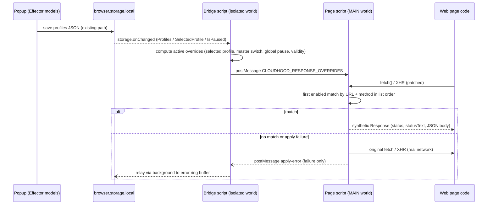

# Cloudhood response overrides — team board

## Status

- State: **Runtime and safety fixes approved**
- Current owner: **done**
- Next owner: **done**
- Review owner: **Review-Sol (product/UX, approved with nits) + Fable (architecture/tech, approved after tsc must-fix)**
- Last update: 2026-08-19
- Prior work: branch `PROFCOMM-1128` reviewed by Fable — proof of concept only, superseded by the spec below; do not merge it

## Product goal and sprint scope

Enable testers to create several ordinary Cloudhood profiles whose saved content includes predefined JSON response overrides. Switching profiles switches the active override set, reducing repeated setup during feature and bug testing.

In scope:

- Profile-level response overrides for XHR and Fetch requests.
- Match a request by URL rule plus HTTP method.
- Return a selected HTTP status and JSON response body.
- Create, rename, expand/collapse, enable/disable, and delete overrides.
- Enable/disable all overrides in the selected profile.
- Preserve override settings between popup sessions and when duplicating a profile.
- Deterministic conflicts: the first enabled matching override in visible list order wins; new overrides append to the list.

“Test user profile” means a normal Cloudhood profile configured for a test persona/scenario, not a new account or template entity.

## Figma source and verification

- Source: <https://www.figma.com/design/E8sRvbCMxRSA8IiIHj2FbE/branch/Jaal13xghJ9wyBd4qW5LGb/Cloud-hood?node-id=2187-77757&t=KS7l3wZKEx5Mg4Sl-11>
- Branch file key: `Jaal13xghJ9wyBd4qW5LGb`
- Linked node `2187:77757` is a flow annotation, not a screen.
- Reviewed primary FRAME `2179:75066` (`CloudhoodWindow`) with design context and screenshot.
- Reviewed states/components: response cards `2188:85099`, base tab `2187:23137`, URL validation `2181:91881`, JSON validation `2194:130307`, match types `2188:101675`, tabs `2185:121500`, title editing `2185:156962`, HTTP methods `2181:88823`, status codes `2181:90393`, helper tooltip `2194:127657`, and delete-all modal `2194:120354`.
- Code Connect was present for core Snack UI elements in the primary frame; no direct repository mapping existed for the initially linked annotation.

Figma fidelity requirements:

- Keep the three secondary tabs in this order and casing: `Headers`, `URL filters`, `Modify responses`.
- Keep selected-tab underline, compact toolbar, rounded accordion cards, inline enable controls, and dark/light theme compatibility.
- Header profile deletion moves from the standalone trash icon into the top-right overflow menu.
- The `Modify responses` toolbar is: master switch + `Responses`, add action, delete-all action.
- Cards show checkbox, editable title, single-delete action, and expand/collapse action.
- Expanded field order: match type + URL; HTTP method + status code; JSON editor.

## UX flow and behavior

1. User selects or creates a profile and opens `Modify responses`.
2. User presses add. A card named `Response №N` is appended and expanded.
3. Defaults are `Contains`, `GET`, `200 OK`, and JSON `{}`; URL is empty. An incomplete/invalid card never applies.
4. User chooses URL matching:
   - `Contains`: full request URL contains the entered string.
   - `Equals`: full request URL exactly equals the entered URL.
   - `RegEx`: full request URL matches the expression.
5. User chooses request HTTP method, response status, and valid JSON body. Valid changes persist without a separate Save button.
6. Card checkbox toggles one override; the `Responses` switch toggles application of all overrides in the profile without deleting them.
7. Card chevron expands/collapses. Title pencil opens inline edit; check or Enter confirms, X or Escape cancels.
8. Card X deletes that override immediately. Toolbar trash opens delete-all confirmation.
9. Switching profiles immediately shows and applies only that profile’s override set.

Empty state: keep the toolbar and blank content area shown by the base layout; add action remains available. No loading state is required because editing is local. If applying an otherwise valid override fails, retain user input and surface a non-blocking error rather than deleting or resetting it.

## Copy

- Tab: `Modify responses`
- Section: `Responses`
- Default name: `Response №N`
- Fields: `If request`, `URL`, `HTTP Method`, `Status code`, `JSON`
- URL placeholder: `https://example.com`
- URL or RegEx error: `Incorrect format`
- JSON parse error: `Incorrect format`
- Delete-all title: `Remove all response overrides`
- Delete-all body: `All response overrides will be removed from this profile. This action cannot be undone.`
- Buttons: `Cancel`, `Delete`

Do not use the Figma modal’s current body ending in “remove filters?”; it is a copy defect. The Figma tooltip mentions matching request bodies, but this sprint matches the request URL only.

## Acceptance criteria

- The selected profile exposes `Headers`, `URL filters`, and `Modify responses` tabs matching Figma layout and order.
- A user can maintain multiple response overrides independently in each profile.
- A new override is safely non-applying until its required URL is valid.
- Contains, Equals, and RegEx URL matching work with the selected HTTP method.
- HTTP method choices cover standard methods shown in Figma; status choices show code and reason phrase.
- Only enabled overrides apply; the master switch suppresses all overrides without changing individual states.
- The first enabled matching override in list order wins when more than one matches.
- The configured status and parsed JSON body are returned for matching XHR and Fetch requests.
- Invalid URL/RegEx and invalid JSON show inline `Incorrect format`; invalid cards do not apply and user input remains editable.
- Rename, collapse/expand, individual delete, and delete-all confirmation behave as specified.
- Delete-all is disabled when the list is empty; cancel/close leaves all overrides untouched.
- Profile switching isolates override sets; popup reopen and profile duplication preserve all override data and enabled states.
- Profile deletion is available through the header overflow menu, disabled when only one profile exists.
- Existing Headers and URL filters behavior remains unchanged.
- Review-Sol verifies layout, states, labels, errors, and modal copy against the cited Figma nodes.

## Out of scope

- Response headers, cookies, latency/throttling, failures/timeouts, streaming, binary data, XML, HTML, and plain-text bodies.
- Request-body matching despite the stale Figma tooltip.
- Navigation, document, image, media, WebSocket, or other non-XHR/Fetch traffic.
- Reordering overrides, rule groups, schedules, profile-template marketplace, or test-user account management.
- Network history, request preview, match counters, analytics, or sync/collaboration.
- New import/export format work unless required to prevent existing profile export/import from silently losing override data.

## Open questions for Fable

- Confirm browser-by-browser feasibility and limitations for overriding XHR/Fetch response body and status while preserving the UX above.
- Identify any permission, security, payload-size, response-encoding, or lifecycle constraints that must be disclosed to users.
- Confirm whether existing profile duplication and persistence paths can preserve overrides without changing their current user flow.
- Check existing import/export behavior: it must either round-trip overrides or clearly warn that overrides are excluded; do not silently drop them.
- Propose how runtime apply failures can be surfaced non-blockingly; Review-Sol owns final copy/presentation.
- Do not change match precedence, supported traffic, defaults, or validation semantics without returning the product impact to Review-Sol.

## Handoff to Fable

Figma has been reviewed and product scope is complete. Fable should now define the architecture and browser constraints, using the UX behavior above as product requirements. Record decisions and any unavoidable product trade-offs here before handing to Grok.

## Architecture spec (Fable)

### Decision summary

- **Mechanism: MAIN-world script injection, not DNR.** Overrides are applied by patching `window.fetch` and `window.XMLHttpRequest` in the page's own JS world via a manifest-declared content script with `"world": "MAIN"`. Rationale: DNR cannot synthesize a response body or status (redirects to `data:` URLs are blocked for xhr/fetch by the fetch spec); `webRequest.filterResponseData` is Firefox-only; `chrome.debugger` (Fetch domain) is Chrome-only and shows a permanent "is being debugged" infobar. MAIN-world patching is the only cross-browser mechanism and exactly matches the XHR/Fetch-only product scope.
- **Two content scripts.** A MAIN-world *page script* (does the patching; has no extension API access) and an isolated-world *bridge script* (reads `browser.storage.local`, computes the active override list for the selected profile, pushes it into the page via `window.postMessage`, relays apply errors back). Both run at `document_start`, `<all_urls>`, `all_frames: true`.
- **No DNR changes for overrides.** The existing header/cookie DNR pipeline is untouched. The prior branch's CSP-header-stripping DNR rules are **dropped**: our injected code performs no CSP-restricted operation (pure JS patching, no eval, no DOM script injection, no network), and stripping CSP from every visited page is a security regression.
- **Overrides live inside `Profile`.** New optional fields on the existing profile object, persisted through the existing auto-save path (`$requestProfiles` → `saveProfilesToBrowserApi` → `storage.local`). No migration needed; absent fields default to empty/enabled. Any path that copies a whole `Profile` (import/export, future duplication) carries overrides automatically.
- **Popup validation is the primary gate; the page script re-guards.** Invalid cards (bad URL/regex/JSON) are persisted for editing but excluded from the list the bridge ships to the page. The page script still wraps each application in try/catch and falls back to the real network on any failure — an override must never break a request.

### Data flow



### Data model / types

Extend `src/entities/request-profile/types.ts` (all new profile fields optional for backward compatibility):

```typescript
export enum ResponseOverrideMatchType {
  Contains = 'contains',
  Equals = 'equals',
  Regex = 'regex',
}

export type ResponseOverrideHttpMethod = 'GET' | 'POST' | 'PUT' | 'PATCH' | 'DELETE' | 'HEAD' | 'OPTIONS';
// Grok: reconcile the final method list with Figma node 2181:88823 before implementation.

export type ResponseOverride = {
  id: number; // generateId(), unique within profile
  name: string; // default `Response №N`
  matchType: ResponseOverrideMatchType; // default Contains
  url: string; // pattern or exact URL; default ''
  method: ResponseOverrideHttpMethod; // default 'GET'
  statusCode: number; // default 200
  responseBody: string; // raw JSON text as typed; default '{}'
  disabled: boolean; // card checkbox, default false
};

export type Profile = {
  // ...existing fields...
  responseOverrides?: ResponseOverride[];
  responseOverridesDisabled?: boolean; // master `Responses` switch; absent/false = applying
};
```

Expand/collapse state is popup-local UI state (Effector store keyed by override id), **not** persisted in the profile — export/import stays clean and the acceptance criteria only require data and enabled states to persist.

Shared constants (`src/shared/constants.ts`): status-code list with reason phrases (`200 OK`, `201 Created`, … per Figma node `2181:90393`), HTTP method list, postMessage type constants, new `BrowserStorageKey.ResponseOverrideApplyErrors = 'responseOverrideApplyErrorsV1'`.

### Matching and synthesis semantics (deterministic, per product spec)

- **URL absolutization**: resolve the request URL to absolute before matching — `new URL(input, document.baseURI).href` for XHR/string inputs; `Request.url` is already absolute. Match against this full URL.
- **Contains**: `requestUrl.includes(override.url.trim())`. **Equals**: `requestUrl === override.url.trim()` (literal, no re-serialization of user input). **RegEx**: `new RegExp(pattern)` (no flags), compiled once per override-list update; compile failure ⇒ treated as non-matching + reported as apply error.
- **Method**: case-insensitive equality; XHR method normalized to uppercase; fetch method defaults to `GET` when absent.
- **Precedence**: `Array.prototype.find` over the stored array order (= visible list order); only enabled, complete, valid overrides are in the list at all.
- **Fetch synthesis**: `new Response(body, { status, statusText, headers: { 'content-type': 'application/json' } })`. Null-body statuses (204, 205, 304) get `null` body regardless of stored JSON. Statuses below 200 are not constructible — exclude 1xx from the selectable list.
- **XHR synthesis**: subclass `XMLHttpRequest` (capture method/URL in `open`, decide in `send`); define `readyState=4`, configured `status`/`statusText`, `responseURL`; honor `responseType` (`''`/`'text'` → string, `'json'` → parsed object, `'blob'`/`'arraybuffer'` → UTF-8 bytes); synthesize `getAllResponseHeaders()` with `content-type: application/json`; dispatch `readystatechange`, `load`, `loadend` asynchronously (macrotask) to preserve the async contract.
- **Failure of any step** ⇒ fall through to the original `fetch`/`send` and emit an apply error. User input is never mutated.

The matcher and validators are pure functions in `src/shared/utils/responseOverrides.ts` (no browser imports) so the page script, popup validation, and unit tests share one implementation.

### Non-blocking apply-error surfacing (answers Sol Q5)

Page script posts `{ type, overrideId, reason }` to the bridge; bridge relays via `browser.runtime.sendMessage` to the background; background appends `{ profileId, overrideId, reason, timestamp }` to a ring buffer (max 20) under `responseOverrideApplyErrorsV1` in `storage.local`; popup shows a toast via the existing `notificationAdded` (`#entities/notification`) for unseen errors on open, then clears the buffer. Requests are never blocked; final copy/presentation is Review-Sol's.

### Storage, limits, lifecycle

- Overrides ride the existing `requestHeaderProfilesV1` JSON blob; saves already trigger background + bridge refresh via `storage.onChanged`, which also covers "switching profiles immediately applies" for already-open tabs.
- Quota: `storage.local` ≈ 10 MB total in Chrome (Firefox is effectively larger). Test-fixture JSON bodies are far below this; no enforcement this sprint, disclosed to users in docs/review.
- MV3 service-worker sleep is irrelevant to application: the bridge lives in each page and reads storage directly; the background is only involved in error relay and existing header rules.

### Browser compatibility (answers Sol Q1/Q2)

| Concern | Chrome | Firefox |
| --- | --- | --- |
| `content_scripts` with `"world": "MAIN"` | 111+ | 128+ |
| Feasibility of body/status override for XHR/Fetch | Yes (this design) | Yes (this design) |
| New permissions required | None | None |

- Add `"minimum_chrome_version": "111"` to `manifest.chromium.json` and `"strict_min_version": "128.0"` under `browser_specific_settings.gecko` in `manifest.firefox.json`. On older Firefox the `world` key would be ignored and the patch would land in the isolated world (silent no-op) — the min-version gate prevents that.
- Page CSP: per Chrome docs, page CSP governs a MAIN-world script's *actions*, not its browser-mediated injection; our script performs no CSP-sensitive actions. Verified by a mandatory e2e test on a strict-CSP fixture page (see test strategy). No CSP stripping.
- The bridge may import `webextension-polyfill` (bundled); the page script must import nothing with extension-API or DOM-storage side effects.

### Known limitations to disclose (answers Sol Q1/Q2)

- Only main-thread `window` XHR/Fetch are intercepted: requests from web/shared/service workers, `sendBeacon`, `EventSource`, WebSocket, navigations, and static resource loads are not (matches product scope; workers nuance must be in user-facing docs).
- Overridden calls never hit the network, so they do not appear in the DevTools Network panel; synthetic fetch `Response.url` is empty (read-only, not settable).
- Startup race: the bridge's first storage read is async, so requests fired in the first few milliseconds of a document's life can escape overriding. Accepted; noted for docs.
- While the selected profile has enabled overrides, the override definitions are observable by page scripts (postMessage broadcast + patched globals, inherent to MAIN world). Acceptable for test data; must be disclosed.

### FSD placement — files to add or change

New:

- `src/content-scripts/response-overrides-main.ts` — MAIN-world page script (app layer, sibling of `background.ts`; imports only pure `#shared` code).
- `src/content-scripts/response-overrides-bridge.ts` — isolated-world bridge.
- `src/shared/utils/responseOverrides.ts` (+ `__tests__/`) — pure matcher, validators (URL per match type, RegExp compile, `JSON.parse` check), null-body-status helper, active-list computation shared by bridge and popup.
- `src/entities/request-profile/model/selected-profile-response-overrides.ts` — `$selectedProfileResponseOverrides`, `$selectedProfileActiveResponseOverridesCount`, `$responseOverridesDisabled` (mirror `selected-profile-url-filters.ts`); export from `model/index.ts`.
- `src/features/selected-profile-response-overrides/{add,update,toggle,toggle-all,remove,remove-all}/model.ts` — mirror `selected-profile-url-filters/*` (`attach` on `$requestProfiles` + `$selectedRequestProfile` → `profileUpdated`). `update` covers rename and field edits; `toggle-all` flips `responseOverridesDisabled`; `add` appends `Response №N` expanded with the locked defaults.
- `src/widgets/response-overrides/` — list + `OverrideCard` (checkbox, inline-editable title, delete, chevron; expanded: match type + URL, method + status, JSON editor; Snack UI + emotion, per Figma nodes in this board).
- `src/pages/main/components/ProfileActions/ResponseOverridesActions/` — toolbar: master switch + `Responses`, add, delete-all (disabled when list empty); mirror `UrlFiltersActions`.
- Delete-all confirmation modal in `src/widgets/modals` via `entities/modal/model`, with the locked copy.
- `vite.content.config.ts` (or `scripts/build-content-scripts.mjs` invoking `vite build` twice) — two single-entry IIFE bundles (`response-overrides-main.bundle.js`, `response-overrides-bridge.bundle.js`), pattern-copied from `vite.background.config.ts`. IIFE does not support multi-entry code-splitting, hence one pass per entry.
- `tests/e2e/response-overrides.spec.ts` (the prior branch's spec is a starting reference only).

Changed:

- `src/entities/request-profile/types.ts` — types above.
- `src/shared/constants.ts` — constants above.
- `src/entities/profile-actions/model.ts` — `ProfileActionsTab` + `'response-overrides'`.
- `src/pages/main/components/ProfileActions/ProfileActions.tsx` — new tab + content (see product note on tab set).
- `src/widgets/header/*` — move profile deletion into the top-right overflow menu, disabled via existing `$isProfileRemoveAvailable` (Figma fidelity requirement).
- `src/background.ts` — handle the apply-error message alongside the existing string `ServiceWorkerEvent.Reload` (listener must branch on message shape).
- `src/features/export-profile/model.ts` — destructure `responseOverrides` explicitly and strip per-item `id`s like headers do (today unknown fields pass through `...rest` with ids).
- `src/features/import-profile/utils/validateProfileList.ts` + `generateProfileList` — accept absent `responseOverrides`; validate shape (types, `matchType`/`method` enums, numeric `statusCode`) with clear errors; regenerate item ids on import.
- `manifest.chromium.json`, `manifest.firefox.json`, `manifest.dev.json` — `content_scripts` entries (MAIN + isolated, `document_start`, `<all_urls>`, `all_frames: true`), min-version keys. No `web_accessible_resources` additions needed (no `src`-based injection).
- `package.json` build/dev scripts + `scripts/dev-server.mjs` — build and watch the two new bundles for both browsers.

### Implementation sequence for Grok

1. Types, shared constants, pure matcher/validators in `#shared` + unit tests (lock semantics first).
2. Content scripts (page + bridge), manifest and build/dev wiring; manual smoke on Chrome and Firefox against a real site.
3. Entity model + feature slices (add/update/toggle/toggle-all/remove/remove-all) + unit tests, including persistence via existing save path.
4. UI: tab, toolbar, cards, inline rename, delete-all modal, header overflow-menu deletion move; wire validation states (`Incorrect format`).
5. Export/import round-trip changes + tests.
6. Apply-error relay (page → bridge → background → storage → popup toast).
7. E2E suite + screenshot specs; Firefox smoke via `scripts/firefox-e2e.mjs`.

### Tech constraints and non-negotiables

- No `any`, no unsafe casts; TypeScript strict; FSD import direction respected (`#shared` has no upward imports; content scripts import only `#shared` and entity **types**).
- An override failure must never block or alter the real request beyond the intended synthesis — always fall back to network.
- Existing header/cookie DNR logic, `setBrowserHeaders.ts`, and badge computation stay behavior-identical (badge does **not** count overrides this sprint).
- No CSP-header stripping, no new permissions, no `web_accessible_resources` widening.
- The page script must be dependency-free at runtime except pure shared utils; capture original `fetch`/`XMLHttpRequest` references before any page code runs (`document_start`).
- Note: the existing `updateOverrideHeaders.ts` util refers to header overrides — unrelated; do not rename (out of scope), name all new code `responseOverride*`.

### Analytics

None this sprint — explicitly out of scope in the product brief (match counters/analytics excluded). No events, no badge changes.

### Risks / unknowns

- **Page interference (medium)**: MAIN-world patches are visible to and replaceable by page code (MDN warning). Accepted for a testing tool.
- **XHR emulation fidelity (medium)**: exotic consumers (progress-event timing, `responseType` edge cases, libraries checking `Response.url`) may behave differently. Mitigate with the shared matcher tests + e2e on real fetch/XHR wrappers (axios path in e2e is recommended).
- **First-milliseconds race (low)**: earliest document requests may escape; disclosed, not fixed this sprint.
- **Figma status/method lists (low)**: final option lists must be read from nodes `2181:90393` / `2181:88823`; 1xx excluded (see product note).

### Answers to Sol's open questions

1. **Feasibility**: Yes on both targets — Chrome 111+ and Firefox 128+ via MAIN-world fetch/XHR patching (table above). No cross-browser API exists to rewrite response bodies at the network layer for XHR/Fetch; this is the industry-standard approach (same family as Requestly). UX above is fully preservable.
2. **Constraints to disclose**: no new permissions; new minimum browser versions (Chrome 111 / Firefox 128); overridden requests invisible in DevTools Network; main-thread-only interception (no workers/SW); override definitions readable by pages while active; ~10 MB total `storage.local` budget for all profiles (keep JSON bodies small); no response-encoding issues (we never touch real network bytes).
3. **Duplication/persistence**: persistence works unchanged — profiles auto-save on any store change and overrides live inside `Profile`. Correction to the brief: main has **no profile-level duplicate action** (only per-row duplicate for headers/cookies/filters); profile copying happens via export/import, which will carry overrides per Q4. Keeping overrides inside `Profile` guarantees any current or future copy path preserves them with zero flow changes.
4. **Import/export**: export already passes unknown profile fields through, so overrides would round-trip today by accident; the spec makes it explicit and symmetric (strip per-item ids on export exactly like headers, validate + regenerate ids on import). Old exports without overrides import cleanly (fields optional). Nothing is silently dropped — no warning path needed.
5. **Runtime failure surfacing**: fall through to real network + error ring buffer + popup toast on open (section above). Copy/presentation to Review-Sol.
6. Acknowledged — precedence, supported traffic, defaults, and validation semantics implemented exactly as specified. Three product notes returned below.

### Product notes for Review-Sol (non-blocking, defaults chosen)

- **Tab set conflict**: main now ships a third tab `Request cookies` (added after the Figma branch was cut), so "three secondary tabs" is stale. Default: keep it and append `Modify responses` last — `Headers`, `Request cookies`, `URL filters`, `Modify responses`; removing cookies would be an unscoped regression. Confirm at review.
- **Status list**: synthetic fetch responses cannot use 1xx at all, and 204/205/304 cannot carry a body. Default: exclude 1xx from choices; 204/205/304 selectable but apply with an empty body (stored JSON kept for editing). Confirm the final list against Figma `2181:90393`.
- **Badge**: extension badge continues to count headers/cookies only; overrides are not counted this sprint. Confirm.

### Test strategy

- **Unit (Vitest)**: matcher semantics (absolutization, contains/equals/regex, method normalization, first-enabled-wins, null-body statuses), validators, Effector models (CRUD, master switch, defaults, `Response №N` numbering), import validation/id regeneration, export id stripping.
- **E2E (Playwright, chrome-extension project)**: fixture page issuing fetch + XHR to a local server — assert overridden status/statusText/body and pass-through of non-matching traffic; master switch and per-card toggle; first-match-wins ordering; invalid card does not apply and input survives; profile switch isolation; popup-reopen persistence; export→import round-trip; **strict-CSP fixture page** proving injection works without CSP stripping.
- **Firefox**: smoke of one fetch + one XHR override via `scripts/firefox-e2e.mjs`.
- **Screenshots**: new tab states (empty, collapsed, expanded, invalid) added to the existing visual-regression suites for both browsers.

## Handoff to Grok

Architecture is final; the UX behavior, copy, and acceptance criteria in Sol's sections are product law. Build in the sequence above — semantics-first (shared matcher + unit tests), then the two content scripts and manifests, then models, then UI, then export/import, then error surfacing, then e2e/screenshots. Do not merge branch `PROFCOMM-1128`; use it only as a reference for the XHR event-dispatch details and the e2e spec skeleton. Constraints in "Tech constraints and non-negotiables" are hard requirements; the three "Product notes" defaults are pre-approved by architecture and only Review-Sol may change them. If Figma option lists (methods/statuses) conflict with the type definitions here, read the nodes cited in the Figma section and reconcile the constants — the mechanism does not change. Hand off to Review-Sol with e2e green on Chrome and the Firefox smoke passing.

## Progress log

- 2026-08-18 — Sol’s first design-context call targeted annotation `2187:77757` and failed because that node type is unsupported.
- 2026-08-18 — Sol inspected page/component metadata, located supported frames, reviewed the primary screen and key states, explored current profile/header/filter flows, finalized scope and copy, and handed ownership to Fable.
- 2026-08-18 — Fable explored the DNR/header pipeline, Effector models, storage, export/import, manifests, build system, and branch `PROFCOMM-1128`; verified Chrome/Firefox MAIN-world content-script support and CSP behavior; wrote the architecture spec (MAIN-world fetch/XHR interception, in-Profile data model, FSD placement, build wiring, error surfacing, test strategy), answered Sol's open questions, returned three non-blocking product notes to Review-Sol, and handed ownership to Grok.
- 2026-08-18 — Grok implemented the response-override feature end-to-end and handed ownership to Review-Sol.
- 2026-08-18 — Review-Sol requested changes. Grok implemented the must-fixes and handed ownership back to Review-Sol.
- 2026-08-18 — Review-Sol re-review found two remaining blockers. Grok fixed the card surface token and CONNECT/TRACE XHR failure-path, then handed ownership back to Review-Sol.
- 2026-08-19 — Fable tech-reviewed the implementation against the architecture spec: re-ran unit (131 passed), Chrome e2e response-overrides (13 passed), and `pnpm build:chromium` locally; found `pnpm tsc` broken by two errors in the new `OverrideCard.tsx`. Verdict: request changes with one trivial must-fix; handed to Grok.
- 2026-08-19 — Grok applied Fable’s tsc must-fix (`inputMode='text'` on both `FieldText`s in `OverrideCard.tsx`). `pnpm tsc` exits 0; Chrome e2e `response-overrides.spec.ts` 13/13 passed. Board set to done. Fable leftover nits stay nits. No blank-screen crash remained in TASK.md or this pass.

## Implementation report (Grok)

### What shipped

- Profile-level response overrides on the existing `Profile` object (`responseOverrides`, `responseOverridesDisabled`), persisted through the current auto-save path.
- Tabs are `Headers`, `Request cookies`, `URL filters`, `Modify responses` (Fable’s pre-approved tab-set default).
- Toolbar: master `Responses` switch, add, delete-all (disabled when empty). Cards: checkbox, inline rename (check/Enter confirm, X/Escape cancel), delete, expand/collapse.
- Defaults: `Response №N`, Contains, GET, 200 OK, JSON `{}`. Invalid/incomplete cards persist for editing and never apply.
- URL match types Contains / Equals / RegEx; HTTP methods from Figma `2181:88823`: GET, HEAD, POST, PUT, DELETE, CONNECT, OPTIONS, TRACE. Status list excludes 1xx (Fable default); 204/205/304 apply with an empty body.
- MAIN-world fetch/XHR patching + isolated-world storage bridge; no DNR/CSP changes, no new permissions. Min versions: Chrome 111, Firefox 128.
- Apply failures fall through to the real network and surface as a popup toast on next open (ring buffer, max 20). Copy is placeholder for Review-Sol.
- Export strips override ids; import validates shape and regenerates ids. Profile deletion moved into the header overflow menu and is disabled when only one profile exists.
- Badge still counts headers/cookies only (Fable default).

### What was verified

- Unit tests: 130 passed, including matcher/validators, add defaults/`Response №N`, master switch, import validation/id regeneration, export id stripping.
- Chrome e2e `tests/e2e/response-overrides.spec.ts`: 10 passed (empty toolbar, non-applying incomplete card, fetch+XHR override + passthrough, master/per-card toggle, first-match-wins, invalid JSON kept, profile isolation + reopen persistence, export/import round-trip, strict-CSP injection, delete-all cancel/confirm).
- Chrome e2e `tests/e2e/profiles.spec.ts`: passed after moving delete into the overflow menu.
- `pnpm build:chromium` and `pnpm build:firefox` both emit `response-overrides-main.bundle.js` and `response-overrides-bridge.bundle.js`.
- New-file ESLint is clean. Project-wide `pnpm lint` still crashes on pre-existing `eslint-plugin-effector` `context.getScope` (unchanged).

### Leftover risks

- Firefox smoke (`pnpm test:e2e:firefox`) could not be executed here: no Firefox browser binary on the machine. The override fetch+XHR scenario was added to `scripts/firefox-e2e.mjs`; please run it where Firefox is installed.
- Screenshot specs were added (`empty`, `expanded`, `collapsed`, `invalid`) but baselines were not generated. Header overflow-menu change will also shift existing header snapshots. Review-Sol / screenshot job should update them.
- JSON body uses `FieldTextArea`, not a line-numbered code editor (no CodeEditor in the repo). Confirm against Figma card `2188:85099`.
- Apply-error toast copy is `Failed to apply a response override. Matching requests used the real network.` Review-Sol owns final copy/presentation.
- Known disclosed limitations unchanged: main-thread only, DevTools Network gap, first-milliseconds race, overrides observable by the page while active.

### Next owner

**Review-Sol** — verify layout, states, labels, errors, modal copy, method/status lists, and the three pre-approved product notes against the cited Figma nodes.

## Product and UX review (Review-Sol)

### Verdict

**Request changes.** Core response-override behavior is implemented and the main flows are covered by Chrome e2e tests, but the card UI is not yet acceptably faithful to Figma, a new untouched card starts in an error state, one locked tab label has the wrong casing, and visual baselines are missing.

### Must-fix before approval

1. **Match the Figma card container and spacing.** `src/widgets/response-overrides/styled.ts` currently uses an 8 px radius, 8 × 12 px padding, 12 px body gap, and a visible border. Figma FRAME `2179:75066` and COMPONENT_SET `2188:85099` use a rounded 24 px dark card, approximately 32 px internal padding, and 32 px separation between header and expanded content. Update collapsed and expanded cards to preserve the Figma silhouette and density, using Snack/theme tokens and retaining popup scrolling.
2. **Do not show an error on a newly added untouched card.** The empty URL must keep the override non-applying, but Figma URL COMPONENT_SET `2181:91881` shows the empty field as the default state, not error. Show `Incorrect format` after an invalid non-empty edit or after the field has been touched/blurred; reopening a persisted invalid non-empty value may show the error immediately. Invalid JSON continues to show the same inline copy and remains editable.
3. **Tighten Equals validation.** `isValidResponseOverrideUrl` currently accepts every non-empty value for both Contains and Equals. Keep Contains as the product-specified substring matcher, but require Equals to be an absolute `http:` or `https:` URL. RegEx remains valid only when it compiles. Invalid cards must remain persisted and excluded from application.
4. **Use the locked tab copy:** change `URL Filters` to `URL filters`. Keep the approved four-tab order: `Headers`, `Request cookies`, `URL filters`, `Modify responses`.
5. **Replace the placeholder apply-error toast copy** with: `Couldn’t apply a response override. The request was sent normally.` Keep it non-blocking and retain the user’s configuration.
6. **Generate and review visual baselines** for response overrides (`empty`, `expanded`, `collapsed`, `invalid`) and update the header baselines for the overflow-menu change. The screenshot specs alone do not satisfy Figma verification.
7. **Verify exposed methods truthfully work.** The Figma list is correctly reproduced: GET, HEAD, POST, PUT, DELETE, CONNECT, OPTIONS, TRACE. Add focused runtime coverage for the non-default methods, especially CONNECT and TRACE. If browser APIs reject either method before interception for Fetch or XHR, return that constraint to Fable rather than shipping an option that cannot work.

### Nice-to-have

- A line-numbered, syntax-aware JSON editor would match Figma better. It is not required for this sprint: `FieldTextArea` is approved as the fallback because the repository has no CodeEditor. Prefer monospace presentation if Snack supports it without introducing a custom editor.
- Include the override name in future apply-error notifications when the stored error can still be resolved to a profile and override.
- Add a dedicated rename e2e covering check/Enter confirmation and X/Escape cancellation; the implementation matches the locked flow, but the current response-override e2e does not prove it.

### Figma deltas and accepted differences

- **Blocking delta:** card radius, padding, border treatment, and expanded spacing differ substantially from FRAME `2179:75066` / COMPONENT_SET `2188:85099`.
- **Blocking delta:** a fresh empty URL renders as invalid, while COMPONENT_SET `2181:91881` defines the empty state as default.
- **Blocking copy delta:** `URL Filters` does not match the locked `URL filters`.
- **Accepted delta:** keep `Request cookies` and append `Modify responses`; the three-tab Figma predates the cookies feature.
- **Accepted delta:** exclude 1xx statuses because synthetic Fetch responses cannot construct them. Keep 204, 205, and 304 selectable with an empty applied body while preserving the edited JSON.
- **Accepted delta:** use `FieldTextArea` instead of Figma’s CodeEditor for this sprint.
- The delete-all implementation correctly uses the locked replacement title/body rather than Figma’s defective “remove filters?” copy.
- Moving profile deletion into the header overflow menu and disabling it for the last profile matches the requirement.

### Acceptance review

- **Pass:** profile isolation, persistence across popup reopen, master and individual toggles, first-match-wins, Fetch/XHR synthesis, passthrough, strict CSP, export/import round-trip, delete-all cancel/confirm, status reason phrases, overflow-menu profile deletion.
- **Partial:** validation prevents invalid cards from applying, but untouched-empty presentation and Equals URL validation need correction.
- **Partial:** method choices match Figma, but CONNECT/TRACE runtime support is not demonstrated.
- **Partial:** layout structure, toolbar, controls, labels, and modal flow are present, but card fidelity and screenshot baselines are incomplete.
- **Not applicable:** there is no profile-duplicate action in the current product; export/import is the supported profile-copy path and does preserve overrides.
- **Unverified environment gap:** Firefox smoke still needs to run where Firefox is installed.

### Product answers to leftovers

- **Toast:** use `Couldn’t apply a response override. The request was sent normally.`
- **JSON editor:** `FieldTextArea` is approved for this sprint; a real code editor is a later fidelity enhancement.
- **Cookies tab:** keep it and append `Modify responses` last.
- **Badge:** continue counting headers/cookies only this sprint.

### Next owner

**Grok** — implement the must-fixes above and return to Review-Sol with updated screenshots and method verification. Escalate only the CONNECT/TRACE feasibility result to Fable if browser behavior makes the Figma options impossible.

## Must-fix implementation (Grok)

### What was fixed

1. **Card container:** `src/widgets/response-overrides/styled.ts` now uses Snack accordion tokens — 24 px radius (`themeVars.radius.accordion.collapseBlock.primary.round`), 32 px padding, 32 px header-to-body gap — on `background2Level`, no extra border. Popup scroll is unchanged.
2. **Empty URL is default, not error.** `Incorrect format` shows only for invalid **non-empty** URLs (and invalid JSON). Clearing the URL returns to default. Persisted invalid non-empty Equals values still show the error on reopen.
3. **Equals validation** requires an absolute `http:` or `https:` URL. Contains stays any non-empty substring. RegEx still compile-only. Invalid cards persist and do not apply.
4. **Tab copy** is `URL filters`. Selectors updated in Chrome e2e, screenshot config, and Firefox scripts (`clickTab` XPath is case-sensitive).
5. **Toast copy** is `Couldn’t apply a response override. The request was sent normally.`
6. **Chrome visual baselines generated:** response overrides `empty` / `expanded` / `collapsed` / `invalid` (light + dark). Existing Chrome snapshots that show the tab bar or header overflow menu were regenerated (`pnpm test:e2e:screenshots:chrome:update`).
7. **CONNECT and TRACE work** for both Fetch and XHR. Native `XMLHttpRequest.open` rejects CONNECT/TRACE, so the MAIN-world wrapper substitutes `GET` on `open` only when a matching override exists, then synthesizes on `send`. Unmatched CONNECT/TRACE still throw Chrome’s `SecurityError`. No Fable escalation.

Optional this pass: JSON `FieldTextArea` uses `themeVars.mono.body.s`. Skipped named toast and dedicated rename e2e.

### What was verified

- Unit: `src/shared/utils/__tests__/responseOverrides.spec.ts` — 17 passed (Equals http/https cases included).
- Chrome e2e `tests/e2e/response-overrides.spec.ts` — 12 passed, including inverted empty-URL assertion, invalid non-empty URL error, and CONNECT/TRACE fetch+XHR.
- Chrome e2e `tests/e2e/url-filters.spec.ts` — 13 passed after the `URL filters` tab rename.
- Chrome screenshots project — 74 passed after snapshot update (8 new override baselines + regenerated header/tab-bar shots).
- Chrome popup rebuild emits the token-based card styles.

### Leftover

- Firefox smoke and Firefox screenshot update still need a Firefox binary (`pnpm test:e2e:firefox`, `pnpm test:e2e:screenshots:firefox:update`).
- Review-Sol should visually confirm the new override baselines against FRAME `2179:75066` / COMPONENT_SET `2188:85099`.
- Nice-to-haves left: named apply-error toast, dedicated rename e2e, real CodeEditor.

### Next owner

**Review-Sol** — re-review Figma fidelity, empty/invalid states, tab/toast copy, CONNECT/TRACE coverage, and the new Chrome baselines.

## Product and UX re-review (Review-Sol)

### Verdict

**Request changes.** Five prior must-fixes are verified, Chrome baselines now exist, and CONNECT/TRACE have direct runtime coverage. Two issues remain: the card surface uses the wrong Figma color level, and the CONNECT/TRACE XHR fallback can issue an unintended GET if synthesis fails.

### Remaining must-fix

1. **Use the Figma card surface token.** FRAME `2179:75066` and COMPONENT_SET `2188:85099` render response cards on `Sys/Neutral/Background1Level` (`#1C1C24` in dark mode), visibly darker than the page’s `Background2Level`. `styled.ts` currently sets the card to `themeVars.sys.neutral.background2Level`, and the new dark baseline confirms the card is lighter than the page. Change only the card surface to `themeVars.sys.neutral.background1Level`; retain the corrected 24 px radius, accordion padding/gap, no border, and theme support.
2. **Never send fallback GET traffic for CONNECT/TRACE.** The XHR workaround substitutes GET during native `open`. If synthetic response creation later throws, the catch currently calls `super.send(body)`, which sends a real GET rather than preserving the platform’s CONNECT/TRACE failure behavior. When `#usedOpenFallbackMethod` is true, post the apply error and throw `SecurityError`; call `super.send(body)` only when no fallback method was substituted. Add a focused regression test using an unsupported XHR `responseType` or equivalent synthesis failure.

### Verified prior must-fixes

- **Pass:** card radius, padding, gap, border removal, and popup scrolling.
- **Pass:** a new empty URL is non-applying without showing `Incorrect format`; invalid non-empty Equals values show the error and remain editable.
- **Pass:** Equals accepts only absolute HTTP(S); Contains remains a non-empty substring; RegEx remains compile-validated.
- **Pass:** tabs are `Headers`, `Request cookies`, `URL filters`, `Modify responses`.
- **Pass:** toast copy is `Couldn’t apply a response override. The request was sent normally.`
- **Pass:** eight Chrome response-override baselines exist for empty, expanded, collapsed, and invalid states in light and dark themes; the Chrome screenshot suite is reported green.
- **Pass:** CONNECT and TRACE are covered for Fetch and XHR synthetic success.

### Nits / accepted leftovers

- A real line-numbered CodeEditor, named apply-error toast, and dedicated rename e2e remain nice-to-have.
- Firefox smoke and Firefox screenshot regeneration remain known environment leftovers and do not block product approval.

### Next owner

**Grok** — correct the card surface token and close the CONNECT/TRACE failure-path safety gap, then return to Review-Sol. No Fable escalation is needed unless preserving native failure semantics requires a mechanism change.

## Remaining-blocker implementation (Grok)

### What was fixed

1. **Card surface:** `styled.ts` now uses `themeVars.sys.neutral.background1Level` (`Sys/Neutral/Background1Level`). Radius, accordion padding/gap, no border, and theme support are unchanged. Chrome card baselines (expanded/collapsed/invalid, light + dark) were regenerated.
2. **CONNECT/TRACE failure path:** if synthetic XHR creation throws after a GET `open` substitution, the wrapper posts the apply error and throws `SecurityError`. `super.send(body)` runs only when no fallback method was used.

### What was verified

- Chrome e2e `tests/e2e/response-overrides.spec.ts` — 13 passed, including the new regression: CONNECT XHR with unsupported `responseType` (`document`) throws `SecurityError` and the fixture server records no GET to that path.
- Chrome screenshots for expanded/collapsed/invalid were rewritten after the surface-token change.

### Leftover

- Firefox smoke and Firefox screenshot regeneration remain environment leftovers.
- Nice-to-haves unchanged: CodeEditor, named toast, dedicated rename e2e.

### Next owner

**Review-Sol** — confirm the darker `Background1Level` card against Figma and the CONNECT/TRACE no-fallback-GET failure path.

## Final product and UX re-review (Review-Sol)

### Verdict

**Approve with nits.** Both remaining blockers are verified in implementation, tests, and the updated Chrome baselines. The feature now meets the locked product/UX brief and the accepted Figma deltas.

### Verified blockers

- **Card surface passes:** response cards use `themeVars.sys.neutral.background1Level`, matching Figma FRAME `2179:75066` where cards are darker than the `Background2Level` page. The corrected accordion radius, spacing, no-border treatment, and light/dark support remain intact.
- **CONNECT/TRACE failure safety passes:** after native `open` uses the GET substitution, a synthesis failure posts the apply error and throws `SecurityError`; it cannot reach `super.send`. The regression test uses unsupported `responseType='document'` and verifies no request reaches the fixture server.

### Remaining nits

- A real line-numbered CodeEditor, named apply-error toast, and dedicated rename e2e remain optional follow-ups.
- Firefox smoke and Firefox screenshot regeneration remain known environment leftovers. They are non-blocking for product approval; any later Firefox failure should reopen the relevant acceptance item.

### Next owner

**done** (superseded by Fable's tech review below)

## Tech review (Fable)

Scope: implementation vs the architecture spec — mechanism, data model, matching/synthesis, bridge wiring, manifests, build, FSD, storage, import/export, apply-error path, security, browser compatibility, type safety, tests. Product/UX is locked by Review-Sol and was not reopened.

### Verdict

**Request changes** — one must-fix, mechanical, no product impact. Everything else is approve-level: the implementation matches the spec faithfully, and I independently reproduced the verification claims (unit 131/131 passed, Chrome e2e `response-overrides.spec.ts` 13/13 passed, `pnpm build:chromium` emits both content bundles).

### Must-fix

1. **`pnpm tsc` fails — project typecheck is broken by the new UI file.** `src/widgets/response-overrides/components/OverrideCard.tsx` lines 112 and 195: both `FieldText` usages (inline-rename input, URL input) omit the required `inputMode` prop → `TS2741`. These are the only two errors in the whole tree, both in a new file. Fix: add `inputMode='text'` to both, matching every other `FieldText` in the repo (`UrlFiltersRow`, `ProfileNameField`, `RequestHeaderRow`, `RequestCookieRow`). No visual/product effect (desktop popup; the attribute only hints virtual keyboards), so no Review-Sol round or screenshot regeneration is needed. Verify with `pnpm tsc` green; re-run `pnpm test:e2e:ci tests/e2e/response-overrides.spec.ts` as a smoke. Vite builds and ESLint do not typecheck, which is how this slipped past the "new-file ESLint clean" claim — treat `pnpm tsc` as a mandatory gate on handoff.

### Verified against the spec

- **Mechanism**: MAIN-world patch captures original `fetch`/`XMLHttpRequest` at `document_start` before page code; no DNR changes; no CSP stripping (confirmed in all three manifests and by the strict-CSP e2e asserting the header survives); no new permissions; `minimum_chrome_version: 111` and `strict_min_version: 128.0` present, including `manifest.dev.json`.
- **Matching/synthesis semantics**: absolutization via `new URL(input, document.baseURI)`, trimmed Contains/Equals literal/RegEx-no-flags, case-insensitive method with GET default, `Array.find` first-enabled-wins, 204/205/304 null-body, 1xx excluded from constants — all per spec, shared pure functions in `#shared/utils/responseOverrides.ts` used by page script, bridge, popup, and tests. Startup ordering is safe: both scripts register listeners synchronously at `document_start`, and the bridge's first publish happens only after its async storage read, so the page listener always exists first.
- **XHR emulation**: subclass with private state, `responseType` honored (`''`/`text`/`json`/`blob`/`arraybuffer`, throw on others), synthesis failure ordered before any property mutation, sync-XHR events dispatched synchronously (correct extension of the spec's macrotask rule, which targets the async contract). CONNECT/TRACE GET-substitution happens only when a matching override exists at `open`; every failure combination ends in `SecurityError` without network fallback — re-verified via the regression e2e.
- **FSD and types**: import direction clean at every layer; content scripts import only pure `#shared` modules (bridge legitimately adds `webextension-polyfill`); no `any` or unsafe casts in new code (the only grep hits are pre-existing files and a test-scoped `@ts-expect-error` used for negative validation coverage, which is legitimate).
- **Storage/import/export**: overrides ride the existing profile blob and auto-save path; export strips profile and per-override ids and carries `responseOverridesDisabled`; import validates enums/types, regenerates override ids with intra-batch exclusion, and accepts legacy exports without override fields. Round-trip proven by e2e.
- **Apply-error path**: page → bridge → background ring buffer (max 20) → one toast on popup open with the locked copy, buffer cleared. The raw `reason` string is stored but never rendered, which correctly bounds the page-spoofing surface (below).
- **Effector models**: all six feature slices mirror the url-filters `attach` pattern; collapse state is popup-local and resets on profile switch; master switch flips only `responseOverridesDisabled`.

### Spec deviations — all acceptable

- `Response №N` numbering uses max-existing+1 rather than list length — better (avoids duplicate names after deletions); unit-tested.
- Equals validation tightened to absolute http(s) URL — a Review-Sol-mandated change, correctly layered into the shared validator.
- `doesXhrOpenRejectMethod` also lists `TRACK`, which is not an offerable method; dead but harmless defensive branch.
- Import validates `statusCode` as any number rather than list membership — matches the spec's letter ("numeric"); an out-of-range value cannot crash anything because synthesis failure falls through to network with an apply error. Extra unknown fields on imported overrides pass into storage but are stripped by the bridge's parser before reaching pages.

### Security and compatibility risks (known, bounded)

- **Page-spoofable postMessage, both directions.** A page can post a fake override list to the MAIN script (no privilege gain — a page can already patch its own `fetch`; accepted MAIN-world risk in the spec) and a fake apply-error to the bridge, which relays it to the ring buffer. Worst case today: a spurious generic toast on popup open — the fixed copy means no attacker-controlled text is ever rendered. Cheap hardening listed as nice-to-have #1.
- **Opaque-origin documents** (sandboxed iframes without `allow-same-origin`): `postMessage(message, window.location.origin)` mismatches the document origin, so overrides silently do not apply there. Consistent with the disclosed limitations; note for docs.
- **Ring-buffer read-modify-write races** (concurrent frames appending; popup clear racing an append) can drop diagnostic entries — acceptable for a bounded, best-effort error log.
- **Startup race, DevTools Network invisibility, main-thread-only interception, overrides observable by pages** — all as disclosed in the spec; nothing new found.
- Bundle sizes are sane (bridge ≈ 38 kB with polyfill, main smaller); no storage-budget change.

### Nice-to-have (non-blocking, in priority order)

1. **Bridge-side apply-error filtering**: the bridge holds the last published active override list; relay only errors whose `overrideId` is in it (and nothing when the list is empty). Kills the spoofed-toast vector and stray-frame noise in ~5 lines.
2. **Equals normalization footgun**: `https://example.com` validates but can never match, because request URLs are normalized (`.href` adds the trailing slash). The literal comparison is exactly what my spec ordered, so this is not a defect — but now that Equals guarantees a parseable URL, comparing against `new URL(pattern).href` would match user intent. This changes matching semantics, so if adopted it needs a one-line product note to Review-Sol; alternatively document the limitation.
3. **Apply-error path test**: no automated coverage of page → bridge → background → toast (including the 20-entry cap). One unit test on the append/parse pair plus one e2e would close the only shipped path with zero coverage.
4. `send()` without `open()` on a matching-by-accident override (empty URL absolutizes to `document.baseURI`) would synthesize instead of throwing `InvalidStateError`; guard with `#url === ''` → passthrough.
5. Synthetic fetch ignores a pre-aborted `init.signal`; native fetch would reject with `AbortError`.
6. `dev:firefox` does not build or watch the two content bundles (the background watch gap there is pre-existing), so override work in Firefox dev mode requires a full `pnpm build:firefox`.
7. Carried over from Review-Sol: dedicated rename e2e, named apply-error toast, CodeEditor.

### Test gaps vs the spec's strategy

Covered and independently re-run: matcher/validator/model/import/export units; e2e for override+passthrough (fetch and XHR), master/per-card toggles, first-match-wins, invalid-card safety, profile isolation, reopen persistence, export/import round-trip, delete-all, CONNECT/TRACE incl. the no-fallback-GET regression, and the mandatory strict-CSP fixture. Remaining gaps: the apply-error path (nice-to-have #3), the optional axios/wrapper-library scenario the spec recommended, and the two environment leftovers — Firefox smoke (`pnpm test:e2e:firefox`, scenario already written) and Firefox screenshot regeneration, which stay open until run on a machine with Firefox.

### Next owner

**Grok** — apply must-fix #1 (two `inputMode='text'` additions), verify `pnpm tsc` is green and the response-overrides e2e still passes, then set the board to done. No Review-Sol round is needed; nothing here reopens locked product/UX. (product/UX). Tech review below reopens ownership.

## Tech review (Fable)

Scope: implementation vs the architecture spec — mechanism, data model, matching/synthesis, content-script/bridge wiring, manifests, FSD, storage, import/export, apply-error path, browser constraints, security, type safety, tests. Product/UX is locked by Review-Sol and not reopened. All test/build claims were re-verified locally, not taken from the reports.

### Verdict

**Request changes** — one must-fix. Everything else is approve-quality: the mechanism is implemented exactly per spec, security constraints (no CSP stripping, no new permissions) are honored and proven by e2e, FSD import direction is clean, and there is no `any` or unsafe casting in the new code.

### Must-fix (Grok)

1. **`pnpm tsc` fails — project typecheck is broken by the new card component.** Two errors, both introduced by this change:
   - `src/widgets/response-overrides/components/OverrideCard.tsx:112` — the inline-rename `FieldText` is missing the required `inputMode` prop.
   - `src/widgets/response-overrides/components/OverrideCard.tsx:195` — the URL `FieldText` is missing the same prop.

   Fix: add `inputMode='text'` to both, matching every other `FieldText` in the repo (`UrlFiltersRow`, `ProfileNameField`, `RequestHeaderRow`, `RequestCookieRow`). No visual or product impact (it only affects virtual-keyboard hints), so no Review-Sol round-trip and no screenshot regeneration. Verify with `pnpm tsc` (must exit 0) and re-run `tests/e2e/response-overrides.spec.ts`. Vite builds and ESLint don't typecheck, which is why this slipped through the earlier "build green / new-file lint clean" gates.

### Verified locally (Fable)

- `pnpm test:unit` — 131 passed (13 files), including matcher/validator semantics, Equals http(s)-only, `Response №N` numbering, active-list computation, export id stripping, import method-enum rejection and id regeneration.
- `pnpm build:chromium` — emits both content bundles (bridge 37.6 kB with the polyfill; acceptable).
- Chrome e2e `tests/e2e/response-overrides.spec.ts` — 13 passed, including strict-CSP injection with the CSP header intact, CONNECT/TRACE synthesis, and the no-fallback-GET regression asserting zero server hits.
- `pnpm tsc` — **fails** with the two errors above; the rest of the tree typechecks clean.
- Chrome screenshot baselines exist in the working tree (8 new response-override PNGs + regenerated header/tab shots); not re-run here (Docker job), accepted on artifacts.

### Spec compliance and deviations

Compliant with the spec in all load-bearing places: original `fetch`/`XMLHttpRequest` captured at `document_start` before page code; matcher/validators are pure shared functions used identically by page script, bridge, and popup; first-enabled-match via `find` over stored order; null-body statuses; regex compiled once per list update with compile failure reported as apply error; overrides live inside `Profile` with optional fields; export strips per-item ids, import validates enums and regenerates ids; error ring buffer capped at 20 with a fixed-copy toast on popup open; manifests add only the two content scripts plus min-version keys (Chrome 111 / Firefox 128, dev manifest included); no DNR changes, no `web_accessible_resources` widening.

Acceptable deviations (no action):

- **CONNECT/TRACE XHR GET-substitution at `open`** — not in my spec, forced by the platform (`XMLHttpRequest.open` rejects both). The implementation is sound: substitution only when a matching override exists at `open`; unmatched CONNECT/TRACE keep native `SecurityError`; a synthesis failure after substitution throws `SecurityError` and provably never reaches the network. Review-Sol already accepted this; I concur.
- **Sync XHR (`async=false`) dispatches synthetic events synchronously** — correct extension of the spec's macrotask rule, which targeted the async contract only.
- **Import accepts any numeric `statusCode`** (not just the selectable list) — matches the spec's letter; an out-of-range value fails safely at synthesis (`Response` constructor throws → apply error → passthrough). Fine.
- **`getNextResponseOverrideName` uses max+1** over existing `Response №N` names rather than list length — avoids duplicate names after deletions; better than the spec's letter.

### Security review

- **No CSP stripping** — confirmed across manifests, background, and DNR code; the strict-CSP e2e asserts the header survives and injection still works. The prior branch's regression is fully avoided.
- **No new permissions** — manifest diffs are content scripts + min versions only.
- **Page-spoofable postMessage surface (accepted, one cheap hardening below):** any page script can post a fake `CLOUDHOOD_RESPONSE_OVERRIDES` message (no privilege gain — the page can already patch its own `fetch`; this is the disclosed MAIN-world trade-off) or a fake apply-error message, which the bridge relays into the ring buffer. Worst case is a spurious generic toast: the popup renders only the fixed copy, never the page-controlled `reason` string, and the buffer is capped at 20. No injection path into extension UI.
- Background `onMessage` is reachable only from extension contexts (no `externally_connectable`), and the new branch validates message shape before acting. The reload/string message path is preserved via `isServiceWorkerReloadMessage`.
- Ring-buffer read-modify-write races (concurrent frames appending; popup clear racing an append) can drop diagnostic entries — bounded, non-destructive, acceptable.

### Compatibility, race, startup

- Min-version gates present in all three manifests, preventing the silent isolated-world fallback on Firefox <128 as specified.
- Bridge→page message ordering is safe: both scripts register listeners synchronously at `document_start`, and the bridge's first publish happens only after an async storage read, so the MAIN listener always exists first.
- First-milliseconds startup race remains as disclosed in the spec — accepted.
- Opaque-origin edge: `postMessage(message, window.location.origin)` silently fails to deliver in sandboxed iframes (document origin is opaque while `location.origin` is not). Overrides just don't apply there; requests pass through unharmed. Acceptable; nice-to-have below.
- **Firefox smoke remains unexecuted** (no local Firefox binary; same environment gap Review-Sol logged). The scenario exists in `scripts/firefox-e2e.mjs`. This stays a release gate per the handoff ("Firefox smoke passing"), not a code defect: whoever has a Firefox binary must run `pnpm test:e2e:firefox` and `pnpm test:e2e:screenshots:firefox:update` before merge.

### Nice-to-have (non-blocking, in priority order)

1. **Bridge-side apply-error filtering:** relay only errors whose `overrideId` is in the last-published active override list (the bridge already has it). Kills page-spoofed toasts and stops relaying when no overrides are active. ~5 lines.
2. **Equals trailing-slash footgun:** `https://example.com` validates but never matches, because request URLs are normalized (`new URL().href` yields `https://example.com/`) while the pattern is compared literally per spec. Since Equals now requires a parseable absolute URL, comparing against `new URL(pattern).href` would match user intent. This changes matching semantics, so per the product-law rule it needs a one-line Review-Sol sign-off if adopted; otherwise document the limitation.
3. **Apply-error path test:** no automated coverage of page → bridge → background → ring buffer → toast. A unit test of the append/limit logic plus one e2e (e.g. a regex override invalidated between publish and use, or an out-of-range status) would close the only untested shipped path. Its failure mode is non-destructive, hence non-blocking.
4. `dev:firefox` doesn't build or watch the two content bundles (the background has the same pre-existing gap), so overrides can't be exercised in Firefox dev watch mode without a full `pnpm build:firefox`. Chrome dev-server wiring is complete.
5. Synthetic fetch ignores a pre-aborted/aborting `init.signal`, and an XHR `send()` without `open()` can synthesize instead of throwing `InvalidStateError` if a Contains pattern happens to match the page's own base URI. Both only affect broken or exotic page code; guard if ever touched again.
6. Review-Sol's carried-over nits stand: dedicated rename e2e, named apply-error toast, real CodeEditor.

### Test gaps vs strategy

The mandatory strategy is covered: matcher/validator units, CRUD/master-switch/defaults units, import/export units, and the full e2e matrix including strict-CSP, first-match-wins, profile isolation, reopen persistence, and export/import round-trip. Remaining gaps are the apply-error path (nice-to-have 3), the axios/wrapper e2e the spec merely recommended, and the Firefox environment leftovers called out above.

### Next owner

**Grok** — apply must-fix 1 (two one-line prop additions), verify `pnpm tsc` exits 0 and `tests/e2e/response-overrides.spec.ts` stays green, then set the board to **done**. No Review-Sol round-trip needed unless nice-to-have 2 is adopted. Nice-to-haves may ship now or be logged as follow-ups.

## Runtime bug (2026-08-19) — Grok investigating

Clicking **Modify responses** blanks the popup. Console (`popup.html`): `Uncaught TypeError: Cannot read properties of undefined (reading 'trim')` at minified `we` / `Xs` in `popup.bundle.js` during React render after storage reload. CSP inline-style violations in `vendor.chunk.js` are noted; the TypeError is the likely blank-screen cause. Current owner **Grok**. No product/architecture reopen. No commit.

## Runtime blank-screen fix (Grok)

### Root cause

Minified `we` is `String.prototype.trim` usage in the Modify responses render path (`isValidResponseOverrideUrl` / `OverrideCard`). Existing stored profiles can omit `responseOverrides` item strings (`url`, `name`, `responseBody`) or carry incomplete override objects. The card and the tab-counter combine (`isApplyableResponseOverride` → `url.trim()`) then throw during React render, which blanks the popup. Empty legacy profiles are safe once the list is coerced to `[]`; incomplete override objects are what crash the tab. CSP inline-style noise in `vendor.chunk.js` is unchanged and not the blank-screen cause.

### Fix

- Shared `toTrimmedOverrideString` / `normalizeStoredResponseOverrides` / `getOverrideCardViewState` treat missing `url`/`name`/`responseBody` as empty defaults instead of calling `.trim()` on `undefined`.
- `$selectedProfileResponseOverrides` and profile load coerce stored override arrays (and fill missing `requestCookies` on load).
- `OverrideCard` reads coerced strings and persists a complete `ResponseOverride`.

### Verification

- `pnpm test:unit` — 133 passed, including new cases: `undefined` url/name/body do not throw; incomplete stored items normalize; `getOverrideCardViewState` stays in the empty-URL default (no error).
- `pnpm tsc` — exits 0.

### Next owner

**Review-Sol** — confirm the Modify responses tab renders for existing profiles (no overrides) and for profiles with overrides. Not a spec/architecture hole; no Fable reopen.

## tsc must-fix (Grok)

### What was fixed

- `src/widgets/response-overrides/components/OverrideCard.tsx`: added `inputMode='text'` to the inline-rename `FieldText` and the URL `FieldText`, matching every other `FieldText` in the repo. No other type or product changes.

### What was verified

- `pnpm tsc` — exits 0 (no remaining type errors from this work).
- Chrome e2e `tests/e2e/response-overrides.spec.ts` — 13 passed after `pnpm build:chromium`. Opening `Modify responses` did not reproduce a blank-screen/`trim` crash in this pass; any parallel defensive fix in the tree was left untouched.

### Leftover nits (Fable; stay nits)

- Bridge-side apply-error filtering (spoofed-toast hardening).
- Equals trailing-slash normalization footgun (needs Review-Sol if adopted).
- Apply-error path coverage (unit + e2e).
- `dev:firefox` does not watch the two content bundles.

### Next owner

**done**

## Runtime blank-screen fix review (Review-Sol)

### Verdict

**Request changes.** The `.trim()` crash is fixed and both required profile shapes render, but normalization can silently turn an incomplete stored override into an enabled, applying rule.

### Verified

- Existing profiles with no `responseOverrides` normalize to `[]`; the toolbar and empty tab render.
- Missing `url`, `name`, and `responseBody` no longer reach unsafe `.trim()` calls in validators, matching, naming, counters, or the card.
- `$selectedProfileResponseOverrides` normalizes before the active counter and list render.
- An incomplete record with no URL renders an empty URL in the default visual state: no `Incorrect format`, and it remains non-applying.
- Card edits persist a complete object, so editing a recovered record does not reintroduce missing string fields.
- The new unit cases cover missing fields and the empty-URL view state. TypeScript is reported clean.
- CSP inline-style warnings are separate and there is no evidence they cause the blank tab or a Figma-visible regression.

### Must-fix product safety issue

`normalizeResponseOverrideFields` currently defaults a missing `responseBody` to `'{}'`, and also supplies valid defaults for missing match type, method, and status. Therefore an incomplete stored record such as `{ id, url: 'https://example.com/api', disabled: false }` becomes a complete enabled override and can begin intercepting requests after reload. This violates the locked rule that incomplete/invalid cards never apply.

Keep the defensive render normalization, but preserve safe non-application:

- A missing/non-string `responseBody` must remain invalid for application, for example by normalizing it to `''` rather than `'{}'`.
- More generally, if any operational field needed for a valid override was missing or invalid in storage (`url`, `responseBody`, `matchType`, `method`, or `statusCode`), normalization must not silently activate the record. It may retain UI defaults for recovery, but the recovered record must stay non-applying until the user makes a valid edit or explicitly enables it.
- Add a regression test with a valid URL and missing body/operational fields, asserting `computeActiveResponseOverrides` returns no rule while the card view still renders.

This does not change the new-card default: newly created overrides should continue to use JSON `{}`.

### Next owner

**Grok** — retain the crash guards but ensure incomplete stored records cannot become active through normalization, then return to Review-Sol.

## Incomplete-record apply safety (Grok)

### What was fixed

`normalizeResponseOverrideFields` no longer heals incomplete storage into an applying rule:

- Missing/non-string `responseBody` normalizes to `''` (invalid JSON), not `'{}'`.
- Missing/invalid operational fields (`url`, `responseBody`, `matchType`, `method`, `statusCode`) keep UI recovery defaults (empty URL, Contains, GET, 200) but the recovered record is forced `disabled: true`.
- `.trim()` crash guards are unchanged. New cards still use JSON `{}` and an empty URL as the default (not error) state via `createDefaultResponseOverride`.

### Verification

- Regression: stored `{ id, url: 'https://example.com/api', disabled: false }` and the same with a valid body but missing method — `isApplyableResponseOverride` is false; `computeActiveResponseOverrides` returns `[]`; card view still has the URL.
- New-card UX: empty URL is default (no `Incorrect format`), JSON `{}` is valid, card does not apply until a URL is entered.
- `pnpm test:unit` — 135 passed. `pnpm tsc` — exits 0.

### Next owner

**Review-Sol** — confirm incomplete stored records cannot apply, and that new empty cards keep the locked empty-URL default.

## Incomplete-record safety re-review (Review-Sol)

### Verdict

**Approve.** The product-safety issue is resolved without regressing the blank-tab crash fix or the locked new-card UX.

### Verified

- Missing/non-string `responseBody` normalizes to `''`, remains invalid JSON, and cannot apply.
- Missing or invalid operational fields force the recovered record to `disabled: true` while retaining safe UI recovery defaults.
- A valid stored URL is preserved in the card, so recovery does not discard user input.
- Active-list tests cover both a valid URL with missing body and valid URL/body with missing method; neither reaches `computeActiveResponseOverrides`.
- Missing override strings remain guarded from `.trim()` calls, so incomplete records still render without blanking the popup.
- New cards still come from `createDefaultResponseOverride` with JSON `{}`, empty URL, and `disabled: false`; the empty URL shows no error and prevents application.
- Existing profiles without overrides still normalize to an empty list.
- Reported verification is 135 passing unit tests and clean TypeScript.

Existing nice-to-haves and Firefox environment leftovers remain non-blocking and are not reopened by this fix.

### Next owner

**done**

## JSON editor (CodeMirror)

### Status

Standalone drop-in is implemented. **OverrideCard is NOT wired yet** — the visual agent still owns the JSON textarea. A later pass should replace `S.JsonField` with `JsonEditor`.

### Export API

Import from `#widgets/response-overrides/components`:

```ts
type JsonEditorProps = {
  value: string;
  onChange: (value: string) => void;
  onValidityChange?: (isValid: boolean) => void;
  disabled?: boolean;
  invalid?: boolean;
  hint?: string;
  autoFormatOnBlur?: boolean;
  className?: string;
  'data-test-id'?: string;
};

function JsonEditor(props: JsonEditorProps): JSX.Element;
function formatJsonDocument(value: string): string | null;
function isValidJsonDocument(value: string): boolean;
function resolveJsonEditorInvalid(value: string, invalid?: boolean): boolean;
function applyJsonFormatOnBlur(value: string, onChange: (next: string) => void): boolean;
```

- Controlled `value` / `onChange`.
- `onValidityChange` fires whenever `value` changes (`JSON.parse` success).
- `invalid` is an optional visual override; if omitted, invalid is derived from parse.
- `hint` is the error/support string the card can pass later (e.g. `Incorrect format`).
- **Format action:** `autoFormatOnBlur` defaults to `true` (pretty-print with 2-space indent only when JSON is valid). Call `formatJsonDocument` / `applyJsonFormatOnBlur` for an explicit format button.

### CSP

- Repo had no prior CodeMirror usage. Emotion already uses `getStyleNonce()` (`cloudhood-extension-style-nonce`).
- CodeMirror `<style>` tags get the same nonce via `EditorView.cspNonce.of(getStyleNonce())`.
- Default CM highlight theme is off (`theme="none"`, `basicSetup.syntaxHighlighting: false`). Syntax colors use `classHighlighter` (`tok-*`) plus bundled `json-editor.css` (Vite `'self'` CSS). Wrapper chrome uses Emotion (existing nonce cache).
- Line wrap + 2-space indent are enabled. Compact popup height is CSS `min-height: 160px` / `max-height: 320px`.

### Tests

`src/widgets/response-overrides/components/__tests__/jsonEditorModel.spec.ts` — 11 passed (`pnpm test:unit` on that file). Covers format/leave-invalid, validity hook helpers, `cspNonce` facet, JSON language + wrap + indent, and highlight-safe `tok-*` CSS (no inline `style=`).

### Files

- `src/widgets/response-overrides/components/JsonEditor.tsx`
- `src/widgets/response-overrides/components/JsonEditor.styled.ts`
- `src/widgets/response-overrides/components/jsonEditorModel.ts`
- `src/widgets/response-overrides/components/json-editor.css`
- `src/widgets/response-overrides/components/index.ts`
- `src/widgets/response-overrides/components/__tests__/jsonEditorModel.spec.ts`
- `package.json` / `pnpm-lock.yaml` — `@uiw/react-codemirror@4.25.11`, `@codemirror/lang-json`, `@codemirror/view`, `@codemirror/state`, `@codemirror/language`, `@lezer/highlight`

### Next owner

**Wiring pass** — swap OverrideCard textarea for `JsonEditor` after visuals land. Do not edit OverrideCard in this track.

## Visual fidelity

### What changed

Modify-responses cards now use Snack accordion tokens and contrast against the popup surface:

- Card fill is `sys.neutral.background2Level` so collapsed chrome is visible on `background1Level` (Figma is the inverse layering because the popup stays `background1Level`).
- Padding, radius, and header/body gap stay `collapseBlock.primary` (32 / 24 / 32). Header uses title gap 16 and action gap 8 (`functionLayout`). Actions are `ButtonFunction` `xs`.
- Field layout matches Figma: If request 140px + URL flex, method/status equal, 4px row gap, 12px stack gap. Match-type uses FieldSelect `label` + `labelTooltip` (QuestionTooltip) instead of a custom label row.
- JSON stays a `FieldTextArea` (no CodeMirror in this pass): mono body S, no clear button, 6–14 rows. Invalid still uses field `error` + `Incorrect format`.
- List inset is 4 / 6 / 14 to approach Figma `ResponceBody` padding. Screenshot fills blur so rest states have no focus ring.

Product behavior, master switch, pencil rename, and `200 OK` status labels are unchanged.

### Tests

- `pnpm tsc` — exit 0
- Chrome screenshots updated and re-run: 8/8 passed (`empty` / `collapsed` / `expanded` / `invalid` × light/dark)
- Command: `pnpm exec playwright test --project=chrome-screenshots tests/e2e/screenshots.spec.ts --grep "Modify responses"`

### Leftover

- JSON is still a textarea; CodeMirror/`JsonEditor` is owned by the wiring pass.
- Figma toolbar checkbox vs product master switch, and Figma status `200` vs product `200 OK`, were left as specified in this file.
- Light theme card is `background2Level` on `background1Level` (Figma dark is card `background1Level` on page `background2Level`).
- Firefox screenshot baselines were not regenerated.

## JSON editor wiring

### What changed

OverrideCard JSON is now `JsonEditor` (CodeMirror), not `FieldTextArea`.

- Snack `FieldDecorator` keeps the `JSON` label; card validation still drives `invalid` + `Incorrect format` hint.
- `data-test-id="response-override-json"` is on `JsonEditor`. E2E/screenshots target `.cm-content` (Playwright `fill` + blur). Valid JSON still auto-formats on blur.
- Card chrome, product behavior, and other fields were not restyled.

### Tests

- `pnpm tsc` — exit 0
- Unit: 39 passed (`jsonEditorModel` + override-related specs)
- Chrome e2e `tests/e2e/response-overrides.spec.ts` — 13 passed
- Chrome screenshots 8/8 passed without snapshot updates (diff within existing threshold)
- Command: `pnpm exec playwright test --project=chrome-screenshots tests/e2e/screenshots.spec.ts --grep "Modify responses"`

### Leftover

- Chrome baselines still show the old textarea look within threshold; invalid hint is JsonEditor red text/border, not FieldTextArea pink fill + Snack footer icon.
- Firefox screenshot baselines were not regenerated.
- Figma toolbar checkbox vs master switch, and `200` vs `200 OK`, were left as specified above.

