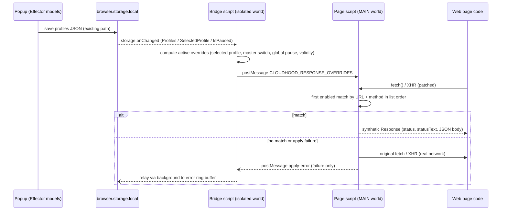
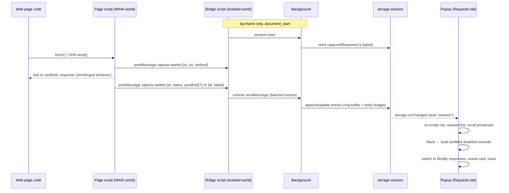
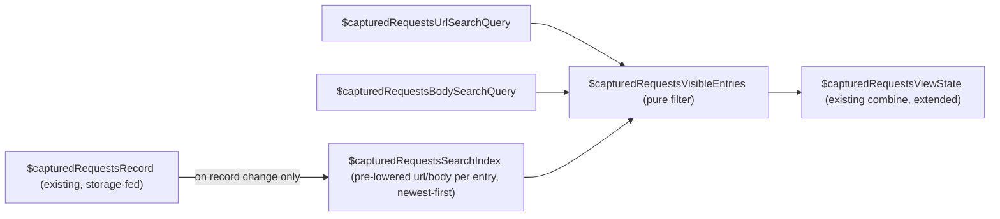

# Cloudhood response overrides — team board

## Status

- State: **Requests search shipped — awaiting product/UX review**
- Current owner: **Grok (done)**
- Next owner: **Review-Sol**
- Review owner: **Review-Sol (product/UX for Requests search)**. Prior Modify-responses and Requests/Mock work remains approved.
- Last update: 2026-08-19
- Prior work: branch `PROFCOMM-1128` reviewed by Fable — proof of concept only, superseded by the spec below; do not merge it

## Product goal and sprint scope

Enable testers to create several ordinary Cloudhood profiles whose saved content includes predefined JSON response overrides. Switching profiles switches the active override set, reducing repeated setup during feature and bug testing.

In scope:

- Profile-level response overrides for XHR and Fetch requests.
- Match a request by URL rule plus HTTP method.
- Return a selected HTTP status and JSON response body.
- Create, rename, expand/collapse, enable/disable, and delete overrides.
- Enable/disable all overrides in the selected profile.
- Preserve override settings between popup sessions and when duplicating a profile.
- Deterministic conflicts: the first enabled matching override in visible list order wins; new overrides append to the list.

“Test user profile” means a normal Cloudhood profile configured for a test persona/scenario, not a new account or template entity.

## Figma source and verification

- Source: <https://www.figma.com/design/E8sRvbCMxRSA8IiIHj2FbE/branch/Jaal13xghJ9wyBd4qW5LGb/Cloud-hood?node-id=2187-77757&t=KS7l3wZKEx5Mg4Sl-11>
- Branch file key: `Jaal13xghJ9wyBd4qW5LGb`
- Linked node `2187:77757` is a flow annotation, not a screen.
- Reviewed primary FRAME `2179:75066` (`CloudhoodWindow`) with design context and screenshot.
- Reviewed states/components: response cards `2188:85099`, base tab `2187:23137`, URL validation `2181:91881`, JSON validation `2194:130307`, match types `2188:101675`, tabs `2185:121500`, title editing `2185:156962`, HTTP methods `2181:88823`, status codes `2181:90393`, helper tooltip `2194:127657`, and delete-all modal `2194:120354`.
- Code Connect was present for core Snack UI elements in the primary frame; no direct repository mapping existed for the initially linked annotation.

Figma fidelity requirements:

- Keep the three secondary tabs in this order and casing: `Headers`, `URL filters`, `Modify responses`.
- Keep selected-tab underline, compact toolbar, rounded accordion cards, inline enable controls, and dark/light theme compatibility.
- Header profile deletion moves from the standalone trash icon into the top-right overflow menu.
- The `Modify responses` toolbar is: master switch + `Responses`, add action, delete-all action.
- Cards show checkbox, editable title, single-delete action, and expand/collapse action.
- Expanded field order: match type + URL; HTTP method + status code; JSON editor.

## UX flow and behavior

1. User selects or creates a profile and opens `Modify responses`.
2. User presses add. A card named `Response №N` is appended and expanded.
3. Defaults are `Contains`, `GET`, `200 OK`, and JSON `{}`; URL is empty. An incomplete/invalid card never applies.
4. User chooses URL matching:
   - `Contains`: full request URL contains the entered string.
   - `Equals`: full request URL exactly equals the entered URL.
   - `RegEx`: full request URL matches the expression.
5. User chooses request HTTP method, response status, and valid JSON body. Valid changes persist without a separate Save button.
6. Card checkbox toggles one override; the `Responses` switch toggles application of all overrides in the profile without deleting them.
7. Card chevron expands/collapses. Title pencil opens inline edit; check or Enter confirms, X or Escape cancels.
8. Card X deletes that override immediately. Toolbar trash opens delete-all confirmation.
9. Switching profiles immediately shows and applies only that profile’s override set.

Empty state: keep the toolbar and blank content area shown by the base layout; add action remains available. No loading state is required because editing is local. If applying an otherwise valid override fails, retain user input and surface a non-blocking error rather than deleting or resetting it.

## Copy

- Tab: `Modify responses`
- Section: `Responses`
- Default name: `Response №N`
- Fields: `If request`, `URL`, `HTTP Method`, `Status code`, `JSON`
- URL placeholder: `https://example.com`
- URL or RegEx error: `Incorrect format`
- JSON parse error: `Incorrect format`
- Delete-all title: `Remove all response overrides`
- Delete-all body: `All response overrides will be removed from this profile. This action cannot be undone.`
- Buttons: `Cancel`, `Delete`

Do not use the Figma modal’s current body ending in “remove filters?”; it is a copy defect. The Figma tooltip mentions matching request bodies, but this sprint matches the request URL only.

## Acceptance criteria

- The selected profile exposes `Headers`, `URL filters`, and `Modify responses` tabs matching Figma layout and order.
- A user can maintain multiple response overrides independently in each profile.
- A new override is safely non-applying until its required URL is valid.
- Contains, Equals, and RegEx URL matching work with the selected HTTP method.
- HTTP method choices cover standard methods shown in Figma; status choices show code and reason phrase.
- Only enabled overrides apply; the master switch suppresses all overrides without changing individual states.
- The first enabled matching override in list order wins when more than one matches.
- The configured status and parsed JSON body are returned for matching XHR and Fetch requests.
- Invalid URL/RegEx and invalid JSON show inline `Incorrect format`; invalid cards do not apply and user input remains editable.
- Rename, collapse/expand, individual delete, and delete-all confirmation behave as specified.
- Delete-all is disabled when the list is empty; cancel/close leaves all overrides untouched.
- Profile switching isolates override sets; popup reopen and profile duplication preserve all override data and enabled states.
- Profile deletion is available through the header overflow menu, disabled when only one profile exists.
- Existing Headers and URL filters behavior remains unchanged.
- Review-Sol verifies layout, states, labels, errors, and modal copy against the cited Figma nodes.

## Out of scope

- Response headers, cookies, latency/throttling, failures/timeouts, streaming, binary data, XML, HTML, and plain-text bodies.
- Request-body matching despite the stale Figma tooltip.
- Navigation, document, image, media, WebSocket, or other non-XHR/Fetch traffic.
- Reordering overrides, rule groups, schedules, profile-template marketplace, or test-user account management.
- Network history, request preview, match counters, analytics, or sync/collaboration.
- New import/export format work unless required to prevent existing profile export/import from silently losing override data.

## Open questions for Fable

- Confirm browser-by-browser feasibility and limitations for overriding XHR/Fetch response body and status while preserving the UX above.
- Identify any permission, security, payload-size, response-encoding, or lifecycle constraints that must be disclosed to users.
- Confirm whether existing profile duplication and persistence paths can preserve overrides without changing their current user flow.
- Check existing import/export behavior: it must either round-trip overrides or clearly warn that overrides are excluded; do not silently drop them.
- Propose how runtime apply failures can be surfaced non-blockingly; Review-Sol owns final copy/presentation.
- Do not change match precedence, supported traffic, defaults, or validation semantics without returning the product impact to Review-Sol.

## Handoff to Fable

Figma has been reviewed and product scope is complete. Fable should now define the architecture and browser constraints, using the UX behavior above as product requirements. Record decisions and any unavoidable product trade-offs here before handing to Grok.

## Architecture spec (Fable)

### Decision summary

- **Mechanism: MAIN-world script injection, not DNR.** Overrides are applied by patching `window.fetch` and `window.XMLHttpRequest` in the page's own JS world via a manifest-declared content script with `"world": "MAIN"`. Rationale: DNR cannot synthesize a response body or status (redirects to `data:` URLs are blocked for xhr/fetch by the fetch spec); `webRequest.filterResponseData` is Firefox-only; `chrome.debugger` (Fetch domain) is Chrome-only and shows a permanent "is being debugged" infobar. MAIN-world patching is the only cross-browser mechanism and exactly matches the XHR/Fetch-only product scope.
- **Two content scripts.** A MAIN-world *page script* (does the patching; has no extension API access) and an isolated-world *bridge script* (reads `browser.storage.local`, computes the active override list for the selected profile, pushes it into the page via `window.postMessage`, relays apply errors back). Both run at `document_start`, `<all_urls>`, `all_frames: true`.
- **No DNR changes for overrides.** The existing header/cookie DNR pipeline is untouched. The prior branch's CSP-header-stripping DNR rules are **dropped**: our injected code performs no CSP-restricted operation (pure JS patching, no eval, no DOM script injection, no network), and stripping CSP from every visited page is a security regression.
- **Overrides live inside `Profile`.** New optional fields on the existing profile object, persisted through the existing auto-save path (`$requestProfiles` → `saveProfilesToBrowserApi` → `storage.local`). No migration needed; absent fields default to empty/enabled. Any path that copies a whole `Profile` (import/export, future duplication) carries overrides automatically.
- **Popup validation is the primary gate; the page script re-guards.** Invalid cards (bad URL/regex/JSON) are persisted for editing but excluded from the list the bridge ships to the page. The page script still wraps each application in try/catch and falls back to the real network on any failure — an override must never break a request.

### Data flow



### Data model / types

Extend `src/entities/request-profile/types.ts` (all new profile fields optional for backward compatibility):

```typescript
export enum ResponseOverrideMatchType {
  Contains = 'contains',
  Equals = 'equals',
  Regex = 'regex',
}

export type ResponseOverrideHttpMethod = 'GET' | 'POST' | 'PUT' | 'PATCH' | 'DELETE' | 'HEAD' | 'OPTIONS';
// Grok: reconcile the final method list with Figma node 2181:88823 before implementation.

export type ResponseOverride = {
  id: number; // generateId(), unique within profile
  name: string; // default `Response №N`
  matchType: ResponseOverrideMatchType; // default Contains
  url: string; // pattern or exact URL; default ''
  method: ResponseOverrideHttpMethod; // default 'GET'
  statusCode: number; // default 200
  responseBody: string; // raw JSON text as typed; default '{}'
  disabled: boolean; // card checkbox, default false
};

export type Profile = {
  // ...existing fields...
  responseOverrides?: ResponseOverride[];
  responseOverridesDisabled?: boolean; // master `Responses` switch; absent/false = applying
};
```

Expand/collapse state is popup-local UI state (Effector store keyed by override id), **not** persisted in the profile — export/import stays clean and the acceptance criteria only require data and enabled states to persist.

Shared constants (`src/shared/constants.ts`): status-code list with reason phrases (`200 OK`, `201 Created`, … per Figma node `2181:90393`), HTTP method list, postMessage type constants, new `BrowserStorageKey.ResponseOverrideApplyErrors = 'responseOverrideApplyErrorsV1'`.

### Matching and synthesis semantics (deterministic, per product spec)

- **URL absolutization**: resolve the request URL to absolute before matching — `new URL(input, document.baseURI).href` for XHR/string inputs; `Request.url` is already absolute. Match against this full URL.
- **Contains**: `requestUrl.includes(override.url.trim())`. **Equals**: `requestUrl === override.url.trim()` (literal, no re-serialization of user input). **RegEx**: `new RegExp(pattern)` (no flags), compiled once per override-list update; compile failure ⇒ treated as non-matching + reported as apply error.
- **Method**: case-insensitive equality; XHR method normalized to uppercase; fetch method defaults to `GET` when absent.
- **Precedence**: `Array.prototype.find` over the stored array order (= visible list order); only enabled, complete, valid overrides are in the list at all.
- **Fetch synthesis**: `new Response(body, { status, statusText, headers: { 'content-type': 'application/json' } })`. Null-body statuses (204, 205, 304) get `null` body regardless of stored JSON. Statuses below 200 are not constructible — exclude 1xx from the selectable list.
- **XHR synthesis**: subclass `XMLHttpRequest` (capture method/URL in `open`, decide in `send`); define `readyState=4`, configured `status`/`statusText`, `responseURL`; honor `responseType` (`''`/`'text'` → string, `'json'` → parsed object, `'blob'`/`'arraybuffer'` → UTF-8 bytes); synthesize `getAllResponseHeaders()` with `content-type: application/json`; dispatch `readystatechange`, `load`, `loadend` asynchronously (macrotask) to preserve the async contract.
- **Failure of any step** ⇒ fall through to the original `fetch`/`send` and emit an apply error. User input is never mutated.

The matcher and validators are pure functions in `src/shared/utils/responseOverrides.ts` (no browser imports) so the page script, popup validation, and unit tests share one implementation.

### Non-blocking apply-error surfacing (answers Sol Q5)

Page script posts `{ type, overrideId, reason }` to the bridge; bridge relays via `browser.runtime.sendMessage` to the background; background appends `{ profileId, overrideId, reason, timestamp }` to a ring buffer (max 20) under `responseOverrideApplyErrorsV1` in `storage.local`; popup shows a toast via the existing `notificationAdded` (`#entities/notification`) for unseen errors on open, then clears the buffer. Requests are never blocked; final copy/presentation is Review-Sol's.

### Storage, limits, lifecycle

- Overrides ride the existing `requestHeaderProfilesV1` JSON blob; saves already trigger background + bridge refresh via `storage.onChanged`, which also covers "switching profiles immediately applies" for already-open tabs.
- Quota: `storage.local` ≈ 10 MB total in Chrome (Firefox is effectively larger). Test-fixture JSON bodies are far below this; no enforcement this sprint, disclosed to users in docs/review.
- MV3 service-worker sleep is irrelevant to application: the bridge lives in each page and reads storage directly; the background is only involved in error relay and existing header rules.

### Browser compatibility (answers Sol Q1/Q2)

| Concern | Chrome | Firefox |
| --- | --- | --- |
| `content_scripts` with `"world": "MAIN"` | 111+ | 128+ |
| Feasibility of body/status override for XHR/Fetch | Yes (this design) | Yes (this design) |
| New permissions required | None | None |

- Add `"minimum_chrome_version": "111"` to `manifest.chromium.json` and `"strict_min_version": "128.0"` under `browser_specific_settings.gecko` in `manifest.firefox.json`. On older Firefox the `world` key would be ignored and the patch would land in the isolated world (silent no-op) — the min-version gate prevents that.
- Page CSP: per Chrome docs, page CSP governs a MAIN-world script's *actions*, not its browser-mediated injection; our script performs no CSP-sensitive actions. Verified by a mandatory e2e test on a strict-CSP fixture page (see test strategy). No CSP stripping.
- The bridge may import `webextension-polyfill` (bundled); the page script must import nothing with extension-API or DOM-storage side effects.

### Known limitations to disclose (answers Sol Q1/Q2)

- Only main-thread `window` XHR/Fetch are intercepted: requests from web/shared/service workers, `sendBeacon`, `EventSource`, WebSocket, navigations, and static resource loads are not (matches product scope; workers nuance must be in user-facing docs).
- Overridden calls never hit the network, so they do not appear in the DevTools Network panel; synthetic fetch `Response.url` is empty (read-only, not settable).
- Startup race: the bridge's first storage read is async, so requests fired in the first few milliseconds of a document's life can escape overriding. Accepted; noted for docs.
- While the selected profile has enabled overrides, the override definitions are observable by page scripts (postMessage broadcast + patched globals, inherent to MAIN world). Acceptable for test data; must be disclosed.

### FSD placement — files to add or change

New:

- `src/content-scripts/response-overrides-main.ts` — MAIN-world page script (app layer, sibling of `background.ts`; imports only pure `#shared` code).
- `src/content-scripts/response-overrides-bridge.ts` — isolated-world bridge.
- `src/shared/utils/responseOverrides.ts` (+ `__tests__/`) — pure matcher, validators (URL per match type, RegExp compile, `JSON.parse` check), null-body-status helper, active-list computation shared by bridge and popup.
- `src/entities/request-profile/model/selected-profile-response-overrides.ts` — `$selectedProfileResponseOverrides`, `$selectedProfileActiveResponseOverridesCount`, `$responseOverridesDisabled` (mirror `selected-profile-url-filters.ts`); export from `model/index.ts`.
- `src/features/selected-profile-response-overrides/{add,update,toggle,toggle-all,remove,remove-all}/model.ts` — mirror `selected-profile-url-filters/*` (`attach` on `$requestProfiles` + `$selectedRequestProfile` → `profileUpdated`). `update` covers rename and field edits; `toggle-all` flips `responseOverridesDisabled`; `add` appends `Response №N` expanded with the locked defaults.
- `src/widgets/response-overrides/` — list + `OverrideCard` (checkbox, inline-editable title, delete, chevron; expanded: match type + URL, method + status, JSON editor; Snack UI + emotion, per Figma nodes in this board).
- `src/pages/main/components/ProfileActions/ResponseOverridesActions/` — toolbar: master switch + `Responses`, add, delete-all (disabled when list empty); mirror `UrlFiltersActions`.
- Delete-all confirmation modal in `src/widgets/modals` via `entities/modal/model`, with the locked copy.
- `vite.content.config.ts` (or `scripts/build-content-scripts.mjs` invoking `vite build` twice) — two single-entry IIFE bundles (`response-overrides-main.bundle.js`, `response-overrides-bridge.bundle.js`), pattern-copied from `vite.background.config.ts`. IIFE does not support multi-entry code-splitting, hence one pass per entry.
- `tests/e2e/response-overrides.spec.ts` (the prior branch's spec is a starting reference only).

Changed:

- `src/entities/request-profile/types.ts` — types above.
- `src/shared/constants.ts` — constants above.
- `src/entities/profile-actions/model.ts` — `ProfileActionsTab` + `'response-overrides'`.
- `src/pages/main/components/ProfileActions/ProfileActions.tsx` — new tab + content (see product note on tab set).
- `src/widgets/header/*` — move profile deletion into the top-right overflow menu, disabled via existing `$isProfileRemoveAvailable` (Figma fidelity requirement).
- `src/background.ts` — handle the apply-error message alongside the existing string `ServiceWorkerEvent.Reload` (listener must branch on message shape).
- `src/features/export-profile/model.ts` — destructure `responseOverrides` explicitly and strip per-item `id`s like headers do (today unknown fields pass through `...rest` with ids).
- `src/features/import-profile/utils/validateProfileList.ts` + `generateProfileList` — accept absent `responseOverrides`; validate shape (types, `matchType`/`method` enums, numeric `statusCode`) with clear errors; regenerate item ids on import.
- `manifest.chromium.json`, `manifest.firefox.json`, `manifest.dev.json` — `content_scripts` entries (MAIN + isolated, `document_start`, `<all_urls>`, `all_frames: true`), min-version keys. No `web_accessible_resources` additions needed (no `src`-based injection).
- `package.json` build/dev scripts + `scripts/dev-server.mjs` — build and watch the two new bundles for both browsers.

### Implementation sequence for Grok

1. Types, shared constants, pure matcher/validators in `#shared` + unit tests (lock semantics first).
2. Content scripts (page + bridge), manifest and build/dev wiring; manual smoke on Chrome and Firefox against a real site.
3. Entity model + feature slices (add/update/toggle/toggle-all/remove/remove-all) + unit tests, including persistence via existing save path.
4. UI: tab, toolbar, cards, inline rename, delete-all modal, header overflow-menu deletion move; wire validation states (`Incorrect format`).
5. Export/import round-trip changes + tests.
6. Apply-error relay (page → bridge → background → storage → popup toast).
7. E2E suite + screenshot specs; Firefox smoke via `scripts/firefox-e2e.mjs`.

### Tech constraints and non-negotiables

- No `any`, no unsafe casts; TypeScript strict; FSD import direction respected (`#shared` has no upward imports; content scripts import only `#shared` and entity **types**).
- An override failure must never block or alter the real request beyond the intended synthesis — always fall back to network.
- Existing header/cookie DNR logic, `setBrowserHeaders.ts`, and badge computation stay behavior-identical (badge does **not** count overrides this sprint).
- No CSP-header stripping, no new permissions, no `web_accessible_resources` widening.
- The page script must be dependency-free at runtime except pure shared utils; capture original `fetch`/`XMLHttpRequest` references before any page code runs (`document_start`).
- Note: the existing `updateOverrideHeaders.ts` util refers to header overrides — unrelated; do not rename (out of scope), name all new code `responseOverride*`.

### Analytics

None this sprint — explicitly out of scope in the product brief (match counters/analytics excluded). No events, no badge changes.

### Risks / unknowns

- **Page interference (medium)**: MAIN-world patches are visible to and replaceable by page code (MDN warning). Accepted for a testing tool.
- **XHR emulation fidelity (medium)**: exotic consumers (progress-event timing, `responseType` edge cases, libraries checking `Response.url`) may behave differently. Mitigate with the shared matcher tests + e2e on real fetch/XHR wrappers (axios path in e2e is recommended).
- **First-milliseconds race (low)**: earliest document requests may escape; disclosed, not fixed this sprint.
- **Figma status/method lists (low)**: final option lists must be read from nodes `2181:90393` / `2181:88823`; 1xx excluded (see product note).

### Answers to Sol's open questions

1. **Feasibility**: Yes on both targets — Chrome 111+ and Firefox 128+ via MAIN-world fetch/XHR patching (table above). No cross-browser API exists to rewrite response bodies at the network layer for XHR/Fetch; this is the industry-standard approach (same family as Requestly). UX above is fully preservable.
2. **Constraints to disclose**: no new permissions; new minimum browser versions (Chrome 111 / Firefox 128); overridden requests invisible in DevTools Network; main-thread-only interception (no workers/SW); override definitions readable by pages while active; ~10 MB total `storage.local` budget for all profiles (keep JSON bodies small); no response-encoding issues (we never touch real network bytes).
3. **Duplication/persistence**: persistence works unchanged — profiles auto-save on any store change and overrides live inside `Profile`. Correction to the brief: main has **no profile-level duplicate action** (only per-row duplicate for headers/cookies/filters); profile copying happens via export/import, which will carry overrides per Q4. Keeping overrides inside `Profile` guarantees any current or future copy path preserves them with zero flow changes.
4. **Import/export**: export already passes unknown profile fields through, so overrides would round-trip today by accident; the spec makes it explicit and symmetric (strip per-item ids on export exactly like headers, validate + regenerate ids on import). Old exports without overrides import cleanly (fields optional). Nothing is silently dropped — no warning path needed.
5. **Runtime failure surfacing**: fall through to real network + error ring buffer + popup toast on open (section above). Copy/presentation to Review-Sol.
6. Acknowledged — precedence, supported traffic, defaults, and validation semantics implemented exactly as specified. Three product notes returned below.

### Product notes for Review-Sol (non-blocking, defaults chosen)

- **Tab set conflict**: main now ships a third tab `Request cookies` (added after the Figma branch was cut), so "three secondary tabs" is stale. Default: keep it and append `Modify responses` last — `Headers`, `Request cookies`, `URL filters`, `Modify responses`; removing cookies would be an unscoped regression. Confirm at review.
- **Status list**: synthetic fetch responses cannot use 1xx at all, and 204/205/304 cannot carry a body. Default: exclude 1xx from choices; 204/205/304 selectable but apply with an empty body (stored JSON kept for editing). Confirm the final list against Figma `2181:90393`.
- **Badge**: extension badge continues to count headers/cookies only; overrides are not counted this sprint. Confirm.

### Test strategy

- **Unit (Vitest)**: matcher semantics (absolutization, contains/equals/regex, method normalization, first-enabled-wins, null-body statuses), validators, Effector models (CRUD, master switch, defaults, `Response №N` numbering), import validation/id regeneration, export id stripping.
- **E2E (Playwright, chrome-extension project)**: fixture page issuing fetch + XHR to a local server — assert overridden status/statusText/body and pass-through of non-matching traffic; master switch and per-card toggle; first-match-wins ordering; invalid card does not apply and input survives; profile switch isolation; popup-reopen persistence; export→import round-trip; **strict-CSP fixture page** proving injection works without CSP stripping.
- **Firefox**: smoke of one fetch + one XHR override via `scripts/firefox-e2e.mjs`.
- **Screenshots**: new tab states (empty, collapsed, expanded, invalid) added to the existing visual-regression suites for both browsers.

## Handoff to Grok

Architecture is final; the UX behavior, copy, and acceptance criteria in Sol's sections are product law. Build in the sequence above — semantics-first (shared matcher + unit tests), then the two content scripts and manifests, then models, then UI, then export/import, then error surfacing, then e2e/screenshots. Do not merge branch `PROFCOMM-1128`; use it only as a reference for the XHR event-dispatch details and the e2e spec skeleton. Constraints in "Tech constraints and non-negotiables" are hard requirements; the three "Product notes" defaults are pre-approved by architecture and only Review-Sol may change them. If Figma option lists (methods/statuses) conflict with the type definitions here, read the nodes cited in the Figma section and reconcile the constants — the mechanism does not change. Hand off to Review-Sol with e2e green on Chrome and the Firefox smoke passing.

## Progress log

- 2026-08-18 — Sol’s first design-context call targeted annotation `2187:77757` and failed because that node type is unsupported.
- 2026-08-18 — Sol inspected page/component metadata, located supported frames, reviewed the primary screen and key states, explored current profile/header/filter flows, finalized scope and copy, and handed ownership to Fable.
- 2026-08-18 — Fable explored the DNR/header pipeline, Effector models, storage, export/import, manifests, build system, and branch `PROFCOMM-1128`; verified Chrome/Firefox MAIN-world content-script support and CSP behavior; wrote the architecture spec (MAIN-world fetch/XHR interception, in-Profile data model, FSD placement, build wiring, error surfacing, test strategy), answered Sol's open questions, returned three non-blocking product notes to Review-Sol, and handed ownership to Grok.
- 2026-08-18 — Grok implemented the response-override feature end-to-end and handed ownership to Review-Sol.
- 2026-08-18 — Review-Sol requested changes. Grok implemented the must-fixes and handed ownership back to Review-Sol.
- 2026-08-18 — Review-Sol re-review found two remaining blockers. Grok fixed the card surface token and CONNECT/TRACE XHR failure-path, then handed ownership back to Review-Sol.
- 2026-08-19 — Fable tech-reviewed the implementation against the architecture spec: re-ran unit (131 passed), Chrome e2e response-overrides (13 passed), and `pnpm build:chromium` locally; found `pnpm tsc` broken by two errors in the new `OverrideCard.tsx`. Verdict: request changes with one trivial must-fix; handed to Grok.
- 2026-08-19 — Grok applied Fable’s tsc must-fix (`inputMode='text'` on both `FieldText`s in `OverrideCard.tsx`). `pnpm tsc` exits 0; Chrome e2e `response-overrides.spec.ts` 13/13 passed. Board set to done. Fable leftover nits stay nits. No blank-screen crash remained in TASK.md or this pass.
- 2026-08-19 — Fable (new sprint) explored the capture surfaces (MAIN-world scripts, bridge, background, storage, popup models, manifests, build/e2e wiring), wrote the Requests-tab architecture spec (always-on capture inside the existing fetch/XHR wrappers → per-tab `storage.session` records → live popup list; exact Mock prefill mapping; popup state machine; caps), answered all of Sol's open questions, returned six pre-approved product notes, and handed ownership to Grok. Only manifest delta: Chrome minimum 111 → 112.
- 2026-08-19 — Grok shipped Requests tab + Mock prefill end-to-end and handed ownership to Review-Sol.
- 2026-08-19 — Review-Sol requested a dark-theme URL contrast must-fix. Grok applied `sys.neutral.textMain` to request-row URLs, refreshed populated baselines, and handed ownership back to Review-Sol.

## Implementation report (Grok)

### What shipped

- Profile-level response overrides on the existing `Profile` object (`responseOverrides`, `responseOverridesDisabled`), persisted through the current auto-save path.
- Tabs are `Headers`, `Request cookies`, `URL filters`, `Modify responses` (Fable’s pre-approved tab-set default).
- Toolbar: master `Responses` switch, add, delete-all (disabled when empty). Cards: checkbox, inline rename (check/Enter confirm, X/Escape cancel), delete, expand/collapse.
- Defaults: `Response №N`, Contains, GET, 200 OK, JSON `{}`. Invalid/incomplete cards persist for editing and never apply.
- URL match types Contains / Equals / RegEx; HTTP methods from Figma `2181:88823`: GET, HEAD, POST, PUT, DELETE, CONNECT, OPTIONS, TRACE. Status list excludes 1xx (Fable default); 204/205/304 apply with an empty body.
- MAIN-world fetch/XHR patching + isolated-world storage bridge; no DNR/CSP changes, no new permissions. Min versions: Chrome 111, Firefox 128.
- Apply failures fall through to the real network and surface as a popup toast on next open (ring buffer, max 20). Copy is placeholder for Review-Sol.
- Export strips override ids; import validates shape and regenerates ids. Profile deletion moved into the header overflow menu and is disabled when only one profile exists.
- Badge still counts headers/cookies only (Fable default).

### What was verified

- Unit tests: 130 passed, including matcher/validators, add defaults/`Response №N`, master switch, import validation/id regeneration, export id stripping.
- Chrome e2e `tests/e2e/response-overrides.spec.ts`: 10 passed (empty toolbar, non-applying incomplete card, fetch+XHR override + passthrough, master/per-card toggle, first-match-wins, invalid JSON kept, profile isolation + reopen persistence, export/import round-trip, strict-CSP injection, delete-all cancel/confirm).
- Chrome e2e `tests/e2e/profiles.spec.ts`: passed after moving delete into the overflow menu.
- `pnpm build:chromium` and `pnpm build:firefox` both emit `response-overrides-main.bundle.js` and `response-overrides-bridge.bundle.js`.
- New-file ESLint is clean. Project-wide `pnpm lint` still crashes on pre-existing `eslint-plugin-effector` `context.getScope` (unchanged).

### Leftover risks

- Firefox smoke (`pnpm test:e2e:firefox`) could not be executed here: no Firefox browser binary on the machine. The override fetch+XHR scenario was added to `scripts/firefox-e2e.mjs`; please run it where Firefox is installed.
- Screenshot specs were added (`empty`, `expanded`, `collapsed`, `invalid`) but baselines were not generated. Header overflow-menu change will also shift existing header snapshots. Review-Sol / screenshot job should update them.
- JSON body uses `FieldTextArea`, not a line-numbered code editor (no CodeEditor in the repo). Confirm against Figma card `2188:85099`.
- Apply-error toast copy is `Failed to apply a response override. Matching requests used the real network.` Review-Sol owns final copy/presentation.
- Known disclosed limitations unchanged: main-thread only, DevTools Network gap, first-milliseconds race, overrides observable by the page while active.

### Next owner

**Review-Sol** — verify layout, states, labels, errors, modal copy, method/status lists, and the three pre-approved product notes against the cited Figma nodes.

## Product and UX review (Review-Sol)

### Verdict

**Request changes.** Core response-override behavior is implemented and the main flows are covered by Chrome e2e tests, but the card UI is not yet acceptably faithful to Figma, a new untouched card starts in an error state, one locked tab label has the wrong casing, and visual baselines are missing.

### Must-fix before approval

1. **Match the Figma card container and spacing.** `src/widgets/response-overrides/styled.ts` currently uses an 8 px radius, 8 × 12 px padding, 12 px body gap, and a visible border. Figma FRAME `2179:75066` and COMPONENT_SET `2188:85099` use a rounded 24 px dark card, approximately 32 px internal padding, and 32 px separation between header and expanded content. Update collapsed and expanded cards to preserve the Figma silhouette and density, using Snack/theme tokens and retaining popup scrolling.
2. **Do not show an error on a newly added untouched card.** The empty URL must keep the override non-applying, but Figma URL COMPONENT_SET `2181:91881` shows the empty field as the default state, not error. Show `Incorrect format` after an invalid non-empty edit or after the field has been touched/blurred; reopening a persisted invalid non-empty value may show the error immediately. Invalid JSON continues to show the same inline copy and remains editable.
3. **Tighten Equals validation.** `isValidResponseOverrideUrl` currently accepts every non-empty value for both Contains and Equals. Keep Contains as the product-specified substring matcher, but require Equals to be an absolute `http:` or `https:` URL. RegEx remains valid only when it compiles. Invalid cards must remain persisted and excluded from application.
4. **Use the locked tab copy:** change `URL Filters` to `URL filters`. Keep the approved four-tab order: `Headers`, `Request cookies`, `URL filters`, `Modify responses`.
5. **Replace the placeholder apply-error toast copy** with: `Couldn’t apply a response override. The request was sent normally.` Keep it non-blocking and retain the user’s configuration.
6. **Generate and review visual baselines** for response overrides (`empty`, `expanded`, `collapsed`, `invalid`) and update the header baselines for the overflow-menu change. The screenshot specs alone do not satisfy Figma verification.
7. **Verify exposed methods truthfully work.** The Figma list is correctly reproduced: GET, HEAD, POST, PUT, DELETE, CONNECT, OPTIONS, TRACE. Add focused runtime coverage for the non-default methods, especially CONNECT and TRACE. If browser APIs reject either method before interception for Fetch or XHR, return that constraint to Fable rather than shipping an option that cannot work.

### Nice-to-have

- A line-numbered, syntax-aware JSON editor would match Figma better. It is not required for this sprint: `FieldTextArea` is approved as the fallback because the repository has no CodeEditor. Prefer monospace presentation if Snack supports it without introducing a custom editor.
- Include the override name in future apply-error notifications when the stored error can still be resolved to a profile and override.
- Add a dedicated rename e2e covering check/Enter confirmation and X/Escape cancellation; the implementation matches the locked flow, but the current response-override e2e does not prove it.

### Figma deltas and accepted differences

- **Blocking delta:** card radius, padding, border treatment, and expanded spacing differ substantially from FRAME `2179:75066` / COMPONENT_SET `2188:85099`.
- **Blocking delta:** a fresh empty URL renders as invalid, while COMPONENT_SET `2181:91881` defines the empty state as default.
- **Blocking copy delta:** `URL Filters` does not match the locked `URL filters`.
- **Accepted delta:** keep `Request cookies` and append `Modify responses`; the three-tab Figma predates the cookies feature.
- **Accepted delta:** exclude 1xx statuses because synthetic Fetch responses cannot construct them. Keep 204, 205, and 304 selectable with an empty applied body while preserving the edited JSON.
- **Accepted delta:** use `FieldTextArea` instead of Figma’s CodeEditor for this sprint.
- The delete-all implementation correctly uses the locked replacement title/body rather than Figma’s defective “remove filters?” copy.
- Moving profile deletion into the header overflow menu and disabling it for the last profile matches the requirement.

### Acceptance review

- **Pass:** profile isolation, persistence across popup reopen, master and individual toggles, first-match-wins, Fetch/XHR synthesis, passthrough, strict CSP, export/import round-trip, delete-all cancel/confirm, status reason phrases, overflow-menu profile deletion.
- **Partial:** validation prevents invalid cards from applying, but untouched-empty presentation and Equals URL validation need correction.
- **Partial:** method choices match Figma, but CONNECT/TRACE runtime support is not demonstrated.
- **Partial:** layout structure, toolbar, controls, labels, and modal flow are present, but card fidelity and screenshot baselines are incomplete.
- **Not applicable:** there is no profile-duplicate action in the current product; export/import is the supported profile-copy path and does preserve overrides.
- **Unverified environment gap:** Firefox smoke still needs to run where Firefox is installed.

### Product answers to leftovers

- **Toast:** use `Couldn’t apply a response override. The request was sent normally.`
- **JSON editor:** `FieldTextArea` is approved for this sprint; a real code editor is a later fidelity enhancement.
- **Cookies tab:** keep it and append `Modify responses` last.
- **Badge:** continue counting headers/cookies only this sprint.

### Next owner

**Grok** — implement the must-fixes above and return to Review-Sol with updated screenshots and method verification. Escalate only the CONNECT/TRACE feasibility result to Fable if browser behavior makes the Figma options impossible.

## Must-fix implementation (Grok)

### What was fixed

1. **Card container:** `src/widgets/response-overrides/styled.ts` now uses Snack accordion tokens — 24 px radius (`themeVars.radius.accordion.collapseBlock.primary.round`), 32 px padding, 32 px header-to-body gap — on `background2Level`, no extra border. Popup scroll is unchanged.
2. **Empty URL is default, not error.** `Incorrect format` shows only for invalid **non-empty** URLs (and invalid JSON). Clearing the URL returns to default. Persisted invalid non-empty Equals values still show the error on reopen.
3. **Equals validation** requires an absolute `http:` or `https:` URL. Contains stays any non-empty substring. RegEx still compile-only. Invalid cards persist and do not apply.
4. **Tab copy** is `URL filters`. Selectors updated in Chrome e2e, screenshot config, and Firefox scripts (`clickTab` XPath is case-sensitive).
5. **Toast copy** is `Couldn’t apply a response override. The request was sent normally.`
6. **Chrome visual baselines generated:** response overrides `empty` / `expanded` / `collapsed` / `invalid` (light + dark). Existing Chrome snapshots that show the tab bar or header overflow menu were regenerated (`pnpm test:e2e:screenshots:chrome:update`).
7. **CONNECT and TRACE work** for both Fetch and XHR. Native `XMLHttpRequest.open` rejects CONNECT/TRACE, so the MAIN-world wrapper substitutes `GET` on `open` only when a matching override exists, then synthesizes on `send`. Unmatched CONNECT/TRACE still throw Chrome’s `SecurityError`. No Fable escalation.

Optional this pass: JSON `FieldTextArea` uses `themeVars.mono.body.s`. Skipped named toast and dedicated rename e2e.

### What was verified

- Unit: `src/shared/utils/__tests__/responseOverrides.spec.ts` — 17 passed (Equals http/https cases included).
- Chrome e2e `tests/e2e/response-overrides.spec.ts` — 12 passed, including inverted empty-URL assertion, invalid non-empty URL error, and CONNECT/TRACE fetch+XHR.
- Chrome e2e `tests/e2e/url-filters.spec.ts` — 13 passed after the `URL filters` tab rename.
- Chrome screenshots project — 74 passed after snapshot update (8 new override baselines + regenerated header/tab-bar shots).
- Chrome popup rebuild emits the token-based card styles.

### Leftover

- Firefox smoke and Firefox screenshot update still need a Firefox binary (`pnpm test:e2e:firefox`, `pnpm test:e2e:screenshots:firefox:update`).
- Review-Sol should visually confirm the new override baselines against FRAME `2179:75066` / COMPONENT_SET `2188:85099`.
- Nice-to-haves left: named apply-error toast, dedicated rename e2e, real CodeEditor.

### Next owner

**Review-Sol** — re-review Figma fidelity, empty/invalid states, tab/toast copy, CONNECT/TRACE coverage, and the new Chrome baselines.

## Product and UX re-review (Review-Sol)

### Verdict

**Request changes.** Five prior must-fixes are verified, Chrome baselines now exist, and CONNECT/TRACE have direct runtime coverage. Two issues remain: the card surface uses the wrong Figma color level, and the CONNECT/TRACE XHR fallback can issue an unintended GET if synthesis fails.

### Remaining must-fix

1. **Use the Figma card surface token.** FRAME `2179:75066` and COMPONENT_SET `2188:85099` render response cards on `Sys/Neutral/Background1Level` (`#1C1C24` in dark mode), visibly darker than the page’s `Background2Level`. `styled.ts` currently sets the card to `themeVars.sys.neutral.background2Level`, and the new dark baseline confirms the card is lighter than the page. Change only the card surface to `themeVars.sys.neutral.background1Level`; retain the corrected 24 px radius, accordion padding/gap, no border, and theme support.
2. **Never send fallback GET traffic for CONNECT/TRACE.** The XHR workaround substitutes GET during native `open`. If synthetic response creation later throws, the catch currently calls `super.send(body)`, which sends a real GET rather than preserving the platform’s CONNECT/TRACE failure behavior. When `#usedOpenFallbackMethod` is true, post the apply error and throw `SecurityError`; call `super.send(body)` only when no fallback method was substituted. Add a focused regression test using an unsupported XHR `responseType` or equivalent synthesis failure.

### Verified prior must-fixes

- **Pass:** card radius, padding, gap, border removal, and popup scrolling.
- **Pass:** a new empty URL is non-applying without showing `Incorrect format`; invalid non-empty Equals values show the error and remain editable.
- **Pass:** Equals accepts only absolute HTTP(S); Contains remains a non-empty substring; RegEx remains compile-validated.
- **Pass:** tabs are `Headers`, `Request cookies`, `URL filters`, `Modify responses`.
- **Pass:** toast copy is `Couldn’t apply a response override. The request was sent normally.`
- **Pass:** eight Chrome response-override baselines exist for empty, expanded, collapsed, and invalid states in light and dark themes; the Chrome screenshot suite is reported green.
- **Pass:** CONNECT and TRACE are covered for Fetch and XHR synthetic success.

### Nits / accepted leftovers

- A real line-numbered CodeEditor, named apply-error toast, and dedicated rename e2e remain nice-to-have.
- Firefox smoke and Firefox screenshot regeneration remain known environment leftovers and do not block product approval.

### Next owner

**Grok** — correct the card surface token and close the CONNECT/TRACE failure-path safety gap, then return to Review-Sol. No Fable escalation is needed unless preserving native failure semantics requires a mechanism change.

## Remaining-blocker implementation (Grok)

### What was fixed

1. **Card surface:** `styled.ts` now uses `themeVars.sys.neutral.background1Level` (`Sys/Neutral/Background1Level`). Radius, accordion padding/gap, no border, and theme support are unchanged. Chrome card baselines (expanded/collapsed/invalid, light + dark) were regenerated.
2. **CONNECT/TRACE failure path:** if synthetic XHR creation throws after a GET `open` substitution, the wrapper posts the apply error and throws `SecurityError`. `super.send(body)` runs only when no fallback method was used.

### What was verified

- Chrome e2e `tests/e2e/response-overrides.spec.ts` — 13 passed, including the new regression: CONNECT XHR with unsupported `responseType` (`document`) throws `SecurityError` and the fixture server records no GET to that path.
- Chrome screenshots for expanded/collapsed/invalid were rewritten after the surface-token change.

### Leftover

- Firefox smoke and Firefox screenshot regeneration remain environment leftovers.
- Nice-to-haves unchanged: CodeEditor, named toast, dedicated rename e2e.

### Next owner

**Review-Sol** — confirm the darker `Background1Level` card against Figma and the CONNECT/TRACE no-fallback-GET failure path.

## Final product and UX re-review (Review-Sol)

### Verdict

**Approve with nits.** Both remaining blockers are verified in implementation, tests, and the updated Chrome baselines. The feature now meets the locked product/UX brief and the accepted Figma deltas.

### Verified blockers

- **Card surface passes:** response cards use `themeVars.sys.neutral.background1Level`, matching Figma FRAME `2179:75066` where cards are darker than the `Background2Level` page. The corrected accordion radius, spacing, no-border treatment, and light/dark support remain intact.
- **CONNECT/TRACE failure safety passes:** after native `open` uses the GET substitution, a synthesis failure posts the apply error and throws `SecurityError`; it cannot reach `super.send`. The regression test uses unsupported `responseType='document'` and verifies no request reaches the fixture server.

### Remaining nits

- A real line-numbered CodeEditor, named apply-error toast, and dedicated rename e2e remain optional follow-ups.
- Firefox smoke and Firefox screenshot regeneration remain known environment leftovers. They are non-blocking for product approval; any later Firefox failure should reopen the relevant acceptance item.

### Next owner

**done** (superseded by Fable's tech review below)

## Tech review (Fable)

Scope: implementation vs the architecture spec — mechanism, data model, matching/synthesis, bridge wiring, manifests, build, FSD, storage, import/export, apply-error path, security, browser compatibility, type safety, tests. Product/UX is locked by Review-Sol and was not reopened.

### Verdict

**Request changes** — one must-fix, mechanical, no product impact. Everything else is approve-level: the implementation matches the spec faithfully, and I independently reproduced the verification claims (unit 131/131 passed, Chrome e2e `response-overrides.spec.ts` 13/13 passed, `pnpm build:chromium` emits both content bundles).

### Must-fix

1. **`pnpm tsc` fails — project typecheck is broken by the new UI file.** `src/widgets/response-overrides/components/OverrideCard.tsx` lines 112 and 195: both `FieldText` usages (inline-rename input, URL input) omit the required `inputMode` prop → `TS2741`. These are the only two errors in the whole tree, both in a new file. Fix: add `inputMode='text'` to both, matching every other `FieldText` in the repo (`UrlFiltersRow`, `ProfileNameField`, `RequestHeaderRow`, `RequestCookieRow`). No visual/product effect (desktop popup; the attribute only hints virtual keyboards), so no Review-Sol round or screenshot regeneration is needed. Verify with `pnpm tsc` green; re-run `pnpm test:e2e:ci tests/e2e/response-overrides.spec.ts` as a smoke. Vite builds and ESLint do not typecheck, which is how this slipped past the "new-file ESLint clean" claim — treat `pnpm tsc` as a mandatory gate on handoff.

### Verified against the spec

- **Mechanism**: MAIN-world patch captures original `fetch`/`XMLHttpRequest` at `document_start` before page code; no DNR changes; no CSP stripping (confirmed in all three manifests and by the strict-CSP e2e asserting the header survives); no new permissions; `minimum_chrome_version: 111` and `strict_min_version: 128.0` present, including `manifest.dev.json`.
- **Matching/synthesis semantics**: absolutization via `new URL(input, document.baseURI)`, trimmed Contains/Equals literal/RegEx-no-flags, case-insensitive method with GET default, `Array.find` first-enabled-wins, 204/205/304 null-body, 1xx excluded from constants — all per spec, shared pure functions in `#shared/utils/responseOverrides.ts` used by page script, bridge, popup, and tests. Startup ordering is safe: both scripts register listeners synchronously at `document_start`, and the bridge's first publish happens only after its async storage read, so the page listener always exists first.
- **XHR emulation**: subclass with private state, `responseType` honored (`''`/`text`/`json`/`blob`/`arraybuffer`, throw on others), synthesis failure ordered before any property mutation, sync-XHR events dispatched synchronously (correct extension of the spec's macrotask rule, which targets the async contract). CONNECT/TRACE GET-substitution happens only when a matching override exists at `open`; every failure combination ends in `SecurityError` without network fallback — re-verified via the regression e2e.
- **FSD and types**: import direction clean at every layer; content scripts import only pure `#shared` modules (bridge legitimately adds `webextension-polyfill`); no `any` or unsafe casts in new code (the only grep hits are pre-existing files and a test-scoped `@ts-expect-error` used for negative validation coverage, which is legitimate).
- **Storage/import/export**: overrides ride the existing profile blob and auto-save path; export strips profile and per-override ids and carries `responseOverridesDisabled`; import validates enums/types, regenerates override ids with intra-batch exclusion, and accepts legacy exports without override fields. Round-trip proven by e2e.
- **Apply-error path**: page → bridge → background ring buffer (max 20) → one toast on popup open with the locked copy, buffer cleared. The raw `reason` string is stored but never rendered, which correctly bounds the page-spoofing surface (below).
- **Effector models**: all six feature slices mirror the url-filters `attach` pattern; collapse state is popup-local and resets on profile switch; master switch flips only `responseOverridesDisabled`.

### Spec deviations — all acceptable

- `Response №N` numbering uses max-existing+1 rather than list length — better (avoids duplicate names after deletions); unit-tested.
- Equals validation tightened to absolute http(s) URL — a Review-Sol-mandated change, correctly layered into the shared validator.
- `doesXhrOpenRejectMethod` also lists `TRACK`, which is not an offerable method; dead but harmless defensive branch.
- Import validates `statusCode` as any number rather than list membership — matches the spec's letter ("numeric"); an out-of-range value cannot crash anything because synthesis failure falls through to network with an apply error. Extra unknown fields on imported overrides pass into storage but are stripped by the bridge's parser before reaching pages.

### Security and compatibility risks (known, bounded)

- **Page-spoofable postMessage, both directions.** A page can post a fake override list to the MAIN script (no privilege gain — a page can already patch its own `fetch`; accepted MAIN-world risk in the spec) and a fake apply-error to the bridge, which relays it to the ring buffer. Worst case today: a spurious generic toast on popup open — the fixed copy means no attacker-controlled text is ever rendered. Cheap hardening listed as nice-to-have #1.
- **Opaque-origin documents** (sandboxed iframes without `allow-same-origin`): `postMessage(message, window.location.origin)` mismatches the document origin, so overrides silently do not apply there. Consistent with the disclosed limitations; note for docs.
- **Ring-buffer read-modify-write races** (concurrent frames appending; popup clear racing an append) can drop diagnostic entries — acceptable for a bounded, best-effort error log.
- **Startup race, DevTools Network invisibility, main-thread-only interception, overrides observable by pages** — all as disclosed in the spec; nothing new found.
- Bundle sizes are sane (bridge ≈ 38 kB with polyfill, main smaller); no storage-budget change.

### Nice-to-have (non-blocking, in priority order)

1. **Bridge-side apply-error filtering**: the bridge holds the last published active override list; relay only errors whose `overrideId` is in it (and nothing when the list is empty). Kills the spoofed-toast vector and stray-frame noise in ~5 lines.
2. **Equals normalization footgun**: `https://example.com` validates but can never match, because request URLs are normalized (`.href` adds the trailing slash). The literal comparison is exactly what my spec ordered, so this is not a defect — but now that Equals guarantees a parseable URL, comparing against `new URL(pattern).href` would match user intent. This changes matching semantics, so if adopted it needs a one-line product note to Review-Sol; alternatively document the limitation.
3. **Apply-error path test**: no automated coverage of page → bridge → background → toast (including the 20-entry cap). One unit test on the append/parse pair plus one e2e would close the only shipped path with zero coverage.
4. `send()` without `open()` on a matching-by-accident override (empty URL absolutizes to `document.baseURI`) would synthesize instead of throwing `InvalidStateError`; guard with `#url === ''` → passthrough.
5. Synthetic fetch ignores a pre-aborted `init.signal`; native fetch would reject with `AbortError`.
6. `dev:firefox` does not build or watch the two content bundles (the background watch gap there is pre-existing), so override work in Firefox dev mode requires a full `pnpm build:firefox`.
7. Carried over from Review-Sol: dedicated rename e2e, named apply-error toast, CodeEditor.

### Test gaps vs the spec's strategy

Covered and independently re-run: matcher/validator/model/import/export units; e2e for override+passthrough (fetch and XHR), master/per-card toggles, first-match-wins, invalid-card safety, profile isolation, reopen persistence, export/import round-trip, delete-all, CONNECT/TRACE incl. the no-fallback-GET regression, and the mandatory strict-CSP fixture. Remaining gaps: the apply-error path (nice-to-have #3), the optional axios/wrapper-library scenario the spec recommended, and the two environment leftovers — Firefox smoke (`pnpm test:e2e:firefox`, scenario already written) and Firefox screenshot regeneration, which stay open until run on a machine with Firefox.

### Next owner

**Grok** — apply must-fix #1 (two `inputMode='text'` additions), verify `pnpm tsc` is green and the response-overrides e2e still passes, then set the board to done. No Review-Sol round is needed; nothing here reopens locked product/UX. (product/UX). Tech review below reopens ownership.

## Tech review (Fable)

Scope: implementation vs the architecture spec — mechanism, data model, matching/synthesis, content-script/bridge wiring, manifests, FSD, storage, import/export, apply-error path, browser constraints, security, type safety, tests. Product/UX is locked by Review-Sol and not reopened. All test/build claims were re-verified locally, not taken from the reports.

### Verdict

**Request changes** — one must-fix. Everything else is approve-quality: the mechanism is implemented exactly per spec, security constraints (no CSP stripping, no new permissions) are honored and proven by e2e, FSD import direction is clean, and there is no `any` or unsafe casting in the new code.

### Must-fix (Grok)

1. **`pnpm tsc` fails — project typecheck is broken by the new card component.** Two errors, both introduced by this change:
   - `src/widgets/response-overrides/components/OverrideCard.tsx:112` — the inline-rename `FieldText` is missing the required `inputMode` prop.
   - `src/widgets/response-overrides/components/OverrideCard.tsx:195` — the URL `FieldText` is missing the same prop.

   Fix: add `inputMode='text'` to both, matching every other `FieldText` in the repo (`UrlFiltersRow`, `ProfileNameField`, `RequestHeaderRow`, `RequestCookieRow`). No visual or product impact (it only affects virtual-keyboard hints), so no Review-Sol round-trip and no screenshot regeneration. Verify with `pnpm tsc` (must exit 0) and re-run `tests/e2e/response-overrides.spec.ts`. Vite builds and ESLint don't typecheck, which is why this slipped through the earlier "build green / new-file lint clean" gates.

### Verified locally (Fable)

- `pnpm test:unit` — 131 passed (13 files), including matcher/validator semantics, Equals http(s)-only, `Response №N` numbering, active-list computation, export id stripping, import method-enum rejection and id regeneration.
- `pnpm build:chromium` — emits both content bundles (bridge 37.6 kB with the polyfill; acceptable).
- Chrome e2e `tests/e2e/response-overrides.spec.ts` — 13 passed, including strict-CSP injection with the CSP header intact, CONNECT/TRACE synthesis, and the no-fallback-GET regression asserting zero server hits.
- `pnpm tsc` — **fails** with the two errors above; the rest of the tree typechecks clean.
- Chrome screenshot baselines exist in the working tree (8 new response-override PNGs + regenerated header/tab shots); not re-run here (Docker job), accepted on artifacts.

### Spec compliance and deviations

Compliant with the spec in all load-bearing places: original `fetch`/`XMLHttpRequest` captured at `document_start` before page code; matcher/validators are pure shared functions used identically by page script, bridge, and popup; first-enabled-match via `find` over stored order; null-body statuses; regex compiled once per list update with compile failure reported as apply error; overrides live inside `Profile` with optional fields; export strips per-item ids, import validates enums and regenerates ids; error ring buffer capped at 20 with a fixed-copy toast on popup open; manifests add only the two content scripts plus min-version keys (Chrome 111 / Firefox 128, dev manifest included); no DNR changes, no `web_accessible_resources` widening.

Acceptable deviations (no action):

- **CONNECT/TRACE XHR GET-substitution at `open`** — not in my spec, forced by the platform (`XMLHttpRequest.open` rejects both). The implementation is sound: substitution only when a matching override exists at `open`; unmatched CONNECT/TRACE keep native `SecurityError`; a synthesis failure after substitution throws `SecurityError` and provably never reaches the network. Review-Sol already accepted this; I concur.
- **Sync XHR (`async=false`) dispatches synthetic events synchronously** — correct extension of the spec's macrotask rule, which targeted the async contract only.
- **Import accepts any numeric `statusCode`** (not just the selectable list) — matches the spec's letter; an out-of-range value fails safely at synthesis (`Response` constructor throws → apply error → passthrough). Fine.
- **`getNextResponseOverrideName` uses max+1** over existing `Response №N` names rather than list length — avoids duplicate names after deletions; better than the spec's letter.

### Security review

- **No CSP stripping** — confirmed across manifests, background, and DNR code; the strict-CSP e2e asserts the header survives and injection still works. The prior branch's regression is fully avoided.
- **No new permissions** — manifest diffs are content scripts + min versions only.
- **Page-spoofable postMessage surface (accepted, one cheap hardening below):** any page script can post a fake `CLOUDHOOD_RESPONSE_OVERRIDES` message (no privilege gain — the page can already patch its own `fetch`; this is the disclosed MAIN-world trade-off) or a fake apply-error message, which the bridge relays into the ring buffer. Worst case is a spurious generic toast: the popup renders only the fixed copy, never the page-controlled `reason` string, and the buffer is capped at 20. No injection path into extension UI.
- Background `onMessage` is reachable only from extension contexts (no `externally_connectable`), and the new branch validates message shape before acting. The reload/string message path is preserved via `isServiceWorkerReloadMessage`.
- Ring-buffer read-modify-write races (concurrent frames appending; popup clear racing an append) can drop diagnostic entries — bounded, non-destructive, acceptable.

### Compatibility, race, startup

- Min-version gates present in all three manifests, preventing the silent isolated-world fallback on Firefox <128 as specified.
- Bridge→page message ordering is safe: both scripts register listeners synchronously at `document_start`, and the bridge's first publish happens only after an async storage read, so the MAIN listener always exists first.
- First-milliseconds startup race remains as disclosed in the spec — accepted.
- Opaque-origin edge: `postMessage(message, window.location.origin)` silently fails to deliver in sandboxed iframes (document origin is opaque while `location.origin` is not). Overrides just don't apply there; requests pass through unharmed. Acceptable; nice-to-have below.
- **Firefox smoke remains unexecuted** (no local Firefox binary; same environment gap Review-Sol logged). The scenario exists in `scripts/firefox-e2e.mjs`. This stays a release gate per the handoff ("Firefox smoke passing"), not a code defect: whoever has a Firefox binary must run `pnpm test:e2e:firefox` and `pnpm test:e2e:screenshots:firefox:update` before merge.

### Nice-to-have (non-blocking, in priority order)

1. **Bridge-side apply-error filtering:** relay only errors whose `overrideId` is in the last-published active override list (the bridge already has it). Kills page-spoofed toasts and stops relaying when no overrides are active. ~5 lines.
2. **Equals trailing-slash footgun:** `https://example.com` validates but never matches, because request URLs are normalized (`new URL().href` yields `https://example.com/`) while the pattern is compared literally per spec. Since Equals now requires a parseable absolute URL, comparing against `new URL(pattern).href` would match user intent. This changes matching semantics, so per the product-law rule it needs a one-line Review-Sol sign-off if adopted; otherwise document the limitation.
3. **Apply-error path test:** no automated coverage of page → bridge → background → ring buffer → toast. A unit test of the append/limit logic plus one e2e (e.g. a regex override invalidated between publish and use, or an out-of-range status) would close the only untested shipped path. Its failure mode is non-destructive, hence non-blocking.
4. `dev:firefox` doesn't build or watch the two content bundles (the background has the same pre-existing gap), so overrides can't be exercised in Firefox dev watch mode without a full `pnpm build:firefox`. Chrome dev-server wiring is complete.
5. Synthetic fetch ignores a pre-aborted/aborting `init.signal`, and an XHR `send()` without `open()` can synthesize instead of throwing `InvalidStateError` if a Contains pattern happens to match the page's own base URI. Both only affect broken or exotic page code; guard if ever touched again.
6. Review-Sol's carried-over nits stand: dedicated rename e2e, named apply-error toast, real CodeEditor.

### Test gaps vs strategy

The mandatory strategy is covered: matcher/validator units, CRUD/master-switch/defaults units, import/export units, and the full e2e matrix including strict-CSP, first-match-wins, profile isolation, reopen persistence, and export/import round-trip. Remaining gaps are the apply-error path (nice-to-have 3), the axios/wrapper e2e the spec merely recommended, and the Firefox environment leftovers called out above.

### Next owner

**Grok** — apply must-fix 1 (two one-line prop additions), verify `pnpm tsc` exits 0 and `tests/e2e/response-overrides.spec.ts` stays green, then set the board to **done**. No Review-Sol round-trip needed unless nice-to-have 2 is adopted. Nice-to-haves may ship now or be logged as follow-ups.

## Runtime bug (2026-08-19) — Grok investigating

Clicking **Modify responses** blanks the popup. Console (`popup.html`): `Uncaught TypeError: Cannot read properties of undefined (reading 'trim')` at minified `we` / `Xs` in `popup.bundle.js` during React render after storage reload. CSP inline-style violations in `vendor.chunk.js` are noted; the TypeError is the likely blank-screen cause. Current owner **Grok**. No product/architecture reopen. No commit.

## Runtime blank-screen fix (Grok)

### Root cause

Minified `we` is `String.prototype.trim` usage in the Modify responses render path (`isValidResponseOverrideUrl` / `OverrideCard`). Existing stored profiles can omit `responseOverrides` item strings (`url`, `name`, `responseBody`) or carry incomplete override objects. The card and the tab-counter combine (`isApplyableResponseOverride` → `url.trim()`) then throw during React render, which blanks the popup. Empty legacy profiles are safe once the list is coerced to `[]`; incomplete override objects are what crash the tab. CSP inline-style noise in `vendor.chunk.js` is unchanged and not the blank-screen cause.

### Fix

- Shared `toTrimmedOverrideString` / `normalizeStoredResponseOverrides` / `getOverrideCardViewState` treat missing `url`/`name`/`responseBody` as empty defaults instead of calling `.trim()` on `undefined`.
- `$selectedProfileResponseOverrides` and profile load coerce stored override arrays (and fill missing `requestCookies` on load).
- `OverrideCard` reads coerced strings and persists a complete `ResponseOverride`.

### Verification

- `pnpm test:unit` — 133 passed, including new cases: `undefined` url/name/body do not throw; incomplete stored items normalize; `getOverrideCardViewState` stays in the empty-URL default (no error).
- `pnpm tsc` — exits 0.

### Next owner

**Review-Sol** — confirm the Modify responses tab renders for existing profiles (no overrides) and for profiles with overrides. Not a spec/architecture hole; no Fable reopen.

## tsc must-fix (Grok)

### What was fixed

- `src/widgets/response-overrides/components/OverrideCard.tsx`: added `inputMode='text'` to the inline-rename `FieldText` and the URL `FieldText`, matching every other `FieldText` in the repo. No other type or product changes.

### What was verified

- `pnpm tsc` — exits 0 (no remaining type errors from this work).
- Chrome e2e `tests/e2e/response-overrides.spec.ts` — 13 passed after `pnpm build:chromium`. Opening `Modify responses` did not reproduce a blank-screen/`trim` crash in this pass; any parallel defensive fix in the tree was left untouched.

### Leftover nits (Fable; stay nits)

- Bridge-side apply-error filtering (spoofed-toast hardening).
- Equals trailing-slash normalization footgun (needs Review-Sol if adopted).
- Apply-error path coverage (unit + e2e).
- `dev:firefox` does not watch the two content bundles.

### Next owner

**done**

## Runtime blank-screen fix review (Review-Sol)

### Verdict

**Request changes.** The `.trim()` crash is fixed and both required profile shapes render, but normalization can silently turn an incomplete stored override into an enabled, applying rule.

### Verified

- Existing profiles with no `responseOverrides` normalize to `[]`; the toolbar and empty tab render.
- Missing `url`, `name`, and `responseBody` no longer reach unsafe `.trim()` calls in validators, matching, naming, counters, or the card.
- `$selectedProfileResponseOverrides` normalizes before the active counter and list render.
- An incomplete record with no URL renders an empty URL in the default visual state: no `Incorrect format`, and it remains non-applying.
- Card edits persist a complete object, so editing a recovered record does not reintroduce missing string fields.
- The new unit cases cover missing fields and the empty-URL view state. TypeScript is reported clean.
- CSP inline-style warnings are separate and there is no evidence they cause the blank tab or a Figma-visible regression.

### Must-fix product safety issue

`normalizeResponseOverrideFields` currently defaults a missing `responseBody` to `'{}'`, and also supplies valid defaults for missing match type, method, and status. Therefore an incomplete stored record such as `{ id, url: 'https://example.com/api', disabled: false }` becomes a complete enabled override and can begin intercepting requests after reload. This violates the locked rule that incomplete/invalid cards never apply.

Keep the defensive render normalization, but preserve safe non-application:

- A missing/non-string `responseBody` must remain invalid for application, for example by normalizing it to `''` rather than `'{}'`.
- More generally, if any operational field needed for a valid override was missing or invalid in storage (`url`, `responseBody`, `matchType`, `method`, or `statusCode`), normalization must not silently activate the record. It may retain UI defaults for recovery, but the recovered record must stay non-applying until the user makes a valid edit or explicitly enables it.
- Add a regression test with a valid URL and missing body/operational fields, asserting `computeActiveResponseOverrides` returns no rule while the card view still renders.

This does not change the new-card default: newly created overrides should continue to use JSON `{}`.

### Next owner

**Grok** — retain the crash guards but ensure incomplete stored records cannot become active through normalization, then return to Review-Sol.

## Incomplete-record apply safety (Grok)

### What was fixed

`normalizeResponseOverrideFields` no longer heals incomplete storage into an applying rule:

- Missing/non-string `responseBody` normalizes to `''` (invalid JSON), not `'{}'`.
- Missing/invalid operational fields (`url`, `responseBody`, `matchType`, `method`, `statusCode`) keep UI recovery defaults (empty URL, Contains, GET, 200) but the recovered record is forced `disabled: true`.
- `.trim()` crash guards are unchanged. New cards still use JSON `{}` and an empty URL as the default (not error) state via `createDefaultResponseOverride`.

### Verification

- Regression: stored `{ id, url: 'https://example.com/api', disabled: false }` and the same with a valid body but missing method — `isApplyableResponseOverride` is false; `computeActiveResponseOverrides` returns `[]`; card view still has the URL.
- New-card UX: empty URL is default (no `Incorrect format`), JSON `{}` is valid, card does not apply until a URL is entered.
- `pnpm test:unit` — 135 passed. `pnpm tsc` — exits 0.

### Next owner

**Review-Sol** — confirm incomplete stored records cannot apply, and that new empty cards keep the locked empty-URL default.

## Incomplete-record safety re-review (Review-Sol)

### Verdict

**Approve.** The product-safety issue is resolved without regressing the blank-tab crash fix or the locked new-card UX.

### Verified

- Missing/non-string `responseBody` normalizes to `''`, remains invalid JSON, and cannot apply.
- Missing or invalid operational fields force the recovered record to `disabled: true` while retaining safe UI recovery defaults.
- A valid stored URL is preserved in the card, so recovery does not discard user input.
- Active-list tests cover both a valid URL with missing body and valid URL/body with missing method; neither reaches `computeActiveResponseOverrides`.
- Missing override strings remain guarded from `.trim()` calls, so incomplete records still render without blanking the popup.
- New cards still come from `createDefaultResponseOverride` with JSON `{}`, empty URL, and `disabled: false`; the empty URL shows no error and prevents application.
- Existing profiles without overrides still normalize to an empty list.
- Reported verification is 135 passing unit tests and clean TypeScript.

Existing nice-to-haves and Firefox environment leftovers remain non-blocking and are not reopened by this fix.

### Next owner

**done**

## JSON editor (CodeMirror)

### Status

Standalone drop-in is implemented. **OverrideCard is NOT wired yet** — the visual agent still owns the JSON textarea. A later pass should replace `S.JsonField` with `JsonEditor`.

### Export API

Import from `#widgets/response-overrides/components`:

```ts
type JsonEditorProps = {
  value: string;
  onChange: (value: string) => void;
  onValidityChange?: (isValid: boolean) => void;
  disabled?: boolean;
  invalid?: boolean;
  hint?: string;
  autoFormatOnBlur?: boolean;
  className?: string;
  'data-test-id'?: string;
};

function JsonEditor(props: JsonEditorProps): JSX.Element;
function formatJsonDocument(value: string): string | null;
function isValidJsonDocument(value: string): boolean;
function resolveJsonEditorInvalid(value: string, invalid?: boolean): boolean;
function applyJsonFormatOnBlur(value: string, onChange: (next: string) => void): boolean;
```

- Controlled `value` / `onChange`.
- `onValidityChange` fires whenever `value` changes (`JSON.parse` success).
- `invalid` is an optional visual override; if omitted, invalid is derived from parse.
- `hint` is the error/support string the card can pass later (e.g. `Incorrect format`).
- **Format action:** `autoFormatOnBlur` defaults to `true` (pretty-print with 2-space indent only when JSON is valid). Call `formatJsonDocument` / `applyJsonFormatOnBlur` for an explicit format button.

### CSP

- Repo had no prior CodeMirror usage. Emotion already uses `getStyleNonce()` (`cloudhood-extension-style-nonce`).
- CodeMirror `<style>` tags get the same nonce via `EditorView.cspNonce.of(getStyleNonce())`.
- Default CM highlight theme is off (`theme="none"`, `basicSetup.syntaxHighlighting: false`). Syntax colors use `classHighlighter` (`tok-*`) plus bundled `json-editor.css` (Vite `'self'` CSS). Wrapper chrome uses Emotion (existing nonce cache).
- Line wrap + 2-space indent are enabled. Compact popup height is CSS `min-height: 160px` / `max-height: 320px`.

### Tests

`src/widgets/response-overrides/components/__tests__/jsonEditorModel.spec.ts` — 11 passed (`pnpm test:unit` on that file). Covers format/leave-invalid, validity hook helpers, `cspNonce` facet, JSON language + wrap + indent, and highlight-safe `tok-*` CSS (no inline `style=`).

### Files

- `src/widgets/response-overrides/components/JsonEditor.tsx`
- `src/widgets/response-overrides/components/JsonEditor.styled.ts`
- `src/widgets/response-overrides/components/jsonEditorModel.ts`
- `src/widgets/response-overrides/components/json-editor.css`
- `src/widgets/response-overrides/components/index.ts`
- `src/widgets/response-overrides/components/__tests__/jsonEditorModel.spec.ts`
- `package.json` / `pnpm-lock.yaml` — `@uiw/react-codemirror@4.25.11`, `@codemirror/lang-json`, `@codemirror/view`, `@codemirror/state`, `@codemirror/language`, `@lezer/highlight`

### Next owner

**Wiring pass** — swap OverrideCard textarea for `JsonEditor` after visuals land. Do not edit OverrideCard in this track.

## Visual fidelity

### What changed

Modify-responses cards now use Snack accordion tokens and contrast against the popup surface:

- Card fill is `sys.neutral.background2Level` so collapsed chrome is visible on `background1Level` (Figma is the inverse layering because the popup stays `background1Level`).
- Padding, radius, and header/body gap stay `collapseBlock.primary` (32 / 24 / 32). Header uses title gap 16 and action gap 8 (`functionLayout`). Actions are `ButtonFunction` `xs`.
- Field layout matches Figma: If request 140px + URL flex, method/status equal, 4px row gap, 12px stack gap. Match-type uses FieldSelect `label` + `labelTooltip` (QuestionTooltip) instead of a custom label row.
- JSON stays a `FieldTextArea` (no CodeMirror in this pass): mono body S, no clear button, 6–14 rows. Invalid still uses field `error` + `Incorrect format`.
- List inset is 4 / 6 / 14 to approach Figma `ResponceBody` padding. Screenshot fills blur so rest states have no focus ring.

Product behavior, master switch, pencil rename, and `200 OK` status labels are unchanged.

### Tests

- `pnpm tsc` — exit 0
- Chrome screenshots updated and re-run: 8/8 passed (`empty` / `collapsed` / `expanded` / `invalid` × light/dark)
- Command: `pnpm exec playwright test --project=chrome-screenshots tests/e2e/screenshots.spec.ts --grep "Modify responses"`

### Leftover

- JSON is still a textarea; CodeMirror/`JsonEditor` is owned by the wiring pass.
- Figma toolbar checkbox vs product master switch, and Figma status `200` vs product `200 OK`, were left as specified in this file.
- Light theme card is `background2Level` on `background1Level` (Figma dark is card `background1Level` on page `background2Level`).
- Firefox screenshot baselines were not regenerated.

## JSON editor wiring

### What changed

OverrideCard JSON is now `JsonEditor` (CodeMirror), not `FieldTextArea`.

- Snack `FieldDecorator` keeps the `JSON` label; card validation still drives `invalid` + `Incorrect format` hint.
- `data-test-id="response-override-json"` is on `JsonEditor`. E2E/screenshots target `.cm-content` (Playwright `fill` + blur). Valid JSON still auto-formats on blur.
- Card chrome, product behavior, and other fields were not restyled.

### Tests

- `pnpm tsc` — exit 0
- Unit: 39 passed (`jsonEditorModel` + override-related specs)
- Chrome e2e `tests/e2e/response-overrides.spec.ts` — 13 passed
- Chrome screenshots 8/8 passed without snapshot updates (diff within existing threshold)
- Command: `pnpm exec playwright test --project=chrome-screenshots tests/e2e/screenshots.spec.ts --grep "Modify responses"`

### Leftover

- Chrome baselines still show the old textarea look within threshold; invalid hint is JsonEditor red text/border, not FieldTextArea pink fill + Snack footer icon.
- Firefox screenshot baselines were not regenerated.
- Figma toolbar checkbox vs master switch, and `200` vs `200 OK`, were left as specified above.

## Sprint — Request list and Mock entry point (2026-08-19)

### Status

- State: **Implemented — awaiting product/UX review**
- Current owner: **Review-Sol**
- Next owner: **Review-Sol**
- Implementation: **Shipped per the architecture spec below**
- Architecture: **Decided by Fable (spec below); Sol's UX sections above remain product law**

### Product goal and scope

Let a tester pick a request from the current page and turn it into a profile response override without manually copying its URL, method, status, or JSON response.

In scope:

- A fifth profile-content tab named `Requests`.
- A live session list of mockable requests from the active browser tab.
- One `Mock` action per request.
- Safe prefilling into the existing `Modify responses` create/card experience.
- Loading, empty, unavailable, and error states.
- Session-only request history and privacy constraints.

The existing `Modify responses` form, validation, card behavior, persistence, matching precedence, supported response formats, and apply behavior remain locked unless this brief explicitly changes the initial prefilled values.

### Figma source and verification

- Source: <https://www.figma.com/design/Jaal13xghJ9wyBd4qW5LGb/Cloudhood--PROFCOMM-809->.
- File key: `Jaal13xghJ9wyBd4qW5LGb`.
- Figma identity and file access were successfully verified after the initial discovery issue.
- The required `figma-design-to-code` skill was loaded before design-context calls.
- Reviewed FRAME `2187:77758` (`Состояние по умолчанию`) via metadata, screenshot, and design context. It shows the existing collapsed `Modify responses` card and the established popup/tab/card composition.
- Reviewed FRAME `2202:131342` (`Карточка заполнена`) via metadata, screenshot, and design context. It shows the expanded create/edit state with Contains, URL, GET, status 200, and JSON.
- Reviewed local-components metadata, including FRAME `2179:75066` (`CloudhoodWindow`), FRAME `2188:85099` (`ResponseCard`), COMPONENT_SET `2188:101675` (`RequestLine`), and the existing response-field component sets cited by the prior sprint.
- Searched both Figma pages programmatically across node names and text for `request`, `mock`, `network`, `log`, `capture`, `запрос`, `мок`, `сеть`, and `лог`.
- No dedicated request-list, Mock, network-log, or capture FRAME/COMPONENT_SET exists in this file. Search hits named “Request” are existing request-header rows, URL-filter copy, and the request-matching fields inside `Modify responses`; they are not a network history design.
- One read-only search attempt returned `Invalid arguments for tool use_figma: description: Invalid input: expected string, received undefined`. The corrected call included the required inner description and succeeded on both pages.
- Because there is no dedicated frame, this brief extends the visual language of the existing popup: secondary tabs, compact row toolbar, Snack controls, current dark/light tokens, and the locked Modify responses card.

### Information architecture

- Tab order: `Headers`, `Request cookies`, `URL filters`, `Modify responses`, `Requests`.
- `Requests` is last because it is a page-observation and shortcut surface, while the first four tabs edit stored profile configuration.
- `Requests` still appears inside the selected profile view because `Mock` creates an override in that selected profile.
- No separate “Network log” or “Traffic” mode is introduced this sprint.

### Meaning of “all requests”

- “All” means every mockable HTTP(S) Fetch/XHR request initiated by the current active tab’s page, including its child frames, during the current page session.
- This is not a DevTools-equivalent list of documents, images, media, fonts, WebSockets, EventSource, beacons, extension traffic, service-worker-only traffic, or other resource types that the existing response-override feature cannot mock.
- A page session starts with the current top-level page load and ends on the next top-level navigation, tab close, or browser restart. Closing/reopening the popup and switching profiles must not itself clear the current page session.
- The list updates live. New entries appear first without forcing the user’s current scroll position to jump.
- Each occurrence is a separate row; repeated requests are not deduplicated because status and response can differ.
- Pending and failed Fetch/XHR calls remain in the list and can still be mocked from their known URL and method.
- Request history is scoped to the browser tab, not the selected Cloudhood profile. Switching profiles keeps the list but changes which profile receives a newly created mock.

### Request-list layout and interaction

- Use the existing popup content width, secondary-tab treatment, compact spacing, typography, and theme behavior.
- The list is ordered newest first.
- Each row shows:
  - HTTP method.
  - Response status and reason phrase when available; `Pending` while in flight; `Failed` when no HTTP response completed.
  - The absolute request URL on one truncated line. The full URL is available through the existing tooltip pattern; do not add a request-detail drawer this sprint.
  - A right-aligned secondary button labeled `Mock`.
- Rows are not expandable. Request headers, cookies, request payloads, timing waterfalls, and raw-response previews are not shown.
- `Mock` remains available for pending and failed rows because URL and method are sufficient to create a draft; unavailable response values use safe defaults.
- Live updates must not close menus, change the selected tab, or move focus away from the user.

### Mock → Modify responses flow

1. User opens `Requests` for the active page.
2. User selects `Mock` on a row.
3. Cloudhood switches to `Modify responses`, appends one new override card, expands it, scrolls it into view, and focuses its first editable field.
4. The card is created **disabled** even though its prefilled fields may be valid. This prevents a request from being intercepted before the user reviews the generated mock.
5. Existing auto-persistence remains unchanged; there is no new Save/Cancel footer.
6. User reviews or edits the card, then checks the card checkbox to enable it.
7. To return, the user selects the `Requests` tab. The request list, scroll position, and current page session are preserved.
8. To abandon the created mock, the user deletes the new card using the existing individual-delete action.

After creation, show the non-blocking confirmation: `Mock created. Review and enable it.`

### Exact prefill mapping

- Name: next existing default `Response №N`.
- If request: `Equals`, not Contains. A picked request should initially target only the observed absolute URL.
- URL: full absolute request URL, including query parameters; fragments are not request data and are not included.
- HTTP Method: observed request method.
- Status code:
  - Observed final HTTP status when it is available and selectable in the locked form.
  - `200 OK` for pending, failed, unavailable, or non-selectable statuses.
- JSON:
  - Pretty-printed observed response body only when it is available and valid JSON.
  - `{}` when the body is unavailable, empty, non-JSON, invalid JSON, or the request is pending/failed.
  - Never use the request body as the mocked response body.
- Enabled state: off until the user explicitly enables the card.
- Response headers, cookies, latency, and failure behavior are not prefilled because the locked form does not support them.

If the same profile already contains an override with the same Equals URL and method, `Mock` still appends a new disabled card. Do not silently edit or enable an existing rule. Existing visible-order precedence remains unchanged; the user can compare and delete duplicates safely.

### States and copy

- Initial load: spinner with `Loading requests…`
- No eligible active page: `Open a web page to view requests.`
- Supported page with no captured requests:
  - Title: `No requests yet`
  - Body: `Reload the page or use it to capture Fetch and XHR requests.`
- Restricted or inaccessible page:
  - Title: `Requests aren’t available on this page`
  - Body: `Open a regular website tab and try again.`
- Capture/read failure:
  - Title: `Couldn’t load requests`
  - Body: `Try again. If the problem continues, reload the page.`
  - Action: `Try again`
- Session reset after navigation: show loading, then the empty or populated state for the new page; do not show stale rows from the previous page.
- Pending row status: `Pending`
- Failed row status: `Failed`
- Row action: `Mock`
- Post-action notification: `Mock created. Review and enable it.`

### Privacy and data handling requirements

- Request history is session-only and must not be included in profile export/import, sync, analytics, logs, or telemetry.
- Do not show, collect for this feature, or persist request headers, cookies, authorization values, or request bodies.
- URLs can contain sensitive query values. Show them truncated in the list and reveal the full value only through the existing tooltip interaction.
- Do not retain response bodies merely to power a future list preview. If an available valid JSON response is copied by `Mock`, it becomes ordinary profile override data and follows the existing profile persistence/export behavior.
- Switching profiles does not duplicate or transfer the request history. Only pressing `Mock` copies the specified fields into the selected profile.

### Acceptance criteria

- The selected-profile tab order is exactly `Headers`, `Request cookies`, `URL filters`, `Modify responses`, `Requests`.
- `Requests` lists every captured mockable HTTP(S) Fetch/XHR occurrence for the active tab’s current page session, including child-frame requests, newest first and without deduplication.
- Popup close/reopen and profile switching preserve the current page-session list; top-level navigation resets it.
- Live arrivals do not steal focus or jump the user’s scroll position.
- Each row shows method, URL, status/`Pending`/`Failed`, and a `Mock` button.
- Loading, empty, no-page, restricted-page, and capture-error states use the locked copy above.
- Selecting `Mock` switches to `Modify responses`, appends and reveals one new card, and preserves the Requests list state for return.
- Prefills are exactly: default name, Equals, absolute URL, observed method, observed selectable status or 200 OK, valid observed JSON or `{}`.
- The new card is disabled until explicitly enabled, so selecting `Mock` alone cannot change page traffic.
- Pending and failed requests can create a disabled mock with status 200 OK and JSON `{}`.
- Non-JSON bodies and request bodies are never inserted into JSON.
- Duplicate URL+method selections create separate disabled cards and never mutate or enable an existing override.
- Returning through the `Requests` tab restores the list and scroll position; deleting the generated card abandons it through the existing flow.
- Request history, headers, cookies, authorization data, and request bodies are not persisted, exported, synced, or sent to analytics.
- Existing Headers, Request cookies, URL filters, Modify responses, profile switching, override precedence, validation, and persistence remain behavior-identical outside the specified prefill flow.
- Product/UX review compares the implementation to the existing popup and Modify responses frames cited above; there is no dedicated request-list Figma frame to match.

### Out of scope

- A full DevTools network inspector or support for document, image, font, media, WebSocket, EventSource, beacon, worker-only, or extension requests.
- Search, filters, sorting controls, grouping, deduplication, pinning, manual Clear, export, HAR, request replay, request details, headers, cookies, timing waterfalls, and payload viewers.
- Editing or replaying outgoing requests.
- Mocking response headers, latency, failures, streams, binary/text/HTML/XML bodies, or non-JSON payloads.
- Redesigning the existing Modify responses form or changing override matching/precedence.
- Cross-tab/global history, history surviving navigation/browser restart, cloud sync, analytics, or collaboration.
- Code implementation or architecture decisions in Sol’s pass.

### Open questions for Fable

- Confirm browser-by-browser feasibility of observing the locked active-tab Fetch/XHR session, including requests made before the popup opens, child frames, cached responses, service-worker-mediated responses, pending requests, and failures.
- Propose the capture/session mechanism and lifecycle without changing the UX definition; identify any permissions or minimum-browser-version impact.
- Confirm whether valid JSON response bodies and final status are reliably available. Return unavoidable gaps to Sol; use the locked 200 OK/`{}` fallback only where specified.
- Propose a safe memory/response-size limit. If a visible cap is unavoidable, return the exact product impact before implementation; do not silently redefine “all”.
- Confirm that session history can remain non-persistent while surviving popup close/reopen and profile switching.
- Confirm how restricted pages and unavailable active tabs are detected so the specified states are truthful.
- Check whether the full URL tooltip could expose query secrets during screen sharing; propose a safer existing Snack interaction if tooltip disclosure cannot be controlled.
- Do not add request-body/header/cookie collection or broaden mockable traffic without a new product/UX review.

### Handoff

Figma has been reviewed, the absence of a dedicated request-list frame is documented, and product/UX behavior is locked. **Next owner: Fable** — define architecture and browser constraints, answer the open questions here, and return any unavoidable product trade-offs to Sol before handing implementation onward.

## Architecture spec — Requests tab and Mock (Fable)

Sol's sections above are product law. This spec changes no locked Modify-responses behavior; the only override-widget additions are a reveal/focus hook and the new prefill entry point, both specified below.

### Decision summary

- **Capture point: the existing MAIN-world page script.** The shipped `response-overrides-main.ts` already wraps `window.fetch` and `window.XMLHttpRequest` in every frame at `document_start`. Capture hooks are added inside those same wrappers — no second patch layer, no new bundle. This surface sees *exactly* the traffic the override form can mock (main-thread Fetch/XHR, child frames included), observes requests made long before the popup opens, sees cached and service-worker-mediated responses as the page sees them, and even sees requests answered by our own overrides (which `webRequest` would miss because they never hit the network).
- **Rejected alternatives**: `webRequest` observation (no response bodies on Chrome, misses overridden requests, includes non-mockable SW-internal traffic, wrong "mockable" semantics); `chrome.debugger`/CDP (Chrome-only, permanent infobar); DevTools panel APIs (only live inside an open DevTools instance). The MAIN-world patch is the only cross-browser mechanism whose visibility is *identical* to the mock mechanism's applicability — the list can never show a request the override engine could not intercept.
- **Session store: `browser.storage.session`, written only by the background, keyed per tab.** Pipeline: page script → `postMessage` → bridge (batches) → `runtime.sendMessage` → background → `storage.session` under `capturedRequestsV1:{tabId}`. The popup reads the active tab's key and subscribes to `storage.onChanged` (area `session`) for live updates. This lifecycle is precisely Sol's: survives popup close/reopen, profile switches, and MV3 service-worker restarts; dies on browser exit; is never written to `storage.local`, so it can never leak into profile export/import or persistence by construction.
- **Navigation reset without new permissions.** The top-frame bridge (`window.self === window.top`) sends a `session-start` message at `document_start`; the background replaces that tab's record with an empty one. No `webNavigation` permission needed. Guards: delay capture and `session-start` while `document.prerendering` is true (send after `prerenderingchange`); re-send `session-start` on `pageshow` with `persisted: true` (bfcache restore). `tabs.onRemoved` deletes the tab's key. Settle events whose request id is not in the current record are dropped (stale events from a replaced session).
- **Capture is always-on** for http(s) pages, because Sol requires requests made before the popup opens to be listed. It is passive (never blocks or alters a request; every hook is try/catch-wrapped), session-only, bounded by the caps below, and captures no request headers, cookies, or request bodies — only method, absolute URL, status, timestamps, and JSON response text within caps.
- **No new permissions. One manifest change:** `minimum_chrome_version` goes `111 → 112`, because `storage.session` quota is 1 MB on Chrome 111 and 10 MB from 112; the caps below need the 10 MB budget. Firefox needs nothing: `storage.session` exists since 115, and our floor is already 128.

### Data flow



### Data model / types

New `src/shared/types/capturedRequest.ts`:

```typescript
export type CapturedRequestState = 'pending' | 'completed' | 'failed';

export type CapturedRequest = {
  id: string; // unique per occurrence, generated in the page script (counter + random; crypto.randomUUID is unavailable on insecure origins)
  url: string; // absolute, fragment stripped
  method: ResponseOverrideHttpMethod; // only mockable methods are captured (product note 2)
  state: CapturedRequestState;
  statusCode: number | null; // completed only; null when masked (opaque/no-cors)
  responseBody: string | null; // raw response text; captured only for JSON content types within caps
  startedAt: number;
};

export type CapturedRequestsTabRecord = {
  entries: CapturedRequest[]; // append order; the popup renders newest first
};
```

Shared constants (`src/shared/constants.ts`): session key prefix `capturedRequestsV1:`; caps (below); page-message names (`CLOUDHOOD_REQUEST_CAPTURE_STARTED`, `CLOUDHOOD_REQUEST_CAPTURE_SETTLED`); `ServiceWorkerEvent.CapturedRequestEvents` and `ServiceWorkerEvent.CapturedRequestsSessionStarted`; a `CAPTURED_REQUESTS_COPY` block with Sol's locked copy verbatim. Nothing is added to `BrowserStorageKey` — that enum is `storage.local` only, and session data must never live there.

### Capture semantics

- **Fetch**: record `started` synchronously in the wrapper (absolute URL via the existing resolvers, fragment stripped with `url.hash = ''`; method via `resolveFetchMethod`). On resolve: record `completed` with `response.status` (`status === 0`/opaque ⇒ `statusCode: null`); read the body from `response.clone()` **only when** the content type matches JSON (`application/json` or `+json` suffix) and the size cap holds (honor `content-length` when present; otherwise abandon the read past the cap). The caller's response object is returned untouched. On reject: record `failed`.
- **XHR**: record `started` in `send()`; attach `load` / `error` / `timeout` / `abort` listeners before dispatch. On `load`: status from `this.status` (0 ⇒ `null`), body from `responseText` when `responseType` is `''`/`'text'`, `JSON.stringify(this.response)` when `'json'`, skipped for `blob`/`arraybuffer`/`document`; content type checked via `getResponseHeader('content-type')`. `error`/`timeout`/`abort` ⇒ `failed` ("no HTTP response completed", per Sol's copy).
- **Overridden requests are captured too**: the synthetic fetch path records the synthetic status/body directly; the synthetic XHR path is caught by the same `load` listener. Mocked traffic therefore appears in the list with its mocked status (product note 4 — useful for verifying a mock took effect).
- **Method gate**: only the eight supported methods are recorded (`isMockableCaptureMethod` guard). Anything else (WebDAV verbs, etc.) is not mockable by the locked form and is excluded from capture entirely (product note 2).
- **Never captured**: request headers, cookies, authorization values, request bodies, non-JSON response bodies, responses over cap. A row without a stored body is still fully mockable — prefill falls back to `{}`.
- **Isolation**: every capture hook is wrapped so a capture failure can neither break nor delay the underlying request; capture errors are swallowed (they are diagnostics about diagnostics — the apply-error ring buffer is not reused for them).
- Reason phrases for display come from the existing `formatStatusOption`/`RESPONSE_OVERRIDE_STATUS_CODES`; unknown-but-real status codes render as the bare number (Sol's "when available").

### Limits (answers Sol Q4 — visible caps, exact product impact)

| Cap | Value | Impact when hit |
| --- | --- | --- |
| Entries per tab session | 500 (ring buffer) | Oldest rows drop off the end of the list; the list shows the 500 most recent occurrences, not "all since load" |
| Stored body per response | 256 KB | Row keeps status; body not stored; Mock prefills `{}` |
| Total stored bodies per tab | 2 MB | Oldest bodies evicted first; rows and statuses stay; Mock on an evicted row prefills `{}` |
| Quota failure (storage.session) | 10 MB global | Background drops bodies first, then oldest entries; capture-error state only if writes keep failing |

These are the numbers behind "do not silently redefine all": on a chatty page the list is truthfully "the most recent 500 mockable requests". No cap indicator is shown this sprint (product note 1 — Sol may add copy later). Batching: the bridge coalesces events per animation-frame-ish window (~100 ms) before `sendMessage`; the background debounces `storage.session` writes per tab (~150 ms) so polling-heavy pages do not thrash storage or the popup.

### Popup: target-tab resolution and state machine (answers Sol Q6)

Target-tab resolution (in `#entities/captured-requests`): query `tabs.query({ active: true, currentWindow: true })`. If the resolved tab is the extension's own origin (possible only when `popup.html` is opened as a tab — dev and e2e), fall back to the single other non-extension tab in the window if exactly one exists, else `no-active-page`. In a real popup the active tab is always the content tab, so production behavior is the plain query; the fallback exists so e2e and dev popup-as-tab flows are deterministic.

| Condition | State | Locked copy |
| --- | --- | --- |
| Initial read in flight | loading | `Loading requests…` |
| No resolvable tab / no URL | no-active-page | `Open a web page to view requests.` |
| Scheme not http/https, or known content-script-blocked host (Chrome Web Store; AMO and other Firefox-restricted domains) | restricted | `Requests aren’t available on this page` |
| http(s), session record exists, entries empty | empty | `No requests yet` + reload body |
| http(s), **no session record** (content script never ran: page predates install/reload) | empty | Same copy — "Reload the page…" is the truthful remedy |
| `tabs.query` or `storage.session` read rejects | error | `Couldn’t load requests` + `Try again` (re-runs the load effect) |
| Record with entries | list | rows, newest first |

The session record is created by `session-start` even before any request fires, which is what distinguishes "capturing but quiet" from "never injected". Live updates: `storage.onChanged` (area `session`, active tab's key only) → store update → list re-render keyed by entry id; new rows prepend. Scroll preservation: keep the list's `scrollTop` in a popup-local Effector store (restored when returning to the tab, reset on session reset) and anchor against prepend-jumps (`overflow-anchor` is supported by both target browsers; manual compensation as fallback). Live updates never move focus. Profile switching does not touch session data; note the pre-existing locked behavior that switching profiles resets the visible tab to `Headers` — the Requests list and scroll restore when the user returns to the tab, satisfying the AC. The `Requests` tab has no toolbar and no counter (product note 5).

### Mock → prefill mapping (exact, answers the flow spec)

`buildResponseOverrideFromCapturedRequest(captured, existingOverrides)` — a pure function in `#shared/utils/capturedRequests.ts`, unit-tested against Sol's table:

- `name`: `getNextResponseOverrideName(existingOverrides)` (existing util).
- `matchType`: `Equals`. The captured URL is `new URL(...).href`-normalized by capture, so the known Equals trailing-slash footgun cannot occur for mock-created cards.
- `url`: the captured absolute URL, query included, fragment already stripped at capture.
- `method`: the captured method (guaranteed mockable by the capture gate).
- `statusCode`: `captured.statusCode` if present in `RESPONSE_OVERRIDE_STATUS_CODES`, else `200` (covers pending, failed, masked/opaque, 1xx-impossible, and unknown codes).
- `responseBody`: `JSON.stringify(JSON.parse(captured.responseBody), null, 2)` when the stored text parses; `'{}'` otherwise (never a request body — request bodies are not captured at all).
- `disabled`: `true`, always.

Flow wiring (`src/features/mock-captured-request/model.ts`): `mockRequestSelected(capturedRequestId)` → attach on `$requestProfiles` + `$selectedRequestProfile` + captured entries → `profileUpdated` with the appended override → `profileActionsTabChanged('response-overrides')` → reveal → `notificationAdded` with `Mock created. Review and enable it.`. Reveal: a `$pendingRevealResponseOverrideId` store in `src/widgets/response-overrides/model.ts` (popup-local, like the collapse store); `OverrideCard` scrolls itself into view and focuses its first editable field (the match-type select, per the locked field order), then clears the store. The new card is expanded automatically — the collapse store tracks collapsed ids and new ids are absent from it. Duplicate URL+method: no lookup, always append (per Sol).

### Browser compatibility (answers Sol Q1/Q2)

| Concern | Chrome | Firefox |
| --- | --- | --- |
| Capture surface (existing MAIN-world scripts) | 111+ (already shipped) | 128+ (already shipped) |
| `storage.session` + 10 MB quota | 112+ (quota bump) | 115+ (under our 128 floor) |
| New permissions | None | None |
| Manifest change | `minimum_chrome_version: "112"` | None |

Feasibility per Sol Q1, point by point: requests before the popup opens — **yes** (always-on content-script capture); child frames — **yes** (`all_frames: true`), except sandboxed opaque-origin iframes (postMessage origin mismatch, pre-existing disclosed limitation) and `about:blank`/`srcdoc` frames (content scripts do not run there today; same gap already applies to overriding — see risks); cached responses — **yes**, observed with status/body like any other; service-worker-mediated responses — **yes**, the page-visible response is captured, which is exactly what a mock would replace (requests originating *inside* a service worker are not page traffic and are out of scope); pending — **yes**, rows appear at send time; failures — **yes**, rejection/error/timeout/abort ⇒ `Failed`.

### Availability of status and body (answers Sol Q3)

Reliably available: status and JSON body for same-origin responses and CORS-readable cross-origin responses — the overwhelming testing case. Unavoidable gaps, all covered by Sol's locked fallbacks: opaque (`no-cors`) responses mask status and body (row shows no status — product note 3; prefill `200 OK` + `{}`); non-JSON content types (body intentionally not captured ⇒ `{}`); bodies over cap or evicted by budget (⇒ `{}`); XHR `blob`/`arraybuffer`/`document` response types (⇒ `{}`); requests fired in the first milliseconds before the wrappers land (pre-existing disclosed race — those escape the list entirely); pages loaded before the extension was installed/reloaded (no capture until reload; the empty-state copy's "Reload the page" is the remedy).

### Session lifecycle (answers Sol Q5)

`storage.session` is exactly "non-persistent but survives the popup": kept by the browser per extension session, independent of the popup's and the MV3 worker's lifetimes, cleared on browser exit, never synced, never in `storage.local`, never in export. Reset on top-level navigation via `session-start`; tab close cleans the key; profile switching is orthogonal by construction.

### Tooltip and query secrets (answers Sol Q7)

Keep the existing Snack tooltip pattern. Rationale: disclosure requires a deliberate hover (same exposure class as the existing URL-filter tooltips), and the full URL necessarily appears in the Modify-responses card the moment the user presses `Mock` — the card, not the tooltip, is the larger disclosure surface, and it is locked product behavior. There is no Snack interaction that reveals-on-explicit-click without adding a new control to the locked row spec. If Sol wants stricter behavior, the alternative is dropping the tooltip so the prefilled card is the only full-URL surface; default is to keep it.

### FSD placement — files to add or change

New:

- `src/shared/types/capturedRequest.ts` — types above.
- `src/shared/utils/capturedRequests.ts` (+ `__tests__/`) — pure: `isMockableCaptureMethod`, fragment stripping, JSON content-type check, `appendCapturedRequestEvents` (ring buffer + body budget + stale-settle drop), record parser/guards, `buildResponseOverrideFromCapturedRequest`.
- `src/shared/utils/capturedRequestMessages.ts` — page↔bridge and bridge↔worker message types and guards (mirror `responseOverrideMessages.ts`).
- `src/entities/captured-requests/model.ts` — target-tab resolution, `$capturedRequestsViewState` (state machine above), load effect, `storage.onChanged` subscription, retry event, scroll-position store.
- `src/features/mock-captured-request/model.ts` — the Mock flow wiring above.
- `src/widgets/captured-requests/` — `CapturedRequests.tsx` (state screens + list), `components/CapturedRequestRow.tsx` (method, status/`Pending`/`Failed`, truncated URL + tooltip via `@snack-uikit/truncate-string`/`tooltip`, right-aligned secondary `Mock` button), `styled.ts`.
- `tests/e2e/captured-requests.spec.ts`.

Changed:

- `src/shared/constants.ts` — constants and copy block above.
- `src/entities/profile-actions/model.ts` — `ProfileActionsTab` + `'requests'`.
- `src/pages/main/components/ProfileActions/ProfileActions.tsx` — fifth tab `Requests`, last, no counter; content is the widget directly (no toolbar).
- `src/content-scripts/response-overrides-main.ts` — capture hooks inside the existing fetch/XHR wrappers (file name stays; renaming bundles would churn manifests/build/e2e for zero behavior).
- `src/content-scripts/response-overrides-bridge.ts` — `session-start` (top frame, prerender/bfcache guards), capture-event batching relay.
- `src/background.ts` — handle the two new `ServiceWorkerEvent`s (validate shape, apply via the pure append helper, debounced `storage.session` writes), `tabs.onRemoved` cleanup.
- `src/widgets/response-overrides/model.ts` + `components/OverrideCard.tsx` — reveal/focus hook (additive; no locked behavior changes).
- `manifest.chromium.json` + `manifest.dev.json` — `minimum_chrome_version: "112"`. `manifest.firefox.json` unchanged.
- `scripts/firefox-e2e.mjs` — capture + Mock smoke scenario.
- `tests/e2e/screenshots.spec.ts` + configs — Requests-tab states.

No new bundles, no build-script changes (`build-content-scripts.mjs` already builds the two entries), no export/import changes (session data is excluded by construction), no DNR/webRequest changes, no `web_accessible_resources` changes.

### Implementation sequence for Grok

1. Shared types, constants, message guards, pure capture/append/prefill utils + unit tests (lock semantics first, as last sprint).
2. Page-script capture hooks + bridge relay + background session store + manifest min-version bump; manual smoke on Chrome and Firefox against a real site (verify pre-popup capture, navigation reset, pending/failed rows).
3. `captured-requests` entity model (resolution, state machine, live updates, scroll store) + unit tests.
4. `mock-captured-request` feature + reveal/focus hook in the response-overrides widget + unit tests (prefill table, disabled-on-create, duplicate-append).
5. Requests tab UI (states, rows, tooltip, Mock button) with Snack + emotion, matching the existing popup visual language (no dedicated Figma frame exists — Sol's brief is the reference).
6. E2E + screenshots; Firefox smoke scenario in `scripts/firefox-e2e.mjs`.

### Tech constraints and non-negotiables

- No `any`, no unsafe casts; TypeScript strict; `pnpm tsc` green is a mandatory handoff gate (lesson from last sprint).
- FSD import direction respected; content scripts keep importing only pure `#shared` code (+ polyfill in the bridge).
- Capture must never block, delay, mutate, or fail a page request; every hook try/catch-isolated; the override path's behavior stays byte-identical when capture code throws.
- Session data never touches `storage.local`, export/import, or analytics; no request headers/cookies/bodies collected — the message guards and the pure append helper must not even have fields for them.
- Locked Modify-responses semantics untouched: validation, matching, precedence, defaults for user-created cards, card UI. Mock-created cards differ from add-created cards only in the prefilled values and `disabled: true`, exactly per Sol's table.
- All copy verbatim from Sol's "States and copy" section, in one constants block.
- No new permissions; the only manifest delta is the Chrome 112 floor.

### Risks / unknowns

- **Chatty pages (medium)**: request storms (polling, analytics) stress the message path and storage writes. Mitigated by the method/content-type gates, batching, debounced writes, and hard caps; e2e includes a burst scenario.
- **Page-spoofable capture messages (low, accepted)**: a page can postMessage fake capture events and fabricate rows (same accepted MAIN-world class as the override list). Bounded: rows are rendered as escaped text; the worst case is the user manually pressing `Mock` on a fake row, producing a *disabled* card they then review. The bridge drops malformed events; ids are opaque.
- **Prerender/bfcache session resets (low)**: guards specified; residual edge cases show at worst a briefly stale list that the next `session-start` corrects.
- **Clone-read memory (low)**: `response.clone()` on capped JSON responses briefly doubles buffering; caps bound it.
- **Fifth-tab width (low)**: five secondary tabs may crowd the popup's tab bar; Snack tabs overflow behavior to be verified in screenshots — return to Sol only if labels must change.
- **`about:blank`/`srcdoc` frames (pre-existing)**: neither overridden nor captured today. Adding `match_origin_as_fallback`/`match_about_blank` would widen both consistently but touches the locked override feature's injection matrix — explicitly out of this sprint; logged as a follow-up.
- **e2e determinism for pending rows**: fixture server needs a never-responding route; screenshot states can seed `storage.session` directly through the background worker handle in Playwright.

### Test strategy

- **Unit (Vitest)**: prefill mapping table (selectable vs non-selectable status, valid/invalid/absent body, pretty-print, disabled-always); ring buffer + body budget + eviction order; stale-settle drop; message guards (malformed/spoofed shapes); method gate; fragment stripping; view-state machine transitions; tab-resolution fallback.
- **E2E (Playwright, chrome-extension project)**: fixture page firing fetch + XHR (JSON success, non-JSON, pending via hanging route, failed via aborted/refused) → rows newest-first with correct status labels; pre-popup capture (fire requests, then open popup); Mock → tab switch + revealed expanded card with exact prefills and unchecked checkbox; enabling the card applies the mock (reuse override assertions); duplicate Mock appends a second disabled card; navigation resets the list; popup reopen preserves list; child-frame request appears; restricted state on a `chrome://` tab; error-state retry; burst scenario respects the 500 cap.
- **Screenshots**: Requests tab — populated, empty, restricted (light + dark), seeded via `storage.session`; both browsers' suites.
- **Firefox**: capture + Mock roundtrip added to `scripts/firefox-e2e.mjs` (run where a Firefox binary exists — same environment caveat as last sprint).

### Answers to Sol's open questions (index)

1. **Feasibility**: yes on both targets via the shipped MAIN-world wrappers — detailed point-by-point in "Browser compatibility". No mechanism change, no new APIs.
2. **Mechanism/lifecycle/permissions**: capture pipeline and `storage.session` lifecycle above; zero new permissions; one constraint to disclose — Chrome minimum rises 111 → 112 (Firefox unchanged at 128).
3. **Status/body availability**: reliable for same-origin and CORS-readable JSON; the full gap list ("Availability of status and body") maps every gap to Sol's locked 200 OK/`{}` fallbacks; nothing else needs new product copy.
4. **Limits**: caps table above; the one visible product impact is the 500-row window on chatty pages (product note 1).
5. **Non-persistent session**: `storage.session` gives exactly the required lifecycle; confirmed.
6. **Restricted-page truthfulness**: detection table above; the one honest ambiguity (page loaded before install vs. blocked host) resolves to the empty state whose "Reload the page" copy is the correct remedy for the common case.
7. **Tooltip**: keep it; reasoning and the stricter alternative in "Tooltip and query secrets" — Sol's call if the default should change.
8. Acknowledged: no request-body/header/cookie collection anywhere in the pipeline, and mockable traffic is not broadened — the capture gate reuses the exact method/type limits of the locked form.

### Product notes for Sol (non-blocking, defaults chosen)

1. **Caps**: the list truthfully holds the 500 most recent occurrences per page session; per-body 256 KB and per-tab 2 MB body budgets mean some old rows lose their stored body (Mock then prefills `{}`). No cap indicator UI this sprint.
2. **Unsupported methods**: rows are limited to the eight methods the locked form can express; other verbs (WebDAV etc.) are excluded from the list as not mockable. This is the literal reading of "every *mockable* request".
3. **Opaque (`no-cors`) responses**: an HTTP response completed but the browser masks status and body — the row shows no status value (neither `Pending` nor `Failed` would be truthful); Mock prefills `200 OK` + `{}`.
4. **Mocked requests appear in the list** with their synthetic status — a natural consequence of capturing at the patch layer, and useful for verifying a mock; flagging them visually is out of scope.
5. **No counter on the `Requests` tab** — the other tabs count persisted active items; a live request count would churn constantly and means something different.
6. **Chrome minimum version** rises from 111 to 112 (storage quota); store-listing note only, no UX impact.

### Handoff to Grok

Architecture is final; Sol's UX sections are product law and this spec is the technical law under them. Build in the sequence above — pure semantics first, then the capture pipeline, then models, then UI, then tests. Hard requirements live in "Tech constraints and non-negotiables"; the six product notes are pre-approved defaults only Sol may change. Do not rename the content-script bundles, do not add permissions, and do not let capture code into the override decision path beyond the specified hooks. `pnpm tsc`, unit, and Chrome e2e green are the handoff gates; Firefox smoke runs where a binary exists. Return to Sol only for the product notes or if a browser constraint forces a UX-visible change; return to Fable only if the capture mechanism itself proves insufficient. **Next owner: Grok.**

## Requests tab + Mock — Grok ship (2026-08-19)

### What shipped

- Always-on capture inside the existing MAIN-world fetch/XHR wrappers (no second patch layer). Only mockable http(s) methods; no request headers/cookies/bodies.
- Isolated-world bridge: top-frame `session-start` (prerender/bfcache guards) + ~100 ms event batching.
- Background writes per-tab `storage.session` (`capturedRequestsV1:{tabId}`), ring buffer 500 / 256 KB body / 2 MB tab budget, ~150 ms debounce, `tabs.onRemoved` cleanup. Chrome `minimum_chrome_version` 111 → 112.
- Popup Requests tab (last, no counter/toolbar): loading / no-page / restricted / empty / error+retry / live list newest-first.
- Mock appends a **disabled** Modify-responses card: default name, Equals, absolute URL, observed method, selectable status or 200, pretty JSON or `{}`. Reveal/focus + toast `Mock created. Review and enable it.` Duplicate URL+method always appends.

### What was verified

- `pnpm tsc` green.
- Unit: 170 passed, including prefill table, ring/budget/stale-settle, message guards, method gate, fragment strip, view-state machine, tab-resolution fallback, Mock feature (disabled-always, duplicate-append).
- Chrome e2e `tests/e2e/captured-requests.spec.ts`: 10 passed (empty, pre-popup fetch/XHR, pending/failed Mock, exact prefills + enable-applies, duplicate, reopen/nav reset, child frame, chrome:// restricted, 500-cap burst, session seed).
- Chrome e2e `tests/e2e/response-overrides.spec.ts` still green.
- Chrome screenshots: Requests empty/restricted/populated (light+dark) generated; existing popup baselines updated for the fifth tab.

### Leftovers

- Firefox capture+Mock smoke is in `scripts/firefox-e2e.mjs` but was not run here (no Firefox binary). Firefox screenshot update same caveat.
- Capture/read **error** retry is unit-covered via the view-state machine; no e2e injection for `storage.session` reject.
- Fable product notes 1–6 used as locked defaults (500-row window, no cap UI, method gate, opaque status blank, mocked rows listed, no tab counter, Chrome 112).

### Next owner

**Review-Sol** — verify Requests tab states/copy, Mock → disabled prefilled card, restricted/empty/error, fifth-tab crowding, and the six pre-approved product notes against the existing popup / Modify-responses frames.

## Requests tab + Mock — Product/UX review (Review-Sol)

### Verdict

**Request changes.** The flow, locked copy, tab order, and Mock mapping are correct, but the primary URL text is not legible in the dark-theme populated state.

### Must-fix

1. **Use a theme-aware readable color for request URLs.** In `captured-requests-populated-dark.png`, the URL text renders nearly black on `Background1Level`, while method, status, and action text adapt to the dark theme. The URL is the row’s primary identifying information and must meet the existing popup’s dark/light text treatment. Apply an appropriate Snack neutral text token to the truncated URL content and regenerate/review the populated light and dark baselines.

### Verified

- Figma FRAMEs `2187:77758` and `2202:131342` confirm the established 630 × 492 popup, secondary-tab treatment, compact content, and expanded Modify-responses card language. There is still no dedicated Requests-list frame; Sol’s brief is the source of truth for the list.
- Tab order and copy pass: `Headers`, `Request cookies`, `URL filters`, `Modify responses`, `Requests`; all locked loading/no-page/empty/restricted/error/row/toast strings are present verbatim.
- Empty and restricted states follow the existing popup typography, spacing, and light/dark behavior. Five tabs fit without clipping in the reviewed baselines.
- Rows are newest-first and show method, status/`Pending`/`Failed`, one-line truncated URL with the Snack truncation pattern, and right-aligned `Mock`.
- Mock prefills pass: next default name, `Equals`, absolute URL, observed method, selectable status or `200 OK`, pretty valid JSON or `{}`.
- The generated card is always `disabled: true`; the Chrome e2e also proves selecting Mock alone leaves real traffic unchanged, then explicit checkbox enablement applies the edited mock.
- Mock switches to Modify responses, appends rather than mutates duplicates, reveals the new expanded card, scrolls it into view, focuses the match-type field, and shows `Mock created. Review and enable it.`
- The six Fable product-note defaults are accepted unchanged.

### Nits

- Add visual coverage for loading, no-active-page, and error/retry states; current baselines cover empty, restricted, and populated.
- Add direct interaction assertions for reveal/focus and Requests scroll restoration; the implementation is present, but current e2e coverage does not prove those UX details.

### Next owner

**Grok** — fix dark-theme URL contrast, update the populated baselines, and return to Review-Sol.

## URL contrast must-fix (Grok)

### What was fixed

Request-row URLs now use the same Snack token as method/status: `themeVars.sys.neutral.textMain` on the row and URL, with truncated `TruncateString` content inheriting that color so it tracks light/dark instead of browser-default black.

### What was verified

- Chrome e2e `tests/e2e/captured-requests.spec.ts` 10/10.
- Populated screenshot baselines regenerated: `captured-requests-populated-light.png` and `captured-requests-populated-dark.png`.

### Leftover

Review-Sol nits (loading/no-page/error screenshot coverage; reveal/focus and scroll-restore e2e) were not trivial and were left as nits.

### Next owner

**Review-Sol** — confirm dark-theme URL contrast on the new populated baselines.

## URL contrast re-review (Review-Sol)

### Verdict

**Approve with nits.** The sole must-fix is resolved.

### Verified

- `src/widgets/captured-requests/styled.ts` applies `themeVars.sys.neutral.textMain` to the row and URL content, including the nested `TruncateString` output.
- The refreshed dark populated baseline now renders all three request URLs clearly against `Background1Level`; the light baseline remains readable and consistent.
- No flow, copy, prefill, disabled-by-default, or layout behavior was changed by the contrast fix.

### Remaining nits

- Add visual coverage for loading, no-active-page, and error/retry states.
- Add direct interaction assertions for reveal/focus and Requests scroll restoration.

### Next owner

**done**

## Requests search — Product/UX brief (Sol, 2026-08-19)

### Status and Figma attempt

- Scope: add URL and body search to the shipped `Requests` tab. No implementation or architecture decisions were made in this section.
- Figma file: `Jaal13xghJ9wyBd4qW5LGb`.
- Sol loaded the required `figma-design-to-code` skill, then attempted server-specific discovery for `plugin-figma-figma`. The call returned `server not found`; a retry by `figma|get_metadata|get_design_context` pattern returned no matches, and a second frame-oriented discovery for `get_metadata` returned the same error. No fresh Figma metadata or design context could be retrieved.
- Prior reviewed FRAMEs `2187:77758` and `2202:131342` remain the available visual reference for the 630 × 492 popup, compact content, and secondary-tab treatment. TASK history confirms there is no dedicated Requests-list frame.
- Suggested MCP fixes: reconnect or enable the official Figma plugin for this agent session, verify Figma authentication, then retry metadata on the file and call `get_design_context` only on matching FRAME or COMPONENT_SET nodes.

### Locked UX

- Placement: directly below the Requests tab strip and above the request list, in one compact row. `URL` is first and `Body` second, with equal width. The filtered request rows and their right-aligned `Mock` actions remain unchanged below the fields.
- Labels and placeholders:
  - Label: `URL`; placeholder: `Search by URL`
  - Label: `Body`; placeholder: `Search response body`
- Both fields are optional. Empty fields do not constrain results.
- Filtering is live while typing; there is no submit action.
- Matching is case-insensitive substring matching.
- When both fields contain text, they use **AND**: a row must match both URL and body.
- URL search uses the complete captured URL, including query parameters, rather than only the visually truncated row text.
- Body means the captured **response** body. Request bodies remain excluded.
- Body search uses the complete stored captured response body, not a UI-truncated preview. A row whose body was unavailable, omitted, or evicted by existing capture limits cannot match a non-empty Body query. Such rows remain eligible when Body is empty. Do not treat Mock’s `{}` fallback as captured body content.
- Preserve newest-first ordering among matching rows. Search never changes, deletes, or re-captures records.
- Existing zero-capture state remains:
  - Title: `No requests yet`
  - Body: `Reload the page or use it to capture Fetch and XHR requests.`
- A supported page with captured rows but no search matches shows:
  - Title: `No matching requests`
  - Body: `Try changing or clearing your search.`
- Loading, no-page, restricted, and capture/read error states take precedence over search fields and search results; retain their shipped copy. Search fields appear only when the request collection is available.
- Search values are popup-local interaction state. No visible result count, search chips, advanced operators, or extra toolbar actions are introduced.

### Acceptance criteria

- The Requests tab exposes the two fields in the locked order, placement, labels, and placeholders in light and dark themes.
- Typing updates the visible list without submit.
- Each field performs case-insensitive substring matching; combined values use AND.
- URL matching uses the full captured URL while rows retain their existing one-line truncation and tooltip behavior.
- Body matching searches only available captured response-body content and never request bodies or generated `{}` fallbacks.
- Rows with omitted or evicted bodies are excluded only while Body has a non-empty query.
- Clearing both fields restores every captured row in newest-first order.
- Search preserves each row’s existing method, status, URL treatment, and `Mock` action.
- Mocking a filtered row retains the shipped disabled-card prefill and handoff flow unchanged.
- Zero captures and zero matches show their distinct locked states and copy.
- Existing loading, no-page, restricted, error/retry, navigation reset, session lifecycle, caps, privacy rules, and scroll behavior remain unchanged.
- Keyboard focus and typing do not trigger Mock or other row actions.

### Out of scope

- Request-body capture or search.
- Headers, cookies, status, method, profile, or date filters.
- RegEx, exact-match, case-sensitive, OR, tokenized, or fuzzy search modes.
- Highlighting matches, body previews, result counts, sorting, pagination, saved searches, or search history.
- Changes to capture caps, body retention, persistence, export/import, analytics, permissions, or Mock semantics.
- A new Requests-tab layout beyond the two-field search row and no-match state.

### Questions for Fable

1. Define the implementation architecture that preserves live filtering and popup responsiveness at the existing 500-row / 2 MB limits.
2. Confirm the existing captured response-body representation can support full stored-body substring matching without collecting or retaining additional data.
3. Specify where popup-local search state should live and whether it should survive tab switches or popup reopen; return any UX-visible trade-off to Sol.
4. Confirm how loading/error/navigation transitions clear or retain queries without allowing stale-page results.
5. Define focused unit and e2e coverage for URL-only, Body-only, AND matching, case-insensitivity, omitted/evicted bodies, clearing, and Mock from filtered results.

### Handoff

Figma was attempted and retried before handoff; fresh frame context is blocked by the current MCP tool registry. The UX contract above is locked from the shipped Requests behavior and previously reviewed popup frames. **Next owner: Fable** — make architecture decisions, answer the open questions here, and return any unavoidable product trade-offs to Sol before implementation.

## Architecture spec — Requests search (Fable, 2026-08-19)

Sol's brief above is product law. Nothing below touches capture, storage, caps, session lifecycle, Mock semantics, or Modify responses — search is a pure popup-side projection of the already-shipped per-tab record.

### Decision summary

- **Client-side filtering in the popup, not in the store pipeline.** The background, content scripts, `storage.session` schema, message guards, and caps stay byte-identical. Search is presentation state; pushing it into the background would add IPC latency per keystroke, couple popup UI state to the worker, and buy nothing at a 500-row cap. Rejected likewise: filtering in the React component (untestable, breaks the existing pure-state-machine pattern).
- **Matching lives in `#shared/utils/capturedRequests.ts` as pure functions; precedence stays in `resolveCapturedRequestsViewState`.** Same pattern that made the last sprint's state machine cheap to unit-test.
- **A pre-lowered search index is derived once per record change.** Per keystroke the work is: lowercase two short queries + one `String.prototype.includes` scan over pre-lowered strings. No allocation of the 2 MB body corpus per keystroke, no debounce needed, filtering stays literally live.
- **Search state = two popup-local Effector stores** in `#entities/captured-requests`, exactly like the shipped `$capturedRequestsScrollTop`: survive tab/profile switches within a popup session, reset when the popup closes. Nothing is persisted.

### Matching semantics (exact, unit-locked)

- Normalize both haystack and needle with `toLowerCase()`; match with `includes` (substring, any position).
- **URL field** matches against `entry.url` — the full captured absolute URL, query string included, fragment already stripped at capture. Never against truncated row text.
- **Body field** matches against `entry.responseBody` **only when it is non-null**. `null` (pending, failed, non-JSON, over-cap, evicted) never matches a non-empty Body query and is unaffected by an empty one. The `{}` fallback exists only inside `prettyPrintCapturedJsonBody` at Mock-prefill time — it is not stored and must not be consulted; the data model already enforces this.
- **AND**: when both queries are non-empty, a row must match both.
- **Empty** means zero-length exactly. No trimming, no whitespace collapsing — a query of `" "` is a literal space search. Empty field = no constraint.
- Filtering preserves the record's order projected newest-first; it never mutates, deletes, or re-captures anything.

### Data flow (popup only)



### View-state precedence (extends the shipped machine)

`loading` → `error` → `no-active-page` → `restricted` stay first, untouched, and always suppress the search row. Then:

| Condition | State | Copy |
| --- | --- | --- |
| Record entries empty (zero captures) — regardless of queries | `empty` | `No requests yet` + reload body (locked, unchanged) |
| Entries exist, visible entries empty, at least one query non-empty | `no-matches` (new) | `No matching requests` / `Try changing or clearing your search.` |
| Visible entries exist | `list` | rows newest-first |

The search row renders in `empty`, `no-matches`, and `list` — i.e. whenever the collection is readable on a supported page. Reading Sol's "available" as "readable" (rather than "non-empty") is deliberate: a navigation reset mid-typing must not yank a focused input out from under the user. Product note 1 below.

### Performance at the 500-row / 2 MB caps (answers Sol Q1)

- Worst case per record change: lowercase ≤ 500 URLs + ≤ 2 MB of bodies once — single-digit ms, and it rides the existing ~150 ms storage-write debounce, so live capture cannot thrash it.
- Worst case per keystroke: one `includes` scan over ≤ 2 MB of pre-lowered text — ~1 ms class in V8; no debounce, no virtualization change, no async filtering. Live-while-typing holds with margin.
- Render cost, not string cost, is the real per-keystroke risk: wrap `CapturedRequestRow` in `React.memo`. Entry object identities and the Effector `onMock` handler are stable, so unfiltered rows skip re-render entirely. Purely additive perf change, no behavior delta.
- Memory: the index holds lowered copies (≤ ~2 MB extra) for the popup's lifetime — acceptable and bounded by the existing caps.

### Search state lifecycle (answers Sol Q3/Q4)

- Two stores + two events in `src/entities/captured-requests/model.ts`: `capturedRequestsUrlSearchChanged` / `capturedRequestsBodySearchChanged` → `$capturedRequestsUrlSearchQuery` / `$capturedRequestsBodySearchQuery` (initial `''`).
- **Survive**: popup tab switches (Snack tab content unmounts; Effector module state does not) and profile switches (which reset the visible tab to Headers — locked prior behavior; returning to Requests restores query and scroll, same as the scroll store today).
- **Reset**: popup close/reopen destroys the JS context — queries return to empty. This is the one UX-visible trade-off, returned to Sol as product note 4; it is the direct reading of "popup-local interaction state" and matches the shipped scroll behavior.
- **Never auto-cleared** on navigation, target-tab change, loading, or errors. Stale-page results are impossible by construction: the filter is a pure projection of the current record, and navigation replaces that record — old rows cannot resurface through any query. The retained query is always visible in the fields (no hidden filter state), and the no-match copy self-documents the remedy.
- **Scroll**: any query-change event resets `$capturedRequestsScrollTop` to 0. This also neutralizes the prepend-compensation effect in `CapturedRequests.tsx` (it only adjusts when `scrollTop > 0`), so list growth from clearing a character cannot be misread as a live-capture prepend.

### Existing body representation (answers Sol Q2)

Confirmed sufficient as-is. `CapturedRequest.responseBody: string | null` holds the complete stored text within the shipped caps (256 KB/body, 2 MB/tab, JSON-only capture); search runs against exactly that string. Omitted/evicted/pending/failed rows are `null`, which the locked UX maps to "excluded only while Body has a non-empty query" with zero extra bookkeeping. No new collection, retention, fields, or cap changes.

### Files to change (all additive; no new modules, no manifest/background/content-script changes)

- `src/shared/constants.ts` — extend `CAPTURED_REQUESTS_COPY` verbatim: `searchUrlLabel: 'URL'`, `searchUrlPlaceholder: 'Search by URL'`, `searchBodyLabel: 'Body'`, `searchBodyPlaceholder: 'Search response body'`, `noMatchesTitle: 'No matching requests'`, `noMatchesBody: 'Try changing or clearing your search.'`.
- `src/shared/types/capturedRequest.ts` — `CapturedRequestSearchQuery = { urlQuery: string; bodyQuery: string }`; `CapturedRequestSearchIndexEntry = { request: CapturedRequest; urlLowerCase: string; bodyLowerCase: string | null }`; add `{ type: 'no-matches' }` to `CapturedRequestsViewState`.
- `src/shared/utils/capturedRequests.ts` — pure: `buildCapturedRequestSearchIndex(record)` (newest-first; the `reverse()` currently inside the resolver moves here), `hasCapturedRequestSearchQuery(query)`, `filterCapturedRequestSearchIndex(index, query)`; `resolveCapturedRequestsViewState` input gains `visibleEntries` + `hasSearchQuery` and stops reversing itself (update existing unit tests accordingly).
- `src/entities/captured-requests/model.ts` + `index.ts` — the two events/stores, `$capturedRequestsSearchIndex` (derived from the record only), `$capturedRequestsVisibleEntries`, extended view-state combine, scroll-reset sample on query change; export new units.
- `src/widgets/captured-requests/CapturedRequests.tsx` — search row (two `FieldText` size `s`, locked label/placeholder, Snack default clear button, equal widths) rendered above list/state content for `empty`/`no-matches`/`list`; new `no-matches` state screen reusing `StateScreen`/`StateTitle`/`StateBody`. Test ids: `captured-requests-search`, `captured-requests-search-url`, `captured-requests-search-body`, `captured-requests-no-matches`.
- `src/widgets/captured-requests/components/CapturedRequestRow.tsx` — `React.memo` wrap only.
- `src/widgets/captured-requests/styled.ts` — `SearchRow` (compact flex row, `gap` consistent with existing rows, fields `flex: 1 1 0`).
- Tests: extend `src/shared/utils/__tests__/capturedRequests.spec.ts` and `src/features/mock-captured-request/__tests__/model.spec.ts` (Mock from filtered id unchanged); extend `tests/e2e/captured-requests.spec.ts`; screenshots — `tests/e2e/screenshot-tests/specs/captured-requests.screenshots.ts`, `requests-tab.page.ts` (fill helpers), `screenshot.config.ts` selectors.
- `scripts/firefox-e2e.mjs` — unchanged; search is browser-independent popup logic and the shipped capture+Mock smoke already exercises the surrounding flow.

### Implementation sequence for Grok

1. Copy constants + types + pure utils (index, filter, extended resolver) with unit tests — lock semantics first.
2. Entity model wiring (stores, combines, scroll reset) + unit tests for the extended state machine.
3. Widget: search row, no-matches screen, `React.memo`, test ids.
4. E2E + screenshots; regenerate affected baselines.

### Test plan (answers Sol Q5)

- **Unit — filter**: URL-only; Body-only; AND both-match and one-fails; case-insensitivity in both fields; match inside the query string; `null` body excluded under non-empty Body query and included when Body is empty; `{}` is never synthesized into matching; empty queries = no constraint; literal whitespace (no trimming); newest-first order preserved through filtering.
- **Unit — resolver**: zero entries + active query → `empty` (zero-capture precedence); entries + no match → `no-matches`; entries + match → filtered `list`; loading/error/no-page/restricted unchanged regardless of queries.
- **Unit — index**: rebuilt on record change; evicted body → `bodyLowerCase: null`.
- **E2E (Chrome, extend `captured-requests.spec.ts`)**: search row visible with locked labels/placeholders on a populated list and absent on restricted; typing filters live without submit; uppercase query matches lowercase URL; Body query matches stored JSON and excludes the non-JSON (bodyless) row until cleared; AND across both fields; no-match state shows locked copy; clearing both fields restores all rows newest-first; `Mock` on a filtered row produces the unchanged disabled prefilled card and toast; typing/Enter in the fields creates no override cards; navigation reset with a retained query shows zero-capture state, then newly captured matching rows appear already filtered.
- **Screenshots**: add `captured-requests-no-matches` light+dark; regenerate `captured-requests-empty-*` and `captured-requests-populated-*` (the search row is now visible in both).

### Answers to Sol's questions (index)

1. **Architecture/responsiveness**: client-side derived Effector state with a pre-lowered index; per-keystroke cost is one scan over ≤ 2 MB pre-lowered text plus memoized rows — live filtering holds at the caps with no debounce. Details in "Performance".
2. **Body representation**: sufficient as-is; full stored-body matching with zero new data collected or retained. Details in "Existing body representation".
3. **Search state home**: popup-local Effector stores in the captured-requests entity; survives tab and profile switches within a popup session, resets on popup reopen — the trade-off is product note 4.
4. **Transitions**: queries are never auto-cleared; stale results are structurally impossible (pure projection of the current record); scroll resets to top on query change. Details in "Search state lifecycle".
5. **Coverage**: the test plan above maps one-to-one onto the requested cases.

### Product notes for Sol (non-blocking, defaults chosen)

1. **Search fields also render in the zero-capture `empty` state** (locked copy unchanged below them). Rationale: "available" read as "readable", and a navigation reset must not remove a focused input mid-typing. Consequence: empty-state baselines change. Say the word if fields should hide at zero captures.
2. **Per-field Snack clear button (×) is kept** — a standard field affordance, not a toolbar action, and it backs the "clearing your search" copy.
3. **Queries are literal**: no trimming; only a zero-length field means "no constraint".
4. **Queries reset when the popup closes** (popup-local lifecycle, same as scroll position); they survive tab/profile switches within one popup session.
5. **Query changes reset the list scroll to top** — predictable search behavior and it keeps the shipped prepend-anchoring correct.

### Handoff to Grok

Sol's brief is product law; this spec is the technical law under it. Build in the sequence above — semantics first. Hard constraints: no `any`/unsafe casts, `pnpm tsc` green; FSD import direction; no background, content-script, storage, manifest, cap, or Mock changes; all copy verbatim from the constants block; locked states and their copy untouched; `React.memo` is the only row change. Gates: `pnpm tsc`, unit, Chrome e2e, screenshots green (Firefox smoke unchanged, runs where a binary exists). Return to Sol only for product notes 1–5; return to Fable only if live filtering measurably fails at the caps. **Next owner: Grok.**

## Requests search — Ship note (Grok, 2026-08-19)

### Shipped

Popup-only URL + Body search on the Requests tab, per Sol UX and Fable spec. Two Effector query stores, a pre-lowered newest-first index, AND/empty/literal/case-insensitive matching, `no-matches` state, search row on `empty`/`no-matches`/`list` only. Capture, storage, Mock, and manifests untouched.

### Verified

- `pnpm tsc` green.
- Unit: filter (URL/Body/AND/case/query-string/`null` body/`{}` not synthesized/whitespace/newest-first), index (rebuild + evicted `null`), resolver precedence, Mock-from-filtered-id unchanged.
- Chrome e2e `tests/e2e/captured-requests.spec.ts`: 13 passed (prior capture+Mock plus live filter, AND, no-matches, clear, Mock from filtered row, Enter creates no cards, navigation retains query).
- Chrome screenshots: empty/populated regenerated with the search row; new `captured-requests-no-matches` light+dark; restricted unchanged. Populated seed URLs are now stable `example.com` so the port no longer flakes.

### Leftovers

- Firefox smoke/screenshots not run (no binary here); search is popup-only and browser-independent.
- Fable product notes 1–5 used as locked defaults (search visible on empty, Snack clear ×, no trim, popup-close reset, scroll-to-top on query change).
- Prior Review-Sol nits (loading/no-page/error screenshots; reveal/focus and scroll-restore e2e) still open.

### Next owner

**Review-Sol** — verify search placement/labels/placeholders, live AND matching, empty vs no-matches copy, restricted suppression, and product notes 1–5 against the new baselines.

## Requests search — Product/UX review (Review-Sol, 2026-08-19)

### Verdict

**Approve.** The shipped search matches the locked brief.

### Review

- Copy is verbatim: `URL` / `Search by URL`, `Body` / `Search response body`, and the distinct `No matching requests` state.
- Light/dark baselines place equal-width URL then Body fields directly below the Requests tab and above unchanged request rows; the search row also appears on the zero-capture state as approved in Fable product note 1.
- Loading, no-page, restricted, and error states suppress search. Zero captures retain `No requests yet`; captured rows filtered to zero use the locked no-match copy.
- Filtering is live, literal, case-insensitive substring matching over the full captured URL and stored response body. Empty fields do not constrain results; both populated fields use AND; `null` bodies cannot satisfy Body search; newest-first order is preserved.
- Mock-from-filtered-row, Enter-key isolation, retained popup-session queries, and scroll reset are covered without changing row or Mock behavior.
- Fresh Figma review remains unavailable because `plugin-figma-figma` is not registered in this session. No dedicated Requests-list frame is recorded; the baselines remain consistent with prior reviewed popup FRAMEs `2187:77758` and `2202:131342`. Reconnect/enable the official plugin and verify authentication if a fresh frame check is later required.

### Next owner

**done**

## Requests list URL ellipsis — Ship note (Grok, 2026-08-19)

### Fixed

Long request-row URLs were wrapping and adding extra list height. Rows now stay one line: `nowrap` + overflow hidden + ellipsis, URL cell `flex: 1 1 0` / `min-width: 0` so it shrinks instead of growing the row. Mock stays visible (`flex-shrink: 0`). Dark URL color unchanged (`sys.neutral.textMain`). Existing `TruncateString` tooltip kept (already specified — full URL on hover).

### Verified

- Chrome e2e `tests/e2e/captured-requests.spec.ts`: 14 passed, including a new long-URL case (row height matches a short row; Mock visible).
- Chrome screenshots: empty / restricted / no-matches unchanged; populated light+dark regenerated with a long URL that shows ellipsis.

### Next owner

**Review-Sol** — confirm one-line ellipsis, Mock remains on the row, tooltip still shows the full URL, dark contrast still holds.

## Requests list URL ellipsis — Review (Review-Sol, 2026-08-19)

### Verdict

**Approve.**

- URL uses `flex: 1 1 0`, `min-width: 0`, hidden overflow, nowrap, and ellipsis; Mock is non-shrinking.
- Populated light/dark baselines show the long URL on one row with Mock visible and no wrapping-driven list growth. Dark color remains `sys.neutral.textMain`.
- `TruncateString` still receives the complete URL via `text={request.url}`; the long-row e2e compares its height with a short row.

### Next owner

**done**

